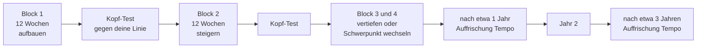

# OFFLINE – Gehirn-Fitness: ein Trainingsmodell wie in der Körperfitness

Arten, Zonen, Wochenplan, vier Lebensabschnitte · Stand 04.10.2026 · Ergänzt `OFFLINE-Gehirntraining-Konzept.md` und `OFFLINE-Gehirntraining-Uebungskatalog.md` · Entwurf für Bill, Prioritäten setzt Mik

> **Nachtrag 04.10.2026:** Dieses Modell ist der Hintergrundplan. Nach außen tritt es als Unterhaltung auf, als Happen-Modul mit Namen „Pause“: `OFFLINE-Modul-Pause-Konzept.md`. Die Trainingsarten, Zonen und Pläne steuern dort die Mischung der Happen, ohne als Programm aufzutreten.

## 1. Was Mik will

Das Training soll für junge Leute spannend sein und einen echten Trainingseffekt haben. Im Alter soll es helfen, Demenz vorzubeugen. Das Vorbild ist die Körperfitness: verschiedene Trainingsarten (Kardio, Kraft, Beweglichkeit, Koordination), Intensitätsstufen, Wochenpläne, Steigerung, Pausen, Fitnesstest. Der Katalog liefert die Übungen, dieses Dokument liefert das Trainingssystem dazu.

## 2. Was die Analogie trägt und was nicht

Vorweg, weil die Aussagen der App davon abhängen.

| Frage | Befund | Heißt für die App |
|---|---|---|
| Hilft **Körpertraining** dem Kopf? | 39 Studien mit Älteren über 50: Bewegung verbessert die geistige Leistung modest (Effektstärke 0,29). Ausdauer, Kraft, Kombitraining und Tai Chi wirken alle. Beste Dosis: 45–60 Minuten, mindestens mäßige Anstrengung, an möglichst vielen Tagen (Northey 2018) | Der Körper ist die belegteste Säule und gehört fest ins Modell |
| Senkt Bewegung das **Demenzrisiko**? | Beobachtungsstudien: 26 Kohorten, Risiko um 14 % niedriger bei viel Bewegung (RR 0,86; 0,76–0,97); beim geistigen Abbau 21 Kohorten, RR 0,65. Meist Selbstauskunft, nur zwei Studien mit Messgerät, mögliche Publikationsverzerrung (Blondell 2014) | Zusammenhang, kein Beweis |
| **Krafttraining** | 17 Studien, 739 Ältere: Gesamtleistung und Arbeitsgedächtnis besser (0,40 bzw. 0,44), Exekutivfunktionen nicht. Wirksam: 3-mal pro Woche, 30–60 Minuten, mindestens 12 Wochen, am stärksten bei 65–74 (Meta-Analyse 2025) | Kraft ist eigene Trainingsart, in Blöcken von 12 Wochen |
| **Computertraining für den Kopf** | 51 Studien, gesunde Ältere: kleiner Effekt (g 0,22) auf Gedächtnis, Tempo, räumliches Denken; keiner auf Exekutivfunktionen und Aufmerksamkeit. Wirksam: 1 bis 3 Einheiten pro Woche, nicht mehr. **In der Gruppe und angeleitet ja, allein zu Hause nein.** Dauer und Alltagsnutzen unbekannt (Lampit 2014) | Kein Dauertraining am Gerät; Gruppen einbauen |
| **Tempo-Training** | ACTIVE: nach 20 Jahren rund 25 % weniger Demenzdiagnosen (HR 0,75) mit Auffrischung nach 11 und 35 Monaten. Ohne Auffrischung kein Effekt (HR 1,01). Diagnosen aus Abrechnungsdaten; Boosters nur für Teilnehmer mit mindestens 8 von 10 Sitzungen | Die einzige Übungsart mit Demenzsignal; Auffrischung ist Pflicht |
| **Körper und Kopf zugleich** (Doppelaufgaben) | 91 Studien, 3.745 Ältere: bessert Gehtempo und Gleichgewicht, aber nicht mehr als reines Bewegungstraining; Doppelaufgaben-Gehen nicht signifikant | Spaß und Alltagsnähe, kein Wundermittel |
| **Videospiele** | 63 Studien, 2.079 Teilnehmer, g 0,25; Verzerrung zugunsten positiver Ergebnisse; Gewinn bei Aufmerksamkeit und Wahrnehmung, keiner beim Gedächtnis; Genre-Etiketten sagen nichts voraus | Für Junge taugt Spieliges als Tempo- und Aufmerksamkeitstraining, mit bescheidenem Anspruch |
| **Hirnspiele allgemein** | Wer ein Spiel übt, wird in dem Spiel besser, aber die Übertragung auf andere Fähigkeiten ist kaum belegt (Simons 2016, 132 Studien) | Keine Versprechen, nur Fertigkeiten, die man im Leben braucht |
| **Abrufen und Verteilen** | Wiederabrufen festigt, Wiederlesen nicht (Karpicke & Roediger 2008) | Der Motor der Kraft-Übungen |
| **Bildung** | Wenig Bildung ist ein Lancet-Faktor in früher Lebenszeit (2024) | Für die Jungen: Wissen und Fertigkeiten aufbauen als „Reserve" |

**Grenze der Analogie:** Ein Muskel wächst mit jedem Training, und das gilt für den ganzen Muskel. Beim Kopf wächst vor allem das, was man übt, und die Übertragung ist klein. Darum verlagert das Modell das Gewicht: Körper als Basis, Kopf-Training in kleinen Dosen mit gezielten Übungsarten, dazu Neues lernen und Menschen. Die App sagt nie „beugt Demenz vor". Sie sagt, was Studien an Zusammenhängen zeigen, und trainiert mit.

## 3. Die Trainingsarten

Wie im Studio: Jede Art hat eine Aufgabe, eine Übungsform und einen Belegstand.

| Art | Körper-Gegenstück | Im Kopf | Beispiele aus dem Katalog | Beleg |
|---|---|---|---|---|
| **Tempo** | Intervalle | schnelle Wahrnehmung, Reaktion, Aufmerksamkeit am Rand | Wo war der Pilz?, Morsen, Klopfecho | **B** (ACTIVE, nur mit Auffrischung) |
| **Kraft** | Gewichte | Abrufen, Arbeitsgedächtnis, Auswendiglernen | Türsteherfrage, Rezept nur einmal, Strophe der Woche, Lumisch | **B** für Abrufen als Lerntechnik; Arbeitsgedächtnis-Spiele **I** |
| **Ausdauer** | Dauerlauf | Fokus halten, 20 bis 45 Minuten bei einer Sache bleiben | Roman lesen, Hörspiel, Schach, Nicht-Wechseln-Zeit | **P** |
| **Beweglichkeit** | Dehnen | umdenken, Regeln wechseln, neue Strategien, neue Sprache | Lumisch, Schnapsen/Tarock, Was würdest du tun?, Weg im Kopf | **P** |
| **Koordination** | Koordination | Körper und Kopf zugleich: Takt und Aufgabe, Gehen und Erzählen | Auf einem Bein, Klopfecho, Gehen und Erzählen | **I** |
| **Gruppe** | Mannschaftssport | gemeinsam trainieren, einander erklären | Fernschach, Kettengeschichte, Frag jemanden | **B** für Gruppentraining (Lampit), sonst **P** |

Daneben die Körpertrainings, die die App anbietet und erinnert, aber nicht misst: **Kardio** (Gehen), **Kraft** (Gewichte, Körpergewicht), **Gleichgewicht**. Dazu **Regeneration**: Schlaf als Pflichtfeld, Ruhetag, Pausenwoche.

## 4. Intensitätszonen

Das Gegenstück zu den Herzfrequenzzonen: Der Schwierigkeitsgrad passt sich so an, dass man in einer bestimmten Zone trainiert. Die Prozentwerte sind **Anfangswerte zum Testen, nicht belegt**.

| Zone | Anfühlen | Trefferquote (Startwert) | Wann |
|---|---|---|---|
| 1 Locker | wie Spazieren, man kann nebenbei reden | über 90 % | Aufwärmen, schlechte Tage |
| 2 Grundlage | fordernd, aber lösbar | 75–85 % | Hauptteil, die meiste Zeit |
| 3 Spitze | an der Grenze | 60–70 % | kurze Phasen, nie über 5 Minuten am Stück |

Wie beim Körper: Wer nur in Zone 3 trainiert, hört auf. Die Regel „mehr als 3 Einheiten pro Woche bringen nichts" gilt für Computertraining (Lampit), darum sind die Spitzenphasen selten.

## 5. Der Plan: Woche, Block, Jahr

- **Woche:** 1 bis 3 Kopf-Einheiten (15 bis 30 Minuten), dazu Körper (siehe unten) und das Verstreute aus dem Katalog.
- **Block:** 12 Wochen, weil die belegten Krafttrainings so lange liefen. Eine Pausenwoche gehört dazu.
- **Auffrischung:** nach etwa einem und nach etwa drei Jahren, nach dem ACTIVE-Muster (11 und 35 Monate). Die App merkt es sich ohne Pushnachricht und legt eine Karte hin.

### Wochenpläne nach Lebensabschnitt (Richtwerte)

Die Wochenzahlen für den Körper folgen den Studien an Älteren und sind für Jüngere übertragen.

| | Jung 14–29 | Mittel 1 30–49 | Mittel 2 50–64 | Alt 65+ |
|---|---|---|---|---|
| **Körper Kardio** | 3 | 2–3 | 3–4 | 3–4 |
| **Körper Kraft** | 2–3 | 2 | 2–3 | 3 (30–60 Min) |
| **Kopf: Tempo** | 2–3 kurz, spielerisch | 1–2 | 2, ab 60 mit Auffrischung | 2 mit Auffrischung |
| **Kopf: Kraft/Abrufen** | täglich kurz | täglich kurz | täglich kurz | täglich kurz |
| **Kopf: Neues (Beweglichkeit)** | 3 (Sprache, Instrument, Schach) | 1–2 | 3 (neues Schwieriges) | 3 |
| **Kopf: Gruppe** | 2 (Duelle, Fernschach) | 1 | 2 | 2–3 (angeleitet oder gemeinsam) |
| **Ruhetag** | 1 | 2 | 1 | 1 |

## 6. Die Lebensabschnitte

### Jung 14–29: spannend und mit echtem Aufbau

- **Idee:** Es soll sich wie ein Spiel und wie Sport anfühlen: Fortschritt sehen, sich messen, etwas freischalten.
- **Wie:** Duelle und Fernschach mit Freunden (Mesh, später), Zwölf-Wochen-Blöcke als „Saison" mit Abschlussrückspiegel, Skins und Lumisch-Stufen als Belohnung für abgeschlossene Blöcke (kein Verlust bei Pause), ein Kopfprofil, das wächst.
- **Inhalt:** Tempo als Spiel (Pilz, Morsen), Abrufen als Lernhilfe (Schule, Sprache), Beweglichkeit durch Neues (Instrument, Sprache, Schach).
- **Ehrlich dabei:** Videospiel-ähnliches Training bringt bescheiden Aufmerksamkeit und Wahrnehmung (g 0,25), nicht Gedächtnis. Der echte Gewinn: Wissen und Fertigkeiten aufbauen. Das passt zum Lancet-Faktor Bildung.

### Mittel 1 30–49: wenig Zeit, kluge Dosis

- **Idee:** Kurz, planbar, ohne schlechtes Gewissen.
- **Wie:** Zwei Kopf-Einheiten à 15 Minuten, dazu das Verstreute. Der Plan sagt, was ausfallen darf.
- **Schwerpunkt:** Fokus (Ausdauer), Schlaf und Bewegung. Die Lancet-Faktoren der Lebensmitte sind überwiegend Körperfaktoren.

### Mittel 2 50–64: Reserve sichern

- **Idee:** Jetzt wird vorgesorgt. Die Sorge ist real, und die App hilft ohne Angst zu machen.
- **Wie:** Neues Schwieriges, Tempo mit Auffrischung ab dem 60. Jahr (Ergebnisse stammen aus Gruppen ab 65, hier übertragen), Körper in Pflicht.
- **Dazu:** Erinnerungen an Hör- und Sehtest (Lancet-Faktoren), Schlaf (Sabia 2021: kurz schlafen mit 50 und 60 ging mit mehr Demenz einher, ein Zusammenhang).

### Alt 65+: Prävention als Gewohnheit

- **Idee:** Ein ruhiges, verlässliches Training, das man gern mit anderen macht.
- **Wie:** Tempo mit Auffrischung, Kraft 3-mal pro Woche, Gruppe (Familie, Stiege, später Mesh), Neues in kleinen Schritten, Erinnerungsarbeit nur auf Einladung.
- **Gemeinsam an einem Gerät:** Weil Training in der Gruppe und angeleitet wirkt und allein zu Hause nicht (Lampit), gibt es den **Gruppenmodus**: ein Gerät, zwei bis sechs Personen, Aufgaben reihum. Das geht auch ohne Mesh.
- **Barrierefrei:** Vorlesen, große Schrift, Hörhilfe-Erinnerung gehören dazu.

## 7. Messen: der Kopf-Fitnesstest

Wie ein Fitnesstest im Studio: wenige Aufgaben, immer dieselben, gegen die eigene Vergangenheit.

| Aufgabe | Misst | Dauer |
|---|---|---|
| Wo war der Pilz? | Tempo, Randwahrnehmung | 2 Min |
| Wortliste, verzögert abrufen | Gedächtnis | 2 Min |
| Regel wechseln | Beweglichkeit | 1 Min |
| Gleichmäßig klopfen und zählen | Koordination, Fokus | 2 Min |
| Fokus-Aufgabe | Ausdauer | 3 Min |

Das Ergebnis ist ein **Kopfprofil** (fünf Achsen, eigene Linie über Monate). Es gilt:

- keine Normwerte, kein „Gehirnalter", keine Prozentränge,
- **kein Demenz-Test**: Wenn jemand wegen Gedächtnisproblemen besorgt ist, nennt die App eine Gedächtnisambulanz oder den Hausarzt und nichts anderes,
- die App sagt, dass das **Übung misst**.

## 8. Was die App sagen darf

| Erlaubt | Nicht erlaubt |
|---|---|
| „Studien zeigen: Wer sich viel bewegt, hat im Durchschnitt ein niedrigeres Demenzrisiko." | „Das beugt Demenz vor." |
| „Das Training schult Tempo und Wahrnehmung. Ob es sich auf den Alltag überträgt, ist noch offen." | „Das macht dich klüger." |
| „Dein Kopfprofil zeigt, was du geübt hast." | „Dein Gehirn ist X Jahre jünger." |
| „Wenn du dich sorgst, sprich mit deiner Ärztin oder deinem Arzt." | Jede Diagnose |

## 9. Bunker

Im Bunker fehlt die Grundlast des Alltags, und alle Arten müssen im Gerät oder mit Menschen entstehen. Körper ohne Raum: Treppen, Gewichte aus Wasserflaschen, Kreisgehen. Kopf: Tempo, Abrufen und Neues kommen aus der Vorratskammer. Gruppe: mit den Mitbewohnern am gemeinsamen Gerät. Die drei Bunkerphasen aus dem Konzept bleiben: Ankommen (feste Zeiten), Durchhalten (Neues in Dosen, Gruppe), Jahre (Weitergeben, Auffrischung nach etwa einem und drei Jahren).

## 10. Bau und offene Punkte

- **Ein Trainingsplan als Datensatz:** Art, Zone, Dauer, Wochentage, Lebensabschnitt. Der Katalog bekommt je Übung die Felder Trainingsart und Zone. Passt zum Paket-Kit.
- **Adaptive Schwierigkeit** ist reine Zustandslogik, ohne KI.
- **Zwei Dinge gehören zusammen:** Das Verstreute (Katalog) ist die Grundlast, der Plan sind die Trainingseinheiten.
- **Offen:**
  1. Reicht „Kopfprofil" mit fünf Achsen, oder soll es einfacher sein?
  2. Gruppenmodus an einem Gerät: Soll er in die erste Version?
  3. Saison und Freischalten bei Jungen: Zustimmung (ohne Streaks und ohne Verlust).
  4. Medizinische Gegenlesung der Aussagen (mit der ärztlichen Prüfung der Guides).
  5. Studienzahlen: Stand der Prüfung im Konzeptdokument; neu hinzugekommen sind Northey, Blondell, die Krafttraining-Meta-Analyse, Lampit (über einen Zusammenfassungstext), das Doppelaufgaben-Review und die Videospiel-Meta-Analyse, jeweils gegen Zusammenfassungen oder Volltexte gelesen.

## Quellen

- [Northey et al. 2018, Bewegung und Kognition ab 50 (BJSM)](https://bjsm.bmj.com/content/52/3/154.abstract)
- [Blondell et al. 2014, Bewegung und Demenz (PMC)](https://pmc.ncbi.nlm.nih.gov/articles/PMC4064273)
- [Krafttraining und Kognition, Meta-Analyse 2025 (Frontiers in Psychiatry)](https://www.frontiersin.org/journals/psychiatry/articles/10.3389/fpsyt.2025.1708244/abstract)
- [Computertraining bei gesunden Älteren, Lampit 2014 (Zusammenfassung)](https://therapytoronto.ca/news/?p=17457)
- [Motorisch-kognitives Training bei Älteren, Review (Frontiers in Psychology)](https://www.frontiersin.org/articles/10.3389/fpsyg.2022.837710/pdf)
- [Videospiel-Training, Meta-Analyse (PMC)](https://pmc.ncbi.nlm.nih.gov/articles/PMC10395941)
- [ACTIVE, 20-Jahres-Auswertung (Fachpresse)](https://www.patientcareonline.com/view/speed-based-cognitive-training-with-booster-sessions-linked-to-lower-dementia-risk-over-20-years)
- [Simons et al. 2016 (APS)](https://www.psychologicalscience.org/news/releases/brain-training-claims-not-backed-by-science-report-shows.html)
- [Karpicke & Roediger 2008 (Purdue)](https://www.purdue.edu/uns/x/2008a/080214KarpickeTest.html)
- [Lancet-Kommission 2024 (Alzheimer Europe)](https://www.alzheimer-europe.org/news/2024-lancet-commission-underscores-potential-dementia-risk-reduction-identifying-14-modifiable)
- [Sabia et al. 2021, Schlaf und Demenz (Nature Communications)](https://www.nature.com/articles/s41467-021-22354-2)
