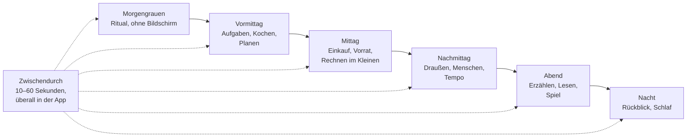

# OFFLINE – Gehirntraining: der Übungskatalog

Übungen, die nicht nach Übungen aussehen · Stand 04.10.2026 · Ergänzung zum Konzept `OFFLINE-Gehirntraining-Konzept.md` · Entwurf für Bill, Prioritäten setzt Mik

> **Nachtrag 04.10.2026:** Dieser Katalog ist die Grundlast, also das Verstreute. Das Trainingssystem dazu (Trainingsarten, Zonen, Wochenplan, Kopf-Fitnesstest, Gruppenmodus) steht in `OFFLINE-Gehirn-Fitness-Trainingsmodell.md`. Jede Übung hier bekommt dort Trainingsart und Zone.

> **Nachtrag (später am 04.10.2026):** Die Übungen werden im Happen-Modul (Name „Pause“) als Happen ausgespielt: `OFFLINE-Modul-Pause-Konzept.md`.

## 1. Der Gedanke dahinter

Wer viel unterwegs ist, trainiert seinen Körper nebenbei: Stiegen, Einkauf, Weg zur Bahn. Mit dem Alter und im Bunker fällt diese **Grundlast** weg, und man muss sie durch bewusste Übung ersetzen. Beim Kopf ist es genauso. Junge Menschen denken den ganzen Tag nebenbei: Weg finden, Namen merken, verhandeln, Pläne ändern, Neues aufnehmen. Fällt das weg, wird der Kopf nicht von allein schlechter, aber er bekommt zu wenig zu tun.

**Konsequenz für OFFLINE:** Die Kopfkarte aus dem Konzept bleibt der Anker (wie das Yoga am Morgen). Der größere Teil des Trainings sitzt **verstreut in der ganzen App**, in kurzen Momenten, als Teil von Dingen, die man ohnehin tut: kochen, planen, erzählen, spielen, den Notfallplan pflegen. Das ist ein Gestaltungsprinzip aus der Analogie zur Alltagsbewegung, kein Studienbefund.

### Sieben Regeln für jede Übung

1. **Tarnung.** Die Übung ist eine Aufgabe in der Welt der App, nie ein „Test". Man erinnert sich an den Namen der Nachbarin, weil Lumi ihn braucht, nicht weil das Gedächtnis geprüft wird.
2. **Wahl statt Pflicht.** Mehrere Angebote, man nimmt eines oder keines. Die App lernt, was gespielt wird, und legt mehr davon hin (sichtbar, begründet, rückgängig).
3. **Nie Fehler anzeigen.** Es gibt kein Falsch-Geräusch und keine rote Zahl. Falsches führt zu „Schau, so war's".
4. **Kurz.** Die meisten Übungen dauern 10 bis 90 Sekunden. Eine Lektion höchstens 15 Minuten.
5. **Fortschritt in Worten, nicht in Punkten.** Der „Rückspiegel" sagt: „Vor drei Monaten hast du für das Zugrätsel acht Minuten gebraucht. Jetzt vier." Das Gefühl, besser zu werden, ist der Antrieb.
6. **Ehrlich bleiben.** Spiele werden besser durch Übung. Die App behauptet nicht, dass das den Kopf allgemein steigert. Die Studienlage dafür ist dünn (Simons et al. 2016).
7. **Schluss bleibt Schluss.** Die Tagesabschluss-Regel gilt auch hier. Siehe Abschnitt 5.

### Bezeichnungen

**Trainiert:** Gd = Gedächtnis · Tp = Aufmerksamkeit und Tempo · Pl = Planen und Entscheiden · Sp = Sprache · Rm = Raum und Orientierung · Mn = Menschen · Kp = Körper
**Für:** J = Jung · M1 = Mittel 1 · M2 = Mittel 2 · A = Alt
**Beleg:** **B** = die Übungsart ist erforscht (Abrufen, Tempo-Training nach ACTIVE-Muster, Gehen, neues Schwieriges lernen) · **P** = plausibel abgeleitet · **I** = Idee, vor allem für Freude und Gewohnheit

## 2. Der Tag verstreut

## 3. Katalog

### A. Morgengrauen: das Ritual (5–10 Minuten, ohne Hektik)

| Übung | So kommt sie daher | Trainiert | Für | Beleg |
|---|---|---|---|---|
| Sonnengruß-Kette | Eine Haltung kommt pro Tag dazu, bis zwölf stehen. Du machst die Folge aus dem Kopf, Lumi hilft nur, wenn du hängst. | Gd, Kp | alle | P |
| Himmelsrichtung | „Wo geht die Sonne heute auf?" Du tippst auf den Kompassring; die App rechnet nach. | Rm, Gd | alle | P |
| Wetter schätzen | Du schaust aus dem Fenster und tippst Wolken, Wind, Tendenz. Abends vergleicht Lumi mit Radio und Bauernregel. | Tp, Pl | alle | I |
| Zeitgefühl | „Wie spät ist es?" ohne Uhr. Lumi sagt die Abweichung nur leise. Im Bunker ohne Tageslicht besonders wertvoll. | Gd, Pl | alle | I |
| Tagesabsicht | Du sagst einen Satz in das Mikro („Heute bringe ich Frau Berger Tee"). Abends spielt Lumi ihn zurück. | Gd, Pl | alle | P |
| Traumnotiz in 20 Sekunden | Sprachnotiz ins Tagebuch. Lumi fragt abends: „Was war es noch?" | Gd | M1–A | I |
| Atemfenster | Vier Atemzüge geführt, der Bildschirm wird dabei dunkler. | Tp | alle | P |

### B. Zwischendurch: die Türsteher-Momente (10–60 Sekunden)

Beim Öffnen der App, beim Wechsel zwischen Bereichen, beim Warten auf einen Download.

| Übung | So kommt sie daher | Trainiert | Für | Beleg |
|---|---|---|---|---|
| Türsteherfrage | Eine Frage aus dem, was du selbst gelesen oder geschrieben hast. Kein Raten: Du holst es aus dem Kopf. | Gd | alle | B |
| Wo liegt es? | „Wo ist die Taschenlampe?" Du sagst es, dann zeigt dir die App deine Notfallmappe. Wer stimmt, bekommt einen Punkt für Bereit. | Gd | alle | B |
| Nachbar-Namen | „Wie heißt die Frau im 2. Stock?" Bestätigt zugleich den Eintrag im Notfallplan. | Gd, Mn | alle | B |
| Wahr oder Märchen | Bauernregel, Hausmittel, Wikipedia-Satz: wahr, falsch, oder „weiß nicht". | Gd, Pl | alle | P |
| Wort des Tages | Ein Wiktionary-Wort. Abends fragt Lumi: „Hast du es benutzt?" | Sp | alle | P |
| Schätzfrage | „Wie viele Schritte bis zur Haustür?" Du gehst und zählst, die App merkt sich den Wert für nächstes Mal. | Gd, Kp | alle | I |
| Fehlt etwas? | Lumis Zimmer verändert sich über Nacht. Ein Ding fehlt oder ist neu. Tipp drauf. | Tp, Gd | J–M2 | P |

### C. Lumi als Mitspielerin

| Übung | So kommt sie daher | Trainiert | Für | Beleg |
|---|---|---|---|---|
| Lumi baut ein Nest | Du verteilst Dinge im Zimmer; später fragt Lumi, wo was liegt. | Gd, Rm | alle | P |
| Der eingebaute Fehler | Lumi erzählt eine Geschichte von unten. In einem Satz stimmt etwas nicht. Du tippst „Mh?". | Tp, Gd | alle | P |
| Erkläre es Lumi | Sie hat etwas nicht verstanden (Wasser abkochen, Kreisverkehr). Du erklärst es: in der Basis durch Auswahl, in Pro frei per Stimme. Erklären festigt Wissen (bekannter Lerneffekt, hier nicht einzeln belegt). | Gd, Sp | alle | P |
| Lumisch | Lumi bringt dir jeden Tag ein Wort ihrer eigenen Sprache bei, nach drei Wochen kannst du Sätze. Vokabellernen im Kostüm. | Gd, Sp | J–A | B |
| Lumi vergisst | Sie hat etwas vergessen, was du ihr gestern gesagt hast. Du hilfst ihr drauf. | Gd | alle | B |
| Lumi hat Hunger | Sie wünscht sich drei Dinge. Du findest sie in deinem Kochbuch oder Vorrat. | Pl, Gd | alle | P |

### D. Draußen und mit den Sinnen (Mikro, Kamera, Sensoren)

| Übung | So kommt sie daher | Trainiert | Für | Beleg |
|---|---|---|---|---|
| Schritte-Quest | „Geh 300 Schritte und finde drei verschiedene Blätter." Der Schrittzähler läuft mit. | Kp, Tp | J–A | B |
| Geräusche-Karte | Du nimmst 30 Sekunden auf und benennst fünf Geräusche. Hören ist ein Lancet-Faktor. | Tp, Gd | alle | P |
| Foto des Tages | Ein Foto, drei Wörter. Eine Woche später fragt Lumi: „Was war am Dienstag auf dem Bild?" | Gd | alle | B |
| Sternenjagd | Die Karte zeigt ein Sternbild. Du findest es am Himmel und tippst, welcher Stern es ist. | Rm, Tp | alle | I |
| Schatten-Uhr | Du fotografierst einen Schatten und schätzt die Uhrzeit. Die App rechnet nach. | Rm, Pl | alle | I |
| Auf einem Bein | 30 Sekunden stehen, während Lumi eine Geschichte erzählt. Gehen oder Stehen zusammen mit Kopfarbeit: eigener Forschungszweig, hier als Idee. | Kp, Tp | alle | I |
| Klopfecho | Lumi klopft ein Muster, das Mikro hört dein Nachklopfen. | Gd, Tp | alle | P |
| Wohnung aus dem Kopf | Du zeichnest den Grundriss deiner Wohnung mit Fluchtweg, danach zeigt die App ihn neben der Notfallmappe. | Rm, Gd | alle | B |

### E. Küche und Vorrat: Planen im echten Leben

| Übung | So kommt sie daher | Trainiert | Für | Beleg |
|---|---|---|---|---|
| Rezept nur einmal | Das Rezept erscheint, verschwindet, du kochst aus dem Gedächtnis. Die Seite kommt zurück, wenn du „Hilfe" tippst. | Gd, Pl | alle | B |
| Speisekammer-Rätsel | 14 Tage Essen für drei Personen aus diesen Vorräten. Es geht auf, wenn Kalorien und Haltbarkeit stimmen. | Pl | M1–A | P |
| Wasserrechnung | „Wie lange reicht das Wasser bei Hitze?" Zeigt auch die Bereit-Zahl. | Pl | alle | P |
| Einkauf im Kopf | Lumi nennt sieben Dinge. Du gehst, ohne Liste. Zurück: Wie viele hast du? | Gd, Kp | alle | B |
| Gramm nach Gefühl | Du schätzt Gewichte mit Handspannen und Tassen. Die App löst auf. | Rm, Pl | alle | I |

### F. Wort und Geschichte

| Übung | So kommt sie daher | Trainiert | Für | Beleg |
|---|---|---|---|---|
| Was kommt als Nächstes? | Im Roman der Woche tippst du vor dem Umblättern deine Vermutung. Am nächsten Tag: „Wer war noch Herr Hofrat?" | Gd, Sp | alle | B |
| Rollen lesen | Das Kapitel wird als Hörspiel verteilt. Lumi spricht eine Rolle, du die andere. | Sp, Tp | alle | I |
| Brief an später | Ein Brief im Tresor, der sich zu einem Datum öffnet. Vorher fragt die App einmal: „Weißt du noch, was drinsteht?" | Gd | alle | P |
| Strophe der Woche | Eine gemeinfreie Strophe, jeden Tag eine Zeile dazu, am Sonntag auswendig. | Gd, Sp | alle | B |
| Zungenbrecher | Das Mikro misst Tempo; du siehst nur, wie viel schneller du wurdest. | Tp, Sp | J–M2 | I |
| Wiener Wort | Ein Ausdruck, seine Herkunft, ein Satz zum Selbermachen. | Sp | alle | I |
| Kettengeschichte | Lumi beginnt einen Satz, du machst weiter. Über Mesh reihum mit Nachbarn. | Sp, Mn | alle | P |

### G. Zahl und Logik

| Übung | So kommt sie daher | Trainiert | Für | Beleg |
|---|---|---|---|---|
| Schnapsen, Tarock, Watten | Kartenspiele gegen den Computer; auf Wunsch zeigt Lumi, welche Trümpfe noch fehlen. | Gd, Pl | M1–A | P |
| Tauschwirtschaft | Spiel im Blackout-Szenario: Was ist ein Liter Wasser gegen ein Päckchen Batterien wert? Rechnen im Kostüm. | Pl | alle | I |
| Stiegenrätsel | „Wer wohnt wo?" mit den Namen deiner eingetragenen Nachbarn. | Pl, Gd | alle | P |
| Sudoku, Kreuzworträtsel | Das Tagesrätsel bleibt: eines, nicht zehn. | Pl, Sp | alle | P |
| Akkurechner | „Reicht der Akku bis Freitag?" Du stellst ein, die App zeigt, wie man spart. | Pl | alle | I |
| Wetterwette | Du setzt auf morgen: Druck steigt oder fällt. Das Barometer des Handys gibt Antwort. | Pl, Gd | M1–A | I |

### H. Raum und Karte

| Übung | So kommt sie daher | Trainiert | Für | Beleg |
|---|---|---|---|---|
| Weg im Kopf | „Beschreibe den Weg zum Spital." Danach zeigt die Karte die Abweichung. | Rm, Gd | alle | B |
| Norden ohne GPS | Karte ohne Kompass: Du markierst Norden, die App prüft mit der Sonne. | Rm | alle | P |
| Puzzlekarte | Bundesländer, Flüsse, Pässe legen. Geografie als Brettspiel. | Gd, Rm | J–A | P |
| Papier falten | Eine Anleitung nur in Bildern, ohne Schrift. Papier braucht keinen Akku. | Rm, Tp | alle | I |
| Knoten | Seemannsknoten mit Schnur nach Bildfolge. | Rm, Gd | alle | P |

### I. Musik und Rhythmus

| Übung | So kommt sie daher | Trainiert | Für | Beleg |
|---|---|---|---|---|
| Liederbuch zum Nachsingen | Das Mikro hört die Tonhöhe. Du siehst nur, ob die Linie hochgeht oder runter. | Tp, Gd | alle | I |
| Ohrwurm ergänzen | Ein Volkslied bricht ab, du singst oder tippst die nächste Zeile. | Gd, Sp | alle | P |
| Pfeifen lernen | Von „kann ich nicht" bis zur ersten Melodie in vier Wochen. | Tp, Kp | alle | I |
| Rhythmus nachklopfen | Siehe Klopfecho: wird länger, wenn es klappt. | Gd, Tp | alle | P |

### J. Menschen: Familie, Nachbarschaft, Mesh

| Übung | So kommt sie daher | Trainiert | Für | Beleg |
|---|---|---|---|---|
| Fernschach und Fernspiele | Laufen über Mesh; das Netz wächst mit. | Pl, Mn | alle | P |
| Wichteln | Wunschlisten erraten. | Gd, Mn | alle | P |
| Frag jemanden | „Frag jemand Älteren, wie es damals ohne Handy war." Aufnehmen, ins Tagebuch. Weitergeben ist der Kern. | Mn, Gd | alle | P |
| Bring es jemandem bei | Du lehrst einen Handgriff (Knoten, Kochen, Reparieren). Lumi hält den Fortschritt fest. | Mn, Pl | M2–A | P |
| Namens-Abend | Eine Nachbarin, ein Satz, den du noch nicht wusstest. | Mn, Gd | alle | B |
| Stille Wette | Familie oder Stiege tippt gemeinsam: Wetter, Spielstand, Heimkehrzeit. | Pl, Mn | alle | I |

### K. Entscheiden und Fühlen

| Übung | So kommt sie daher | Trainiert | Für | Beleg |
|---|---|---|---|---|
| Was würdest du tun? | Die 60 Alltagslagen als Geschichte mit Weggabelungen. Der Aufzug bleibt stecken: Was tust du zuerst? | Pl | alle | P |
| Drei Wörter heute | Eine Wetterkarte der Stimmung in drei Wörtern. Lumi erkennt Muster und sagt sie vorsichtig (keine Diagnose, kein Therapieersatz). | Sp | M1–A | I |
| Mutprobe | Einmal im Quartal ein unbequemer Vorschlag: Fremde ansprechen, etwas neu machen. | Pl, Mn | M2–A | P |

### L. Tempo und Aufmerksamkeit (der Teil mit der besten Studienlage)

| Übung | So kommt sie daher | Trainiert | Für | Beleg |
|---|---|---|---|---|
| Wo war der Pilz? | Lumi blinzelt, an einer Stelle blitzt kurz ein Pilz auf, in der Mitte und am Rand. Du tippst, wo. Schwierigkeit passt sich an. Das ist das ACTIVE-Muster (Tempo-Training) im Kostüm. Wichtig: In ACTIVE wirkte das Tempo-Training nur mit Auffrischung nach 11 und 35 Monaten; ohne Auffrischung zeigte sich kein Effekt. Die Auffrischung gehört deshalb fest dazu: Nach etwa einem und nach drei Jahren kommt eine Auffrischungsrunde. | Tp | alle | B |
| Morsen | Lumi blinkt mit dem Taschenlampen-Licht, du tippst nach. Morsen ist im Notfall nützlich. | Tp, Gd | alle | B |
| Nicht-Wechseln-Zeit | 20 Minuten lesen, ohne die App zu verlassen. Lumi schläft mit. | Tp | M1–A | P |
| Hörst du den Fehler | Siehe Der eingebaute Fehler. | Tp | alle | P |

### M. Erinnern (vorsichtig, vor allem für Alt)

| Übung | So kommt sie daher | Trainiert | Für | Beleg |
|---|---|---|---|---|
| Fotoalbum-Spaziergang | Eigene Fotos, Lumi fragt „Wer ist das?" nur, wenn du Lust hast. Nie als Test, nie mit Fehlermeldung. | Gd | A | P |
| Gehen und Erzählen | Beim Spaziergang erzählst du Lumi, was du siehst. Sprachnotiz für das Tagebuch. | Kp, Sp | M2–A | I |
| Hören im Rauschen | Ein Hörspiel, bei dem das Rauschen leise ansteigt. Sprache verstehen trotz Lärm trainiert das Hören; keine Hörhilfe-Beratung, nur Übung. | Tp | M2–A | I |
| Händewechsel | Zeichnen oder Knoten mit der anderen Hand. | Kp, Tp | alle | I |

### N. Nacht: Rückblick und Schlaf

| Übung | So kommt sie daher | Trainiert | Für | Beleg |
|---|---|---|---|---|
| Der Tag rückwärts | Drei Dinge vom Tag, vom Abend zum Morgen. Der Bildschirm wird dunkel, Lumi schläft ein. | Gd | alle | P |
| Einschlaf-Alphabet | Zu jedem Buchstaben ein Tier, langsam, ohne Bildschirm. Das ist eine bekannte Einschlafhilfe, die Studienlage ist dünn. | Gd, Sp | alle | I |
| Rückspiegel | Einmal im Monat: „Das konntest du vor drei Monaten noch nicht." | – | alle | P |

## 4. Wer bekommt was: Schwerpunkte nach Stufe

| Stufe | Schwerpunkt im Katalog | Beispielreihe für einen Tag |
|---|---|---|
| **Jung** | Neues lernen, Abrufen, Tempo; viel Spiel, viel Lumisch | Sonnengruß-Kette, Zungenbrecher, Lumisch, Pilz-Tempo, Kettengeschichte |
| **Mittel 1** | Fokus, Planen, Schlaf; kurze Dosen, wenig Pflicht | Tagesabsicht, Türsteherfragen, Speisekammer-Rätsel, Nicht-Wechseln-Zeit, Rückwärts-Tag |
| **Mittel 2** | Neues Schwieriges, Weitergeben, Hören | Strophe der Woche, Karten (Tarock), Bring es jemandem bei, Gehen und Erzählen |
| **Alt** | Tempo mit Auffrischung, Erinnern, Menschen, Gehen | Pilz-Tempo, Fotoalbum, Namens-Abend, Morgenkette, Hören im Rauschen |

Alles bleibt für alle erreichbar. Die Stufe bestimmt nur, was zuerst angeboten wird.

## 5. Ehrlicher Gegenentwurf: „süchtig machen" vs. gern zurückkommen

Der Wunsch ist klar: Die Nutzer sollen merken, wie unterhaltsam die App ist und dass sie sich geistig besser fühlen. Dafür trägt dieses Konzept: kleine Erfolge, ein Rückspiegel, Spiele mit Charakter, die Lumi als Gegenüber. Eines passt nicht zu diesem Konzept und auch nicht zu den bisherigen Entscheidungen im Projekt: **Sog**, also variable Belohnungen, Streaks mit Verlustangst und Pushmeldungen. OFFLINE hat keine Push-Nachrichten, die Lumi stirbt nicht, und der Tag hat einen Schluss. Dabei soll es bleiben, und zwar nicht aus Prinzip, sondern weil im Bunker ein Gerät, das einen festhält, dem Kopf schadet. Die Lust zurückzukommen kommt aus Vorfreude (morgen kommt das nächste Kapitel, das nächste Wort, die nächste Haltung), nicht aus Angst, etwas zu verlieren. **Entschieden von Mik am 04.10.2026: bei Vorfreude bleiben** (keine Streaks, keine Push-Nachrichten, Tagesschluss bleibt).

## 6. Was das für den Bau heißt

- **Zwei Arten von Übungen.** Regelbasiert (Basis, gratis, ohne KI): Türsteherfragen, Pilz-Tempo, Morsen, Rezept-nur-einmal, Rätsel, Karten. Mit KI (Pro): Erkläre es Lumi, Rollen lesen, Fehler in der Geschichte, freies Gespräch.
- **Ein Katalog als Datenpaket.** Jede Übung ist ein Datensatz (Name, Tarnung, Dauer, Stufen, Bereich in der App, Bedingungen). Das Wesen und die Tagesseite wählen aus dem Katalog. Passt zum Paket-Kit (Art `modul`) und zur Gelernt-Schicht der Einstellungen.
- **Mehr Sensorik.** Mikro, Kamera, Schrittzähler, Barometer: alles am Gerät, nichts verlässt es. Vor dem Einbau mit der Rechtsliste zu Kindern abgleichen.
- **Kein Test-Gefühl bei Alt.** Fotoalbum, Namen und Erinnerungsfragen laufen nur auf Einladung und ohne Fehleranzeige.

## 7. Erste Version: zwölf Übungen (Vorschlag)

Auswahl nach drei Kriterien: quer über den Tag verteilt, **alle ohne KI und ohne Sensoren** baubar (nur Touch, Daten und Text), und jede mit einem Eigenwert für OFFLINE, nicht nur fürs Training. Tagesrätsel und Schach laufen ohnehin als eigene Pakete weiter.

| # | Übung | Tageszeit | Bausteine, die schon geplant sind |
|---|---|---|---|
| 1 | Türsteherfrage | Zwischendurch | Tagebuch, Roman, Guides als Fragenquelle |
| 2 | Wo liegt es? und Nachbar-Namen | Zwischendurch | Notfallmappe, Bereit-Bestätigung |
| 3 | Sonnengruß-Kette | Morgengrauen | Bilderfolge, Tages-Zähler |
| 4 | Zeitgefühl | Morgengrauen | Uhr, Sonne/Mond-Paket |
| 5 | Wo war der Pilz? (mit Auffrischung) | Lumi, Nachmittag | Lumi, Zustandslogik |
| 6 | Der eingebaute Fehler | Lumi, Abend | Wir-Paket, vorab geschriebene Geschichten |
| 7 | Lumisch | Lumi, täglich | Wir-Paket, Wortliste |
| 8 | Rezept nur einmal | Vormittag, Küche | Kochbuch ohne Strom |
| 9 | Was kommt als Nächstes? | Abend | Roman der Woche |
| 10 | Weg im Kopf | Nachmittag | Offline-Karte, Notfallplan |
| 11 | Frag jemanden | Nachmittag | Auftrag, Tagebuch |
| 12 | Der Tag rückwärts | Nacht | Tagesschluss, Tagebuch |

Die erste Version macht zwölf Dinge, die dem Gerät nicht neu sind, und ändert nur, wann sie auftauchen. Das ist der kleinste Weg, die Verstreuung zu testen.

## 8. Offen

1. Auswahl der zwölf bestätigen oder tauschen.
2. Soll der Rückspiegel Teil der Tagesseite werden?
3. Haltung zu Pro: Welche KI-Übungen sind Pro, welche bleiben gratis?
4. Gegenlesung durch die ärztliche Prüfung der Guides (entschieden 04.10.): betrifft Schlaf, Atem, Gehen, Hören, Fotoalbum.
5. Studienzahlen: teils gegen die Originale geprüft, Stand im Konzeptdokument.
