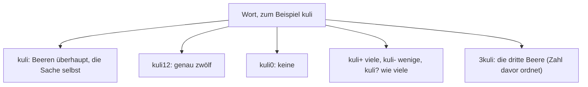
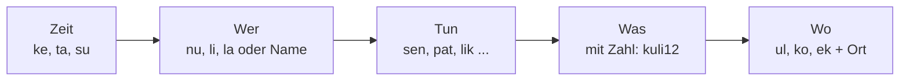

# OFFLINE – Lumisch: Wörterbuch und Grammatik der Lumi

Stand 04.10.2026 · Idee von Mik, ausgearbeitet in der Session · 209 Wörter, 25 Regeln · Entwurf für Bill, Prioritäten setzt Mik

> Die Wörter und die Regeln sind frei erfunden. Gesprochen und gelernt wird Lumisch im Spiel „Lumisch“ (Happen in der Pause, Übung 7 der ersten Version) und im Paket `wir`. Die fünf Wörter aus dem Testspiel (mo, pelu, zan, tiv, orr) gelten unverändert weiter.

## 1. Der Gedanke

Die Lumis sagen von sich „wir“. Ihre Sprache ist so gebaut, wie sie leben: wenig, genau und ohne Umwege. Es gibt keine Mehrzahl, keine Fälle, keine Artikel und kein „sein“. Dafür steckt in jedem Wort die Zahl: **kuli12** sind zwölf Beeren, **kuli0** keine, **kuli** die Beere überhaupt.

Dazu passt eine Regel, die in der App schon gilt: Die Lumi sagt kein „ich“, solange sie keinen Namen hat. Im Lumischen gibt es das Wort „ich“ deshalb gar nicht. Wer keinen Namen hat, sagt **nu** (wir). Wer einen hat, sagt seinen Namen. Der erste Satz mit Namen aus dem Startablauf („Susi. Das bin ich. Das war neu. Ich mag es.“) heißt auf Lumisch: **Susi. ke to tevi. Susi lik.**

## 2. Aussprache und Schrift

| Merkmal | Regel |
|---|---|
| Buchstaben | 15 Laute: a e i o u, m n p t k l r s z v |
| Aussprache | jeder Buchstabe ein Laut, nichts bleibt stumm; z wie in „Zahn“, s weich wie in „Sonne“, v wie in „Wasser“, rr gerollt |
| Betonung | immer auf der ersten Silbe |
| Silben | einfach gebaut, meist Konsonant + Vokal (+ Konsonant) |
| Klang | Weiches und Gutes klingt mit m, l, n, u, o (mulo, lula, mimu). Scharfes und Gefährliches klingt mit k, t, z, i (tikor, tikal, zik). Das ist ein Gedächtnisanker, keine Regel. |
| Lautwörter | mh (der Zweifel) und o (das Staunen) sind Laute und stehen außerhalb des Alphabets |
| Schrift | nur kleine Buchstaben, nur Namen groß; Ziffern bleiben Ziffern; ein Satz endet mit einem Punkt |

## 3. Grammatik in 25 Regeln

Alles, was sich weglassen lässt, ist weggelassen.

### Zahlen

| Nr. | Regel | Beispiel |
|---|---|---|
| 1 | **Die Zahl steckt im Wort.** Es gibt weder Einzahl noch Mehrzahl. Ohne Zahl meint das Wort die Sache selbst. | kuli1 eine Beere · kuli12 zwölf Beeren · kuli0 keine · kuli Beeren überhaupt |
| 2 | **Ungefähres hat Zeichen:** + viele, - wenige, ? wie viele. Gesprochen mol, nik und ma. | kuli+ · kuli- · kuli? |
| 3 | **Die Zahl hinter dem Wort zählt, was das Wort ist.** Bei Dingen die Stücke, bei Tätigkeiten die Male, bei Eigenschaften die Stufe von 1 bis 9, bei der Zeit die Dauer. | kuli3 drei Beeren · sen3 dreimal essen · zan9 so hell wie möglich · zel3 drei Tage |
| 4 | **Die Zahl vor dem Wort ordnet.** Sie macht aus dem Wort den, die oder das Soundsovielte. | 3zel der dritte Tag |
| 5 | **Zahlen werden Ziffer für Ziffer gesprochen.** Keine Zehner, keine Hunderter, kein Zahlwort-Wirrwarr. | 12 = ka sa · 305 = ro ne pa |
| 6 | **Keine Artikel.** Nur wer zeigt, sagt to. | zan Licht, ein Licht, das Licht · to zan dieses Licht |
| 7 | **Keine Fälle, kein Geschlecht.** Die Wörter ändern sich nie. Besitz zeigt ve an. | ora ve nu unser Haus |
| 8 | **Ein Wort für alle Wortarten.** Der Platz im Satz sagt, was gemeint ist. | zan Licht, hell, leuchten · pelu Brot, backen |
| 9 | **Verben ändern sich nie.** Keine Person, keine Endung. | nu sen · li sen · la sen |
| 10 | **„Sein“ gibt es nicht.** Eine Eigenschaft steht einfach da. | mo kir das Wasser ist kalt |
| 11 | **Die Zeit steht vorn als eigenes Wort:** ke früher, ta jetzt, su bald. ta darf fehlen. | ke Susi sumu · su nu pat |
| 12 | **Feste Reihenfolge:** Zeit, Wer, Tun, Was, Wo (siehe Bild). | ta nu sen kuli12 ul uvo |
| 13 | **Verneinung mit ne** direkt vor dem, was verneint wird. | li ne kiru · ne tal nie · ne sam ohne |
| 14 | **Das Gegenteil bildet ne- als Vorsilbe.** | zan ↔ nezan · sum ↔ nesum · mo ↔ nemo |
| 15 | **Steigerung durch Wiederholung.** Vergleichen mit vi. | zan zan sehr hell · zan zan zan am hellsten · A vi B |
| 16 | **Fragen mit ma.** ma steht dort, wo die Antwort stünde. Hinter einem ganzen Satz fragt es nach Ja oder Nein. Antwort: ak oder ne. | ma mi pelu wer hat Brot · li mi pelu ma hast du Brot |
| 17 | **Der Befehl hat kein „Wer“.** | kom ko ora komm ins Haus · pok sul Tür auf, bitte |
| 18 | **Ein „ich“ gibt es nicht.** Ohne Namen sagt man nu, mit Namen den Namen. Du ist li, er, sie, es ist la. Die Zahl macht die Mehrzahl. | Susi lik ich mag · li2 ihr beide |
| 19 | **Zusammensetzung ohne Fuge.** Das Hauptwort steht hinten. | vul + zan = vulzan Feuer · mo + sen = mosen Suppe |
| 20 | **Zeitwörter als Vorsilbe** machen aus einem Wort seine Vergangenheit oder Zukunft. | ke + zan = kezan Erinnerung · su + zan = suzan Hoffnung |
| 21 | **Ein Ortswort für alle Orte,** dazu zwei für die Richtung. | ul bei, in, auf · ko hin · ek weg |
| 22 | **Kein „und“.** Dinge werden aufgereiht, nur „oder“ (ol) gibt es. | pelu2 kuli3 zwei Brote und drei Beeren |
| 23 | **Haben und gehören sind zwei Wörter:** mi und ve. | Susi mi kuli3 · kuli ve Susi |
| 24 | **Nebensätze sind kurze Hauptsätze.** pu (weil) und tan (wenn) stehen einfach vor einem ganzen Satz, der Satz bleibt unverändert. | tan li kom, nu sen wenn du kommst, essen wir |
| 25 | **Namen bleiben, wie sie sind.** Sie werden nicht gebeugt und groß geschrieben. | Susi, Mik, Wien |

### Der Satz in einem Bild

Weil es kein „sein“ und keine Endungen gibt, sieht ein Satz mit pu (weil) oder tan (wenn) aus wie zwei kurze Sätze hintereinander (Regel 24).

## 4. Beispielsätze

| Lumisch | Wort für Wort | Deutsch |
|---|---|---|
| ul uvo zan zan. | bei oben hell hell | Hier oben ist es hell. |
| ul unu nezan tal. | bei unten dunkel immer | Bei uns unten ist es immer dunkel. |
| Susi. ke to tevi. Susi lik. | Susi / früher dies neu / Susi mag | Susi. Das war neu. Ich mag es. |
| ke Susi sumu. | früher Susi schlafen | Ich habe geschlafen. |
| ta nu sen kuli12. | jetzt wir essen Beere-12 | Wir essen zwölf Beeren. |
| Susi lik kuli. | Susi mag Beere (ohne Zahl: die Sache selbst) | Ich mag Beeren (überhaupt). |
| Susi mi kuli3. | Susi hat Beere-3 | Ich habe drei Beeren. |
| li mi pelu ma. | du hast Brot ? | Hast du Brot? |
| ak. Susi mi pelu2. | ja / Susi hat Brot-2 | Ja. Ich habe zwei Brote. |
| ma mi pelu. | wer hat Brot | Wer hat Brot? |
| su nu pat ko unu. | bald wir gehen hin unten | Bald gehen wir nach unten. |
| ke zel3 nu ne mi mo. | früher Tag-3 wir nicht haben Wasser | Vor drei Tagen hatten wir kein Wasser. |
| pok sul. | öffnen bitte | Mach bitte die Tür auf. |
| li kom ko ora. | du kommen hin Haus | Komm ins Haus. |
| 3zel nu pat. | 3.-Tag wir gehen | Am dritten Tag gehen wir. |
| ul uvo zan9. | bei oben Licht-9 | Oben ist es so hell wie nur möglich. |
| mh. kuli0. | Zweifel / Beere-0 | Mh. Keine Beeren. |
| li ne kiru. | du nicht Angst | Du hast keine Angst. |
| zan zan zan. | hell hell hell | Am hellsten. |
| ma nem li. | was Name du | Wie heißt du? |

## 5. Redewendungen

| Lumisch | Deutsch |
|---|---|
| zan sam | Hallo. (Licht mit dir) |
| zan ko | Mach’s gut. (Licht geh mit) |
| su oki | Bis bald. (Bald sehen) |
| zel sum | Guten Morgen. (Guter Tag) |
| nezel sum | Gute Nacht. (Gute Nacht) |
| tul | Danke. |
| sul | Bitte. |
| li sum ma | Wie geht es dir? (Du gut?) |
| ak, sum | Ja, gut. |
| ne, nesum | Nein, schlecht. |
| ma nem li | Wie heißt du? |
| nem Susi | Ich heiße Susi. |
| Susi sumu | Ich bin müde. (Susi müde) |
| Susi nepelu | Ich habe Hunger. (Susi kein Brot) |
| zanpa ul ma | Wo ist die Taschenlampe? |
| tum sul | Hilfe, bitte. |
| mh | Da stimmt etwas nicht. |

## 6. Wörterbuch Lumisch – Deutsch

### Kleine Wörter (sie tragen die Grammatik)

| Lumisch | Deutsch | Hinweis |
|---|---|---|
| **nu** | wir | Die Lumis, alle zusammen. Mit Zahl: nu1 = einer von uns, nu7 = wir sieben. Ein „Ich“ gibt es nicht, solange man keinen Namen hat. |
| **li** | du | li2 = ihr beide, li5 = ihr fünf. |
| **la** | er, sie, es, man | Kein Geschlecht. la3 = sie drei. |
| **ke** | früher, vorher | Vergangenheit. Steht am Satzanfang oder als Vorsilbe (kezan = Erinnerung). |
| **ta** | jetzt | Gegenwart. Darf immer fehlen. |
| **su** | bald, später | Zukunft. Auch Vorsilbe (suzan = Hoffnung). |
| **ne** | nicht, kein, null, un- | Verneint Verben, macht Gegenteile (nezan = dunkel) und ist die Ziffer 0. |
| **ma** | was, wer, wo, wann, wie viele, wie | Das Fragewort. Es steht dort, wo die Antwort stehen würde. Am Ende eines ganzen Satzes macht es eine Ja-Nein-Frage. |
| **ak** | ja | Das Nicken. Ein Nein ist ne. |
| **ve** | von, gehört zu, aus | Besitz: ora ve nu = unser Haus. |
| **ul** | bei, in, an, auf, hier | Ein einziges Ortswort für alle Orte. |
| **ko** | hin, zu, nach | Richtung. pat ko unu = nach unten gehen. |
| **ek** | weg, aus, heraus | Richtung weg von etwas. |
| **to** | dieses, das da, das | Zeigewort. Ersetzt jeden Artikel, wenn man etwas zeigen muss. |
| **ol** | oder | „Und“ gibt es nicht, man reiht einfach auf. |
| **pu** | weil, damit |  |
| **tan** | wenn, falls |  |
| **mu** | auch, noch |  |
| **mol** | viel, viele | Mehr, als man zählen will. Als Zahlzeichen +: kuli+ = viele Beeren. |
| **nik** | wenig, wenige | Als Zahlzeichen -: kuli- = ein paar Beeren. |
| **vi** | mehr | A vi B = A mehr als B. |
| **tal** | immer, jedes Mal | ne tal = nie. |
| **sam** | mit, zusammen | ne sam = ohne. |
| **kus** | für |  |
| **pas** | nur, bloß |  |
| **sul** | bitte | Steht am Ende: pok sul = Tür auf, bitte. |
| **tul** | danke |  |
| **mh** | hm | Da stimmt etwas nicht. Ein Laut, kein Wort. Er ist der Zweifel der Lumi. Wer ihn hört, schaut noch einmal hin. |
| **o** | oh | Das Staunen. |

### Zahlen

| Lumisch | Deutsch | Hinweis |
|---|---|---|
| **ka** | eins, 1 | Gesprochen wird jede Ziffer einzeln: 12 = ka sa. |
| **sa** | zwei, 2 |  |
| **ro** | drei, 3 |  |
| **le** | vier, 4 |  |
| **pa** | fünf, 5, Hand | Mit Absicht doppelt: Die Hand hat fünf Finger. |
| **ni** | sechs, 6 |  |
| **tu** | sieben, 7 |  |
| **vo** | acht, 8 |  |
| **ze** | neun, 9 | Die Null ist ne. |
| **mim** | halb, die Hälfte | kuli mim = eine halbe Beere. |

### Welt und Wetter

| Lumisch | Deutsch | Hinweis |
|---|---|---|
| **zan** | Licht, hell, leuchten | Das erste Wort, das man lernt. Die Lumi leuchtet mit ihren Antennen. |
| **nezan** | dunkel, Dunkelheit | ne + zan. Unten ist es immer nezan. |
| **mo** | Wasser, nass | Auch: Wasser trinken. |
| **kir** | Eis, kalt, frieren | Das Eis über der Höhle. |
| **vul** | warm, Wärme, wärmen | vul vul = heiß. |
| **vulzan** | Feuer | Wärme + Licht. |
| **tok** | Stein, hart |  |
| **umo** | Höhle | Der Ort unter dem Eis. |
| **tem** | Erde, Boden, Land |  |
| **temnim** | Sand | Kleine Erde: tem + nim. |
| **uvo** | oben, Himmel | Wo die Hellen wohnen. |
| **unu** | unten, Zuhause | Wo die Lumis wohnen. Auch das Wort für Heimat. |
| **uvozan** | Sonne | Das Licht von oben. |
| **silu** | Mond, Monat | Ein Mondumlauf ist ein Monat. |
| **zik** | Stern |  |
| **zikzan** | Sternenlicht, Polarlicht |  |
| **mulo** | Wolke |  |
| **kirmulo** | Schnee | Eis-Wolke. |
| **molu** | Regen |  |
| **usu** | Wind |  |
| **usumak** | Sturm | Großer Wind. |
| **mulotem** | Nebel | Wolke am Boden. |
| **momak** | Meer, See | Großes Wasser. |
| **tivmo** | Fluss, Bach | Weg aus Wasser. |
| **kirtem** | Gletscher | Eis-Land. |
| **takor** | Berg |  |
| **turamol** | Wald | Viel Baum. |
| **zel** | Tag | ta zel = heute, ke zel = gestern, su zel = morgen. zel3 = drei Tage. |
| **nezel** | Nacht |  |
| **ruma** | Jahr |  |
| **zelok** | Uhr | Das Auge des Tages. |

### Pflanzen und Pilze

| Lumisch | Deutsch | Hinweis |
|---|---|---|
| **pim** | Pilz | Das Lieblingswort der Lumi. |
| **kuli** | Beere | kuli12 = zwölf Beeren. |
| **tupa** | Eichel |  |
| **tura** | Baum |  |
| **mili** | Blume |  |
| **pala** | Blatt |  |
| **sevi** | Gras |  |
| **nuk** | Nuss |  |
| **tosa** | Wurzel |  |
| **mus** | Moos |  |
| **lisu** | Flechte | Was auf Stein und Dächern wächst und die Städte zurückholt. |
| **semi** | Samen |  |

### Tiere

| Lumisch | Deutsch | Hinweis |
|---|---|---|
| **ani** | Tier |  |
| **pinu** | Pinguin | Der Nachbar von oben. |
| **sila** | Fisch |  |
| **silamak** | Wal | Großer Fisch. |
| **mulu** | Robbe |  |
| **vau** | Hund | Klingt wie er. |
| **miz** | Katze |  |
| **nip** | Maus |  |
| **zum** | Biene, summen |  |
| **lul** | Wurm |  |
| **pipi** | Vogel |  |
| **teru** | Pferd |  |
| **mumu** | Kuh | Klingt wie sie. |
| **mema** | Schaf | Klingt wie es. |
| **kako** | Huhn | Klingt wie es. |

### Körper

| Lumisch | Deutsch | Hinweis |
|---|---|---|
| **pati** | Finger | Kleine Hand. |
| **tap** | Fuß |  |
| **oki** | Auge, sehen |  |
| **ela** | Ohr, hören |  |
| **nam** | Mund, sagen |  |
| **nes** | Nase, riechen |  |
| **kon** | Kopf |  |
| **tuk** | Herz | Klingt wie sein Schlag. |
| **pumu** | Bauch |  |
| **luna** | Haut, Fell | Das Fell der Lumi leuchtet leicht blau. |
| **tokan** | Knochen |  |
| **vulmo** | Blut | Warmes Wasser. |
| **kit** | Zahn |  |
| **lelu** | Haar |  |
| **pal** | Arm |  |

### Essen und Trinken

| Lumisch | Deutsch | Hinweis |
|---|---|---|
| **pelu** | Brot, backen | Eines der ersten Wörter. |
| **sen** | essen, Essen |  |
| **lap** | trinken |  |
| **mosen** | Suppe | Wasser + Essen. |
| **mel** | süß, Honig |  |
| **sal** | Salz |  |
| **kas** | Fleisch |  |
| **umi** | Ei |  |
| **momel** | Milch | Süßes Wasser. |
| **vulsen** | kochen | Warm essen. |
| **nepelu** | Hunger | Kein Brot. |
| **nemo** | Durst, trocken | Kein Wasser. |
| **pot** | Topf |  |
| **lok** | Löffel |  |
| **tik** | Messer |  |
| **pel** | Teller |  |

### Haus und Dinge

| Lumisch | Deutsch | Hinweis |
|---|---|---|
| **orr** | Dach | Das r wird gerollt. |
| **ora** | Haus | Von orr, dem Dach. |
| **pok** | Tür, öffnen | nepok = schließen. |
| **zanpok** | Fenster | Lichttür. |
| **mur** | Wand, Mauer |  |
| **lomo** | Bett |  |
| **tavo** | Tisch |  |
| **sela** | Stuhl |  |
| **kor** | Seil |  |
| **kelu** | Schlüssel |  |
| **kelumur** | Tresor | Schlüssel-Wand. |
| **polo** | Vorrat, Vorratskammer |  |
| **lis** | lesen, Buch |  |
| **lipa** | schreiben |  |
| **pap** | Papier |  |
| **zelis** | Tagebuch | Tag + lesen. |
| **tivpap** | Karte, Landkarte | Weg-Papier. |
| **tiv** | Weg, Straße | Eines der ersten Wörter. |
| **zanpa** | Taschenlampe | Hand-Licht. |
| **elanam** | Telefon | Ohr + Mund. |
| **usuela** | Radio | Das Ohr im Wind. |
| **kolutik** | Rätsel | Denken + Messer: etwas, das den Knoten schneidet. |
| **pil** | spielen, Spiel |  |

### Menschen

| Lumisch | Deutsch | Hinweis |
|---|---|---|
| **uvu** | Mensch | Wesen von oben. |
| **nini** | Kind |  |
| **ama** | Mutter |  |
| **apa** | Vater |  |
| **kami** | Freund, Freundin |  |
| **ulkami** | Nachbar, Nachbarin | Der Freund bei uns. |
| **nem** | Name | Wer einen Namen hat, hat ein Ich: Susi lik = ich mag. |
| **nami** | Wort | Kleiner Mund. |

### Tun

| Lumisch | Deutsch | Hinweis |
|---|---|---|
| **sumu** | schlafen, müde | Ein Wort für den Zustand und die Tat. |
| **pat** | gehen |  |
| **tapi** | laufen, rennen |  |
| **kom** | kommen |  |
| **sap** | wissen |  |
| **sapu** | lernen | Wissen, das gerade ankommt. |
| **kolu** | denken |  |
| **lik** | mögen, gern haben | lik lik = lieben. ne lik = nicht mögen. |
| **mi** | haben | Ein Besitz, kein Wort für „sein“: sein gibt es nicht. |
| **pek** | geben |  |
| **tak** | nehmen |  |
| **kel** | machen |  |
| **orra** | bauen | Ein Dach machen. |
| **kil** | suchen |  |
| **lun** | finden |  |
| **tum** | helfen, Hilfe |  |
| **kik** | lachen, Freude |  |
| **moki** | weinen, traurig, Trauer | Wasser + Auge. |
| **zepa** | tanzen |  |
| **lula** | singen |  |
| **mura** | warten, langsam |  |
| **okiko** | zeigen | Auge hin. |
| **tam** | bleiben |  |
| **kuru** | schicken |  |
| **pera** | anfangen, beginnen |  |

### Wie etwas ist

| Lumisch | Deutsch | Hinweis |
|---|---|---|
| **sum** | gut, schön | Guten Morgen = zel sum. |
| **nesum** | schlecht, hässlich | ne + sum. |
| **mak** | groß |  |
| **nim** | klein |  |
| **tevi** | neu | „Das war neu“ = ke to tevi. |
| **taso** | alt |  |
| **zip** | schnell |  |
| **tokal** | stark | netokal = schwach. |
| **lon** | lang | nelon = kurz. |
| **tomo** | schwer | netomo = leicht. |
| **sol** | voll, satt, ganz, alle, fertig | nesol = leer. |
| **mimu** | ruhig, still |  |
| **suri** | sauer |  |
| **tikal** | scharf |  |
| **sana** | sicher, geschützt |  |
| **zansol** | bereit | Licht voll. So sieht man, wie bereit jemand ist. |

### Gefühle und Gedanken

| Lumisch | Deutsch | Hinweis |
|---|---|---|
| **kiru** | Angst | nekiru = Mut. |
| **tikvul** | Wut, Zorn | Scharf und warm. |
| **tikor** | Gefahr |  |
| **unuko** | Heimweh | Nach unten hin. |
| **suzan** | Hoffnung | Das Licht, das bald kommt. |
| **kezan** | Erinnerung | Das Licht von früher. |
| **kesam** | Geschichte, Erzählung | Das, was früher mit uns war. |
| **tuli** | Zeit, Weile |  |
| **kirzan** | blau | Das Licht im Eis. |

## 7. Register Deutsch – Lumisch

**A** acht vo · alle sol · alt taso · an ul · anfangen pera · Angst kiru · Arm pal · auch mu · auf ul · Auge oki · aus ve/ek

**B** Bach tivmo · backen pelu · bald su · Bauch pumu · bauen orra · Baum tura · Beere kuli · beginnen pera · bei ul · bereit zansol · Berg takor · Bett lomo · Biene zum · bitte sul · Blatt pala · blau kirzan · bleiben tam · bloß pas · Blume mili · Blut vulmo · Boden tem · Brot pelu · Buch lis

**D** Dach orr · damit pu · danke tul · das to · das da to · denken kolu · die Hälfte mim · dieses to · drei ro · du li · dunkel nezan · Dunkelheit nezan · Durst nemo

**E** Ei umi · Eichel tupa · eins ka · Eis kir · er la · Erde tem · Erinnerung kezan · Erzählung kesam · es la · essen sen · Essen sen

**F** falls tan · Fell luna · Fenster zanpok · fertig sol · Feuer vulzan · finden lun · Finger pati · Fisch sila · Flechte lisu · Fleisch kas · Fluss tivmo · Freude kik · Freund kami · Freundin kami · frieren kir · früher ke · fünf pa · für kus · Fuß tap

**G** ganz sol · geben pek · Gefahr tikor · gehen pat · gehört zu ve · gern haben lik · Geschichte kesam · geschützt sana · Gletscher kirtem · Gras sevi · groß mak · gut sum

**H** Haar lelu · haben mi · halb mim · Hand pa · hart tok · hässlich nesum · Haus ora · Haut luna · Heimweh unuko · helfen tum · hell zan · heraus ek · Herz tuk · hier ul · Hilfe tum · Himmel uvo · hin ko · hm mh · Hoffnung suzan · Höhle umo · Honig mel · hören ela · Huhn kako · Hund vau · Hunger nepelu

**I** immer tal · in ul

**J** ja ak · Jahr ruma · jedes Mal tal · jetzt ta

**K** kalt kir · Karte tivpap · Katze miz · kein ne · Kind nini · klein nim · Knochen tokan · kochen vulsen · kommen kom · Kopf kon · Kuh mumu

**L** lachen kik · Land tem · Landkarte tivpap · lang lon · langsam mura · laufen tapi · lernen sapu · lesen lis · leuchten zan · Licht zan · Löffel lok

**M** machen kel · man la · Mauer mur · Maus nip · Meer momak · mehr vi · Mensch uvu · Messer tik · Milch momel · mit sam · mögen lik · Monat silu · Mond silu · Moos mus · müde sumu · Mund nam · Mutter ama

**N** nach ko · Nachbar ulkami · Nachbarin ulkami · Nacht nezel · Name nem · Nase nes · nass mo · Nebel mulotem · nehmen tak · neu tevi · neun ze · nicht ne · noch mu · null ne · nur pas · Nuss nuk

**O** oben uvo · oder ol · öffnen pok · oh o · Ohr ela

**P** Papier pap · Pferd teru · Pilz pim · Pinguin pinu · Polarlicht zikzan

**R** Radio usuela · Rätsel kolutik · Regen molu · rennen tapi · riechen nes · Robbe mulu · ruhig mimu

**S** sagen nam · Salz sal · Samen semi · Sand temnim · satt sol · sauer suri · Schaf mema · scharf tikal · schicken kuru · schlafen sumu · schlecht nesum · Schlüssel kelu · Schnee kirmulo · schnell zip · schön sum · schreiben lipa · schwer tomo · sechs ni · See momak · sehen oki · Seil kor · sicher sana · sie la · sieben tu · singen lula · Sonne uvozan · später su · Spiel pil · spielen pil · stark tokal · Stein tok · Stern zik · Sternenlicht zikzan · still mimu · Straße tiv · Stuhl sela · Sturm usumak · suchen kil · summen zum · Suppe mosen · süß mel

**T** Tag zel · Tagebuch zelis · tanzen zepa · Taschenlampe zanpa · Telefon elanam · Teller pel · Tier ani · Tisch tavo · Topf pot · Trauer moki · traurig moki · Tresor kelumur · trinken lap · trocken nemo · Tür pok

**U** Uhr zelok · un- ne · unten unu

**V** Vater apa · viel mol · viele mol · vier le · Vogel pipi · voll sol · von ve · vorher ke · Vorrat polo · Vorratskammer polo

**W** Wal silamak · Wald turamol · Wand mur · wann ma · warm vul · Wärme vul · wärmen vul · warten mura · was ma · Wasser mo · weg ek · Weg tiv · weil pu · Weile tuli · weinen moki · wenig nik · wenige nik · wenn tan · wer ma · wie ma · wie viele ma · Wind usu · wir nu · wissen sap · wo ma · Wolke mulo · Wort nami · Wurm lul · Wurzel tosa · Wut tikvul

**Z** Zahn kit · zeigen okiko · Zeit tuli · Zorn tikvul · zu ko · Zuhause unu · zusammen sam · zwei sa

## 8. Lumisch in 21 Tagen

Ein Wort pro Tag, nach drei Wochen kann man kleine Sätze. Das ist die Vorlage für das Spiel „Lumisch“. Am siebten Tag wird wiederholt, jede Woche hat ein eigenes Thema: Dinge, Zahl und Zeit, Sätze.

| Tag | Wort | Bedeutung | Kleine Aufgabe |
|---|---|---|---|
| 1 | **zan** | Licht | Mach heute irgendwo das Licht an und sag dabei zan. |
| 2 | **mo** | Wasser | Beim nächsten Glas Wasser: mo. |
| 3 | **pelu** | Brot | Wer Brot sieht, sagt pelu. |
| 4 | **tiv** | Weg | Auf dem Weg zur Haustür: tiv. |
| 5 | **orr** | Dach | Schau auf ein Dach und rolle das r. |
| 6 | **kir** | Eis, kalt | Was ist heute kir? Der Kühlschrank, das Fenster? |
| 7 | **pim** | Pilz | Wiederholungstag: zan, mo, pelu, tiv, orr, kir, pim. |
| 8 | **kuli** | Beere | Zahl im Wort: kuli3 sind drei Beeren. Zähle drei Dinge und schreibe sie mit Zahl. |
| 9 | **ne** | nicht, kein, 0 | Mach ein Gegenteil: nezan ist dunkel. Welches Wort kannst du umdrehen? |
| 10 | **nu** | wir | Sag nu, wenn du dich und jemanden meinst. |
| 11 | **li** | du | Sag li zu einem Menschen, den du magst. |
| 12 | **ke** | früher | ke zel: gestern. Was war gestern zan? |
| 13 | **su** | bald | su zel: morgen. Was wünschst du dir für morgen? |
| 14 | **ma** | Frage | Stell eine Frage mit ma, zum Beispiel ma mi pelu? |
| 15 | **sen** | essen | Bilde einen Satz: ta nu sen pelu. |
| 16 | **lik** | mögen | Sag, was du magst: Name + lik + Ding. |
| 17 | **mi** | haben | Susi mi kuli3: Sag, was du hast, mit Zahl. |
| 18 | **pat** | gehen | su nu pat ko tiv: ein Satz mit Zeit, Wer, Tun, Wohin. |
| 19 | **sumu** | schlafen | Abends: ke zel sumu, su zel zan. |
| 20 | **sum** | gut | Beende deinen Tag mit nezel sum. |
| 21 | **—** | dein Satz | Schreib einen eigenen Satz mit Zeit, Zahl und Verneinung. |

## 9. Was die App damit macht

- **Das Spiel „Lumisch“** zieht seine Wörter aus diesem Wörterbuch. Das Testspiel nutzt schon fünf davon. Wer ein Wort falsch hat, bekommt „Schau, so war's“, keine rote Zahl.
- **Die Ich-Regel** stimmt mit dem Startablauf überein: Ohne Namen sagt die Lumi nu, mit Namen ihren Namen. Die erste Namensgabe ist damit auch die erste Lumisch-Stunde.
- **Mh?** bleibt der Laut für „da stimmt etwas nicht“. Im Spiel „Der eingebaute Fehler“ tippt man Mh.
- **Vorlesen:** Jeder Buchstabe ist ein Laut, deshalb kann die deutsche Stimme Lumisch mit einer kleinen Aussprachetabelle (v wie w, rr gerollt, Betonung vorn) vorlesen.
- **Datenpaket:** Wörterbuch und Lernplan lassen sich als Datei im Paket `wir` mitliefern, jedes Wort mit Gruppe, Beispiel und Tag im Lernplan.

## 10. Offen

1. **Farben** fehlen bis auf blau (kirzan). Rot, grün, gelb, weiß und schwarz brauchen eigene Wörter.
2. **Verwandtschaft, Gefühle, Wetter:** Der Wortschatz reicht für die ersten Wochen, nicht für ein Gespräch. Wachstum auf etwa 500 Wörter in Stufen.
3. **Zufällige Ähnlichkeiten** mit echten Wörtern sind nicht geprüft (zum Beispiel sal, kit, pot, tap, pal). Vor der Veröffentlichung einmal durch eine Wortsuche in den großen Sprachen schicken.
4. **Aufnahme der Aussprache:** Ob die Lumi ihre Wörter mit eigener Stimme spricht oder nur mit der Vorlese-Stimme, entscheidet Mik.
5. **Eigene Schrift** ist nicht entworfen. Vorschlag für später: Zeichen aus Punkten und Strichen, passend zum Licht der Lumi.
6. **Namensfrage:** „Lumisch“ ist der Arbeitsname. Die Lumis selbst nennen ihre Sprache wahrscheinlich nur „sprechen“ (nam).
