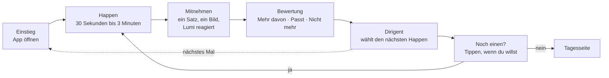
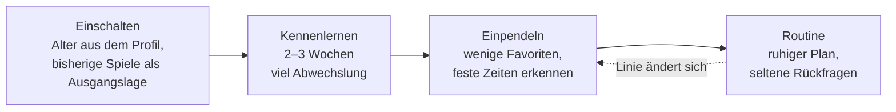
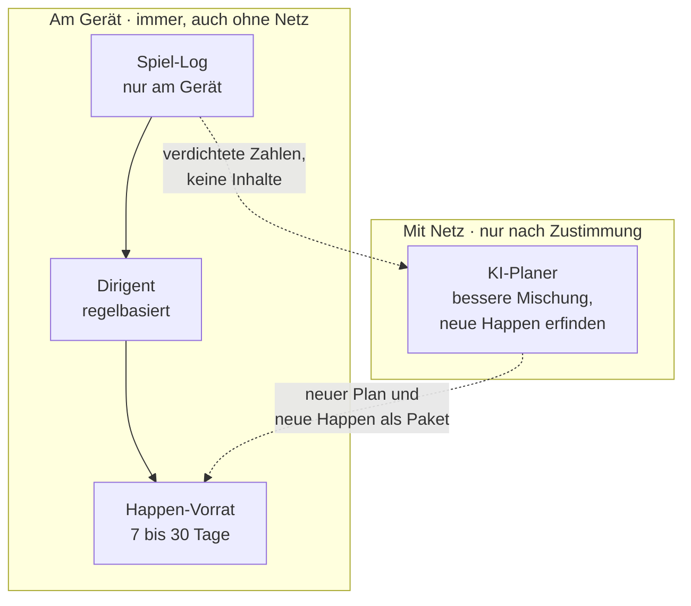

# OFFLINE – Pause: das Happen-Modul, Entertainment zuerst, Training als Wirkung

Name „Pause" (entschieden 04.10.2026) · Stand 04.10.2026 · Baut auf `OFFLINE-Gehirn-Fitness-Trainingsmodell.md` und `OFFLINE-Gehirntraining-Uebungskatalog.md` auf · Entwurf für Bill, Prioritäten setzt Mik

> **Nachtrag 04.10.2026:** Wie viel Zugkraft die Pause haben darf, regelt das Prinzip `OFFLINE-Prinzip-Milde-Zugkraft.md` (Ende, Gelingen, Mitnehmen, keine Hebel aus Angst oder Vergleich; Zielgröße ist das bessere Leben, nicht die Nutzungszeit).

## 1. Die Idee in einem Satz

Jedes Mal, wenn jemand in OFFLINE einsteigt, bekommt er einen **Happen**: eine kleine Auszeit mit etwas, das er mag, einem Ding, auf das er sich konzentriert, einem kleinen Gelingen und einem guten Gefühl, das er in die Wirklichkeit mitnimmt. Wer mehr will, bekommt mehr, und wer mit einem „i Like" eingreift, bestimmt die Linie.

**Ziele:** Motivation, Wohlfühlen, Selbstbestätigung. **Wirkung:** Dass dabei der Kopf trainiert wird, ist die Folge und nicht das Versprechen. Das passt auch zur Forschungslage: Spiele wirken vor allem durch das, was man übt, und die Übertragung ist klein (Simons 2016). Eine App, die Freude macht und nebenbei die Trainingsarten mischt, verspricht nichts, was sie nicht halten kann.

## 2. Der Name

**Entschieden von Mik am 04.10.2026: Pause.** „Happen" bleibt die Bezeichnung für die einzelne Einheit: In der Pause bekommt man Happen.

| Aspekt | Einschätzung |
|---|---|
| Klang | kurz, jeder kennt es, passt zu „der Realität einen Moment entfliehen" |
| Für | sagt genau, was das Modul ist: ein Moment Abstand; klingt nach Erholung und nicht nach Gehirnjogging |
| Zu beachten | „Pause" ist auch ein gewöhnliches Wort (Pausenwoche, Pausentaste); in Menüs und Texten daher klar als Eigenname setzen („Pause" mit großem P, Symbol dazu); Verfügbarkeit des Namens nicht geprüft |
| Untertitel (Vorschlag) | „ein Happen für zwischendurch" |

Die früher gesammelten Alternativen (Jause, Zeitinsel, Stube, Auszeit, Kaffeehaus, Verschnaufer, Kopfjause) bleiben als Reserve, falls der Name rechtlich oder im Gebrauch nicht trägt.

## 3. Wie das Modul funktioniert

### Der Happen

- **Länge:** 30 Sekunden bis 3 Minuten. Nie länger, ohne dass man verlängert.
- **Aufbau:** Einladung in einem Satz → ein Ding, auf das man sich konzentriert → ein Gelingen → ein kurzes Mitnehmen („Heute: drei von drei Pilzen") → fertig.
- **Gelingen vor Schwierigkeit:** Die Aufgabe liegt so, dass es meist klappt (Zone 2 aus dem Trainingsmodell, Startwert 75–85 % Treffer). Das ist zugleich das Rezept für das gute Gefühl.
- **Kein Falsch-Ton, keine rote Zahl.** Ein Happen endet immer freundlich.
- **Mitnehmen in die Wirklichkeit:** Gelegentlich ein kleiner Anker für draußen („Heute Abend: dreimal das Wort aus dem Happen benutzen").
- **Nicht jetzt:** Man kann jeden Happen ohne Folgen auslassen.

### Mehr Happen

Es gibt einen Regler **Appetit** (wenig, mittel, viel), den man selbst stellt und der auch aus dem Verhalten lernt. Wer „Noch einen" tippt, bekommt einen. Die Tagesschluss-Regel bleibt, wie bisher entschieden, **eine Einstellung des Nutzers**: Wann Schluss ist, stellt er selbst ein. Das Modul hat kein eigenes Tageslimit, keine Streaks und keine Pushnachrichten.

### Die Bewertung („i Like")

Nach jedem Happen ein Tipp, der überspringbar ist. Drei Knöpfe: **Mehr davon**, **Passt**, **Nicht mehr**. Gelegentlich dazu: **Zu leicht**, **Genau richtig**, **Zu schwer**, aber höchstens bei jedem fünften Happen.

- „Mehr davon" hebt das Spiel und verwandte Spiele an.
- „Nicht mehr" nimmt das Spiel aus der Auswahl, und zwar dauerhaft, bis der Nutzer es selbst zurückholt.
- „Zu leicht/zu schwer" stellt die Zone.
- Die **Seite „Deine Linie"** zeigt in einfachen Balken, was die App gelernt hat, und erlaubt jede Änderung direkt. Das ist die Gelernt-Schicht der Einstellungen: sichtbar, begründet, rückgängig.

## 4. Wie es startet: Einschalten, Kennenlernen, Routine

- **Einschalten** (Einstellungen → Module): Das Modul liest Alter und Spielhistorie aus dem Gerät und bestimmt den Lebensabschnitt (Jung, Mittel 1, Mittel 2, Alt) und die Ausgangslage.
- **Kennenlernen (etwa 2–3 Wochen):** Viel Abwechslung, jeder Happen ein Probierstück. Rückfragen **höchstens eine pro Tag**, kurz, überspringbar: „Wann passt dir so etwas?", „Lieber schneller oder ruhiger?", „Mehr Wörter oder mehr Zahlen?". Am Ende ein Satz: „So sehe ich dich", zurücksetzbar.
- **Einpendeln:** Die App erkennt Uhrzeiten, Lieblingsspiele und Tempo und baut den ersten stabilen Plan.
- **Routine:** Wenn jemand an etwa vier von sieben Tagen einsteigt (Annahme, zu testen), gilt die Routine als erreicht. Rückfragen werden selten (höchstens eine pro Woche).
- **Testphase:** Für das Modul selbst gibt es eine Testzeit mit wenigen Testern, bis sich eine Routine bildet und die Zahlen stimmen. Erst danach geht es in die Breite.

## 5. Der Dirigent: wie ein Happen ausgewählt wird

Eine Auswahlregel, die ohne KI läuft (Zustandslogik) und später von der KI verbessert wird.

| Eingang | Wofür |
|---|---|
| Alter und Lebensabschnitt | Ausgangsmischung nach Trainingsmodell |
| Spielhistorie: welches Spiel, wie oft, wie lange, abgebrochen, wiederholt | Vorlieben ohne Fragen |
| Ergebnisse: Trefferquote, Tempo | Zone steuern |
| Bewertungen (Mehr davon, Passt, Nicht mehr) | Linie |
| Tageszeit, Wochentag, Akku, Lage (Blackout) | passender Happen, kürzer bei Sparmodus |
| Rückfragen-Antworten | feine Einstellung |

**Mischung (Startwerte, zu testen):** rund zwei Drittel Vertrautes und Beliebtes, ein Viertel Verwandtes, ein Zehntel Überraschung. Der Nutzer kann die Überraschung per Regler „Vertraut ↔ Neues" verschieben.

**Hintergrundbilanz:** Der Dirigent achtet über Wochen darauf, dass die Trainingsarten des Plans (Tempo, Kraft/Abrufen, Ausdauer, Beweglichkeit, Koordination, Gruppe) vorkommen, **ausschließlich in Spielen, die der Nutzer mag**. Ein abgelehntes Spiel wird nicht untergeschoben. Fehlt eine Art, sucht der Dirigent eine andere Form derselben Art. Die Bilanz steht in der Seite „Deine Linie" in einfachen Worten („Ich achte darauf, dass auch schnelle Aufgaben vorkommen, weil du sie magst"). Das Modul wirbt nirgends mit Gehirntraining.

**Tauschregel:** Wie im Studio zählt die Trainingsart, nicht das einzelne Spiel. Jede Art hat mehrere Spiele, und wer ein Spiel nicht mag, tauscht es, ohne dass der Plan sich ändert.

## 6. Die KI im Hintergrund

Gewünscht: Die KI prüft laufend, solange Internet da ist, und startet das Modul auf Basis von Alter, Spielen und Ergebnissen.

- **Basis, ohne KI und ohne Netz:** Der Dirigent läuft regelbasiert am Gerät. Das reicht für die erste Version.
- **KI-Planer mit Netz, nur nach ausdrücklicher Zustimmung:** Sobald Internet da ist, kann ein KI-Planer den Plan verbessern und neue Happen erfinden (Rätsel, Geschichten, Wörter). Das Gerät sendet nur **verdichtete Zahlen** (zum Beispiel „Tempo-Quote 78 %, Wortspiele beliebt, abends aktiv"), keine Inhalte aus Tagebuch, Tresor oder Briefen. Der Planer liefert einen **Plan als Paket** zurück: die Happen der nächsten 7 bis 30 Tage, die das Gerät offline abspielt. Das passt zum Vorratsprinzip der Vorratskammer.
- **Geprüft vor dem Abspielen:** Von der KI erfundene Happen laufen durch dieselbe Prüfung wie Pakete (Paket-Kit) und eine Antwortprüfung, bevor sie im Vorrat landen.
- **Ohne Netz:** Läuft der Vorrat leer, wiederholt der Dirigent beliebte Happen in neuer Reihenfolge. Es gibt nie einen Stillstand.
- **Zur festen Regel „Keine Telemetrie über Inhalte":** Der Datenfluss zum KI-Planer berührt sie nur, wenn der Nutzer ihn einschaltet, und enthält keine Inhalte. Er gehört auf die Anwaltsliste und in die Einstellungen als eigener Schalter („Ich möchte, dass die App mit Netz dazulernt"). Standard ist aus.

## 7. Was ein Happen sein kann

Alles, was ohnehin geplant ist, wird Happen, ergänzt um ein paar neue Formen. Der Katalog bleibt die Quelle.

| Gruppe | Beispiele |
|---|---|
| **Spiel** | Wo war der Pilz?, Morsen, Karten, Schach-Zug, Wörter-Kaffeehaus |
| **Rätsel** | Tagesrätsel (bleibt eines), Stiegenrätsel, Speisekammer-Rätsel |
| **Wort** | Wort des Tages, Lumisch, Strophe, Zungenbrecher |
| **Geschichte** | Kapitel aus dem Roman der Woche, Eingebauter Fehler, Kettengeschichte |
| **Hand** | Zeichnen, Knoten, Papier falten, Rezept nur einmal |
| **Ruhe** | Atemfenster, Sonnenstand, Sternkarte |
| **Zu zweit** | Happen zu zweit am selben Gerät (Gruppenmodus aus dem Trainingsmodell), Fernschach über Mesh später |

Tagesrätsel und Schach laufen weiter als eigene Pakete. Ihre Ergebnisse gehen in das Spiel-Log.

## 8. Alter: wie das Modul sich anpasst

| Lebensabschnitt | Ton und Rhythmus | Mischung (Tendenz) |
|---|---|---|
| **Jung 14–29** | schnell, spielerisch, mit Duellen und kleinen Saisons | Tempo, Wörter, Neues, Wettstreit mit Freunden |
| **Mittel 1 30–49** | kurz, planbar, wenig Anspruch an Zeit | ein oder zwei Happen, Ruhe-Happen, Wörter, Rätsel |
| **Mittel 2 50–64** | neugierig, Schwerpunkt Neues | Neues Schwieriges, Karten, Sprachen, Tempo |
| **Alt 65+** | ruhig, verlässlich, gern gemeinsam | Tempo mit Auffrischung, Gruppen-Happen, Erinnerung auf Einladung, große Schrift, Vorlesen |

Unter 14 gilt der Kinder-Modus mit Elternregeln und Zeitbudget; das Happen-Modul richtet sich dort nach dem Kapitel 7c und nicht nach diesem Dokument.

## 9. Wie es zum Trainingsmodell passt

Das Trainingsmodell (Arten, Zonen, Wochenpläne, Kopf-Fitnesstest) bleibt, aber es wird zum **Hintergrundplan** des Dirigenten und tritt nicht mehr als Programm auf.

- Die **Kopfkarte** wird der erste Happen des Tages.
- Die **Zonen** sind das Mittel für das Gelingen.
- Der **Kopf-Fitnesstest** wird ein freiwilliger Happen („Mein Kopfprofil"), nur auf Wunsch.
- Der **Rückspiegel** („Das konntest du vor drei Monaten noch nicht") bleibt einmal im Monat als ruhige Karte.
- Aussagen zur Wirkung stehen in der Info der Seite „Deine Linie", nicht in der Werbung und nicht bei den Happen. Die erlaubten Sätze stehen im Trainingsmodell (Abschnitt 8).

## 10. Technik und Bauplan

- **Modulart:** `modul` nach dem Paket-Kit. Das Modul spricht nur über `window.offline`.
- **Neue Schnittstelle nötig:** Damit andere Spiele ihre Ergebnisse melden können, braucht `window.offline` eine neue Funktion, zum Beispiel `spiel.melden({ id, art, ergebnis, dauer })`, plus `spiel.liste()` für den Katalog. Das ist Sache von Code nach Freigabe durch Mik und Bill.
- **Spiele als Daten:** Jedes Spiel deklariert Trainingsarten, Dauer, Altersband, Zone-Parameter. Der Dirigent liest die Deklarationen.
- **Speicher:** Spiel-Log, Linie (Gewichte), Plan (Warteschlange) am Gerät, im Tresor-Verfahren; Export in offene Formate.
- **Stufe 1:** Dirigent regelbasiert, zwölf Happen-Formen (siehe Katalog), „i Like"-Knöpfe, Seite „Deine Linie", Kennenlernphase, Rückfragen.
- **Stufe 2:** KI-Planer mit Netz (nach Anwaltsfrage), erfundene Happen als Paket, Rückfragen in freien Worten bei Pro.
- **Stufe 3:** Gruppen-Happen am Gerät, später über Mesh, Saison für Junge, Rückspiegel.

## 11. Entscheidungen und Annahmen

**Von Mik festgelegt (04.10.2026):**

- Das Modul ist Entertainment, das Training ist die Wirkung.
- Es nutzt Alter und Spielergebnisse, startet mit einer Testphase bis zur Routine, stellt gelegentlich Rückfragen.
- Jeder Einstieg bringt einen Happen, der Nutzer bestimmt die Menge, und die „i Like"-Bewertung steuert die Linie.
- Die KI plant im Hintergrund, solange Internet da ist.

**Annahmen von mir, bewusst klein gehalten:**

- Der KI-Planer ist **ein ausdrücklicher Schalter**, standardmäßig aus, und bekommt nur verdichtete Zahlen. Das hält die feste Regel „Keine Telemetrie über Inhalte" ein.
- Das Modul hat **keine Streaks, keine Pushnachrichten und kein eigenes Tageslimit**. Der Tagesschluss bleibt Sache des Nutzers.
- Die Mischung (zwei Drittel Vertrautes), die Zonenquoten und die Routinegrenze (vier von sieben Tagen) sind Startwerte für die Testphase.
- Der Name „Pause" ist entschieden, seine Verfügbarkeit ist nicht geprüft.

**Bei Anwalt, Arzt und Bill:**

- Anwalt: Datenfluss zum KI-Planer, Rechtsgrundlage und Einwilligung, Kinder unter 16.
- Ärztliche Prüfung: Aussagen zu Schlaf, Bewegung, Hören, Erinnerungsarbeit.
- Bill: Aufnahme in `STATUS.md`, Auftrag für die Schnittstelle `spiel.melden`.
