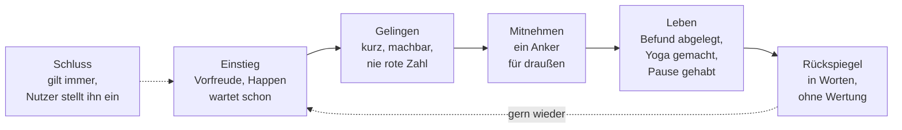

# OFFLINE – Prinzip: Milde Zugkraft

Wie die App gern gebraucht wird, ohne dass sie festhält · Stand 04.10.2026 · gilt für alle Module (Pause, Gesundheit, Morgengrauen, Spiele) · Entwurf für Bill, Prioritäten setzt Mik

## 1. Der Auftrag

**Entschieden von Mik am 04.10.2026:** Was Meta und TikTok an Bindung erzeugen, übernehmen wir in milder Form, und immer mit der Idee dahinter, dem Nutzer zu helfen, sein Leben zu verbessern. Das kann eine Pause sein, eine Arbeit wie das Hochladen von Blutwerten oder ein Gedanke über Yoga.

Der Unterschied liegt nicht in der Technik, sondern im Ziel. Die Plattformen messen Minuten, weil sie von Aufmerksamkeit leben. OFFLINE misst, ob am Ende etwas im Leben des Nutzers besser ist. Ein Happen, der nach zwei Minuten endet und einen Anker für den Abend mitgibt, ist für uns ein Erfolg. Für eine Plattform wäre er ein Verlust.

Gemessen wird am Punkt „Leben“, nicht am Punkt „Einstieg“.

## 2. Was den Plattformen vorgeworfen wird, und was wir daraus machen

Die Vorwürfe stammen aus den EU-Verfahren nach dem Digital Services Act und aus dem ersten US-Musterprozess (Stand 04.10.2026, alles vorläufig oder nicht rechtskräftig, Quellen am Ende). Die Spalte „Milde Form“ ist ein Vorschlag.

| Mechanik | Vorwurf an die Plattformen | Milde Form in OFFLINE | Was wir bewusst weglassen |
|---|---|---|---|
| Endlos-Scroll | kein natürliches Ende | Jeder Happen hat ein Ende. „Noch einen“ muss man selbst tippen. Nach der gewählten Menge sagt die App einmal freundlich „Das war’s für jetzt“. | ein Feed ohne Boden |
| Autoplay | das Nächste startet von selbst | Das Nächste liegt bereit, startet aber nie von allein. | automatisches Weiterspielen |
| Push-Nachrichten | Dopamin-Kicks, Rückholen | Kein Push. Die Vorfreude entsteht beim Öffnen: Die Tagesseite zeigt, was heute wartet. | Benachrichtigungen, die zurückholen |
| Variable Belohnung | Überraschung als Haken | Ein kleiner Überraschungsanteil (etwa jeder zehnte Happen) ist erlaubt, weil Entdecken Freude macht. Die Belohnung ist immer ein echter Fund oder ein Gelingen. | Glücksspiel-Mechanik, Beutekisten, zufällige Punkte |
| Empfehlungsalgorithmus | auf Verweildauer getrimmt | Der Dirigent wählt nach „Gelingen, Wohlbefinden, Linie des Nutzers“. Verweildauer ist keine Zielgröße. Alles steht sichtbar in „Deine Linie“. | Optimieren auf Minuten |
| Likes und Vergleich | Statusdruck, Vergleich | „i Like“ ist privat und dient nur der Steuerung. Gruppenspiele sind Zusammenspiel, kein Ranking. | öffentliche Zahlen, Ranglisten |
| Streaks und Verlustangst | Angst, den Faden zu verlieren | Keine Serien. Wer nach zwei Wochen zurückkommt, wird begrüßt, nicht ermahnt. | „Du hast X Tage verpasst“ |
| Nacht | Scrollen bis tief in die Nacht | Der Tagesschluss gilt, den der Nutzer selbst setzt. Nach Schluss gibt es höchstens ruhige Nacht-Happen. | nächtliche Anreize |
| Fehlende Bremsen | keine brauchbare Zeitkontrolle | Appetit-Regler, Tagesschluss, im Kinder-Modus das Zeitbudget der Eltern. Ein Wochenblick ohne Wertung: „Du warst an vier Tagen da.“ | Zeit als Kennzahl, die man verbessern soll |

## 3. Drei Beispiele aus Mik

### Pause

Der Happen ist eine kurze Flucht aus der Wirklichkeit mit Gelingen und einem Mitnehmen. Der Zug entsteht, weil es sich gut anfühlt, nicht weil etwas fehlt, wenn man nicht kommt. Siehe `OFFLINE-Modul-Pause-Konzept.md`.

### Blutwerte hochladen

Heikel, weil hier Angst ein starker Hebel wäre („Dein Wert ist auffällig!“). Den Hebel nehmen wir nicht.

- **Eine Arbeit, die klein anfängt und gelingt.** „Hol deinen letzten Befund heraus“ ist ein Auftrag mit einem Ende: Foto machen, die ausgelesenen Werte neben dem Original bestätigen, fertig. Danach sagt die App, was geschafft ist („Zwölf Werte abgelegt“), ohne etwas zu bewerten.
- **Zug durch Nutzen, nicht durch Druck.** Der Rückspiegel zeigt Verläufe in Worten („Dein Ruhepuls liegt seit März tiefer“). Er sagt nicht, ob das gut oder schlecht ist, wo das ein Arzt beurteilen muss.
- **Fälligkeiten wie bei „Bereit“.** Der Bereit-Wert zeigt, was Zeit braucht. Das passt zu Vorsorge und Befunden, bleibt aber leise, ohne Alarm und ohne Rot.
- **Gesundheitsdaten werden nie zum Spielstoff.** Keine Punkte, keine Serien, keine Belohnung dafür, möglichst viele Werte einzutragen.

Die harten Grenzen des Gesundheitsmoduls bleiben unverändert (keine Diagnose, kein Heilungsversprechen, bei Notfall sofort 144). Siehe `OFFLINE-Gesundheitsmodul-Konzept.md`.

### Über Yoga nachdenken

Das ist die leiseste Form: ein Gedanke am Morgen, kein Pflichtprogramm. „Was wäre heute dein Yoga?“ als Einladung im Morgengrauen-Ritual, mit einem kleinen Anker („Heute Mittag zwei Minuten Schultern kreisen“). Am Abend schaut Lumi, ob er hielt, und wertet es nicht.

## 4. Fünf Prüffragen für jede neue Funktion

1. **Ende:** Hat es ein Ende, das man spürt?
2. **Leben:** Ist am Schluss etwas im Leben des Nutzers besser, nicht nur in der App?
3. **Ruhige Stunde:** Würde er die Funktion in einer ruhigen Stunde gutheißen, wenn man sie ihm erklärt?
4. **Ohne Hebel:** Kommt sie ohne Angst, Scham, Verlust oder Vergleich aus?
5. **Sichtbar:** Zeigt „Deine Linie“, was die App daraus gelernt hat, und lässt sich jede Annahme ändern?

Fällt eine Frage durch, wird die Funktion umgebaut oder gestrichen.

## 5. Warum „mild“ hier glaubwürdig ist

Ein wesentlicher Grund für das Verhalten der Plattformen ist ihr Geschäftsmodell: Werbung verkauft Verweildauer. OFFLINE verkauft Inhalte, Freischaltungen und später Pakete, und der Nutzer zahlt für Nutzen, nicht für Minuten. Eine Funktion, die ihn länger festhält, bringt uns kein Geld. Deshalb kann die Zielgröße „besseres Leben“ ehrlich sein. Damit das so bleibt, gilt:

- Keine Werbung und keine Weitergabe von Verhaltensdaten (bleibt Festregel, nichts verlässt das Gerät).
- Keine Optimierung auf Nutzungszeit, auch nicht im Hintergrund oder im KI-Planer.
- Der KI-Planer bekommt nur verdichtete Spielzahlen, nie Gesundheitsdaten.

## 6. Grenzen und Vorsicht

- **Kinder-Modus** bleibt strenger (Zeitbudget der Eltern, Tagesschluss, Kapitel 7c des Gesamtkonzepts). Milde Zugkraft gilt dort nur im Rahmen dieser Regeln.
- **Das Wort „süchtig“** bleibt intern ein Arbeitsbegriff für „gern wiederkommen“. In Texten für Nutzer, Presse und Behörden sagen wir „Vorfreude“ und „Lust zurückzukehren“, weil „süchtig machen“ rechtlich und im Ruf genau der Vorwurf ist, den wir nicht tragen wollen.
- **Eigene Prüfung:** Die EU-Verfahren zeigen, wo Behörden die Linie ziehen (Endlos-Scroll, Autoplay, Push, Verweildauer-Empfehlung). Wir bleiben deutlich diesseits davon. Ob das für ein Modul, das der Nutzer selbst einschaltet, in allen Fällen reicht, ist eine Frage für den Anwalt.
- **Wirkung ist nicht bewiesen.** Dass milde Zugkraft Routinen und Wohlbefinden stärkt, ist eine Annahme, die mit den Testern geprüft wird. Gemessen wird am Mitnehmen („habe ich es getan?“), nicht an Minuten.

## 7. Offen

- Wie der Wochenblick „Du warst an vier Tagen da“ genau formuliert wird, damit er nicht nach Zielvorgabe klingt.
- Ob eine vom Nutzer selbst gesetzte Erinnerung (lokaler Wecker, kein Push) erlaubt ist. Vorschlag: nur auf ausdrücklichen Wunsch, einmal pro Tag, vom Nutzer jederzeit änderbar. Entscheidet Mik.
- Anwaltsfrage dazu (Ergänzung zu den bestehenden): Reicht die Gestaltung nach diesem Prinzip aus, damit ein Modul nicht als „süchtig machendes Design“ im Sinn des DSA gilt?

## Quellen

- EU-Kommission, vorläufige Feststellung zu TikTok vom Februar 2026: [Matheson, EU Commission finds platform’s addictive design breaches DSA](https://www.matheson.com/insights/eu-commission-finds-platforms-addictive-design-breaches-dsa/)
- EU-Kommission zu Instagram und Facebook, vorläufige Feststellung vom 10. Juli 2026: [drweb.de](https://www.drweb.de/eu-kommission-instagram-und-facebook-verstossen-mit-suechtig-machendem-design-gegen-den-dsa/)
- US-Musterprozess, TikTok vergleicht sich im Januar 2026: [Rolling Stone](https://ca.rollingstone.com/tiktok-settles-landmark-social-media-addiction-trial/)
- Urteil gegen Meta und YouTube im März 2026, 6 Millionen Dollar Schadenersatz, Rechtsmittel angekündigt: [Al Jazeera](https://www.aljazeera.com/news/2026/3/26/jury-finds-meta-youtube-liable-for-social-media-addiction-what-we-know)
- Projektdokumente: `OFFLINE-Modul-Pause-Konzept.md`, `OFFLINE-Gehirntraining-Uebungskatalog.md`, `OFFLINE-Gesundheitsmodul-Konzept.md`, `OFFLINE-Gesamtkonzept.md`
