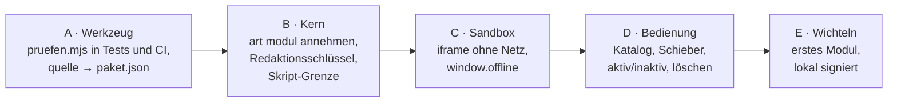

# Auftrag: Paket-Kit-Werkzeug und Module, vom Quellordner bis zum laufenden Wichteln

**Von:** Bill · **Datum:** 2026-09-29 · **Dringlichkeit:** hoch (Miks Priorität für den nächsten Bauauftrag)

## Ziel
Am Ende gibt es einen durchgehenden Weg: Ein Herausgeber gibt einen Quellordner ab, `pruefen.mjs` prüft ihn, Code baut und signiert ihn, und die App zeigt ihn im Katalog. Ist er ein Modul, lädt man es mit dem grünen Schieber, schaltet es aktiv oder inaktiv und kann es löschen. Es läuft in der Sandbox und spricht nur über `window.offline`. Der Beweis ist Wichteln, das so in der Desktop-App läuft. Fertig ist es, wenn Wichteln lokal aus dem Katalog geladen, gespielt, ausgeschaltet und gelöscht werden kann und alle Tests grün sind.

## Hintergrund
- `docs/PAKET-KIT.md` (maßgeblich), `paket-kit/` (Werkzeug für Herausgeber, Beispiel Wichteln)
- `docs/SICHERHEIT.md`, Abschnitt Module, gilt seit 29.09. mit den drei Bedingungen
- `bill/erledigt/2026-09-29-freigabe-module-bill-an-code.md` mit Miks Vorgaben zur Bedienung
- Der Auftrag `2026-09-29-abgleich-bill-an-code.md` (Berichte, Nachtrag im Pflichtenheft) kommt **zuerst**, weil Phase A auf dem Nachtrag aufbaut.

## Umfang: fünf Phasen, nach jeder eine kurze Rückmeldung

**A · Werkzeug**
- `paket-kit/pruefen.mjs` läuft in `werkzeug/test.mjs` und in der CI gegen `paket-kit/beispiel/wichteln` und `paket-kit/vorlage`.
- Nachtrag aus dem Abgleich umsetzen: Notrufhinweis bei Notfallinhalten ist Pflicht (Fehler, wenn er fehlt), `quellen[].id` wird geprüft.
- `werkzeug/paket.mjs bauen` nimmt einen Quellordner mit `paket.quelle.json` an und erzeugt daraus das `paket.json` im bestehenden Format 1 (sha256 je Datei, Signatur). Nimm die Befehle aus Abschnitt 9 des Pflichtenhefts als Abnahme.
- `kategorie` und `alter_ab` für `at-basis` (`ernstfall`, 0) und `wir` (`miteinander`, 0) nachtragen.
- `paket-kit/PFLICHTENHEFT.md` an `docs/PAKET-KIT.md` angleichen, jetzt, wo das Repo die Grundlage ist.

**B · Kern (Rust)**
- `art = "modul"` wird angenommen, aber nur, wenn es mit dem **Redaktionsschlüssel** signiert ist und `pruefstatus: redaktion` trägt. Mit dem Katalogschlüssel signierte Module lehnt der Kern ab.
- Der Kern lehnt jedes `modul`-Paket ab, das außerhalb von `inhalt/modul/` Skripte enthält (`.js`, `.mjs`, `<script>` in HTML).
- Größengrenze für die Oberfläche: 2 MB.
- Der Redaktionsschlüssel wird angelegt. **Der private Schlüssel kommt nie ins Repo.** Schlag Mik vor, wo er liegt (wie der Katalogschlüssel) und frag, bevor du ihn in Secrets legst.

**C · Sandbox und `window.offline`**
- Ein Modul läuft in einem `iframe` mit `sandbox="allow-scripts"`, ohne `allow-same-origin`, mit einer eigenen CSP ohne Netz (`default-src 'none'`, nur eigene Dateien, keine `connect-src`).
- `window.offline` wird im Modul durch eine kleine Brücke per `postMessage` bereitgestellt. Die App prüft jede Nachricht (Herkunft, Aufruf aus der Liste in Abschnitt 5, Größe der Daten) und verwirft alles andere.
- Umfang der Brücke genau nach Abschnitt 5: `speicher.lesen/schreiben` (je Modul getrennt, am Gerät), `vorlesen`, `drucken`, `wesen.sagen` (nur wenn Lumi eingeschaltet ist), `alter()`, `version`. Nichts darüber hinaus.
- Tests: Ein bösartiges Testmodul versucht `fetch`, den Zugriff auf `parent`, das Lesen des Tresors, fremden Speicher und einen unbekannten Aufruf. Alles muss scheitern. Dieses Testmodul gehört in die CI.
- Klär, ob die Tauri-Webview auf allen drei Desktop-Systemen die Sandbox und CSP gleich durchsetzt. Das Ergebnis kommt in die Rückmeldung, auch für das spätere Handy (iOS erlaubt nachgeladenes JavaScript nur in einer Web-Ansicht, die den Zweck der App nicht ändert).

**D · Bedienung (Miks Vorgabe)**
- Katalogeintrag: Titel, Beschreibung, Vorschau-Slider (Folien aus `inhalt/vorschau/`).
- Grüner Schieber „laden“ erscheint nur, wenn man das Recht dazu hat. Im Moment haben es alle, das Rechtemodell (Kauf oder Abo) ist offen. Bau es so, dass später eine Prüfung davorgesetzt werden kann.
- Nach dem Laden verschwindet der Schieber, an seine Stelle treten der Schalter aktiv/inaktiv und der Knopf „löschen“.
- Inaktiv heißt: Das Modul wird nicht geladen und läuft nicht. Der Speicherplatz bleibt belegt.
- Löschen in zwei Schritten: Knopf klicken, dann das Wort „löschen“ eintippen. Beim Löschen fragt die App, ob die Daten des Moduls mitgelöscht werden sollen.
- Handy zuerst: bei 360 Pixel Breite bedienbar, Knöpfe mindestens 44 Pixel.

**E · Wichteln**
- Wichteln aus `paket-kit/beispiel/wichteln` durch den ganzen Weg schicken: prüfen, bauen, mit dem Redaktionsschlüssel signieren, lokal im Katalog anbieten, laden, spielen, ausschalten, löschen.
- **Nicht hochladen** auf Hetzner und nicht in den öffentlichen Katalog, bis Mik es freigibt.

**Ausdrücklich nicht dabei:** die 180 Tipps, der Bereit-Patch, Community-Module, Handy-Bau, Bezahlung und Rechte.

## Prüfung
- `node werkzeug/test.mjs` grün, inklusive `pruefen.mjs` und dem bösartigen Testmodul.
- Ablauf in der Desktop-App am Mac als kurze Bildschirmaufnahme oder Screenshots in der Rückmeldung: Katalog, laden, spielen, inaktiv, löschen.
- Version hochzählen und im Changelog festhalten.

## Offene Fragen
- **Darf Code selbst entscheiden:** Aufbau der Brücke, Dateinamen, wie die Tests aussehen, die Reihenfolge innerhalb einer Phase.
- **Fragen, bevor es weitergeht:** alles, was eine der drei Bedingungen aufweicht; wo der private Redaktionsschlüssel liegt; wenn die Webview auf einem System die Sandbox nicht sicher durchsetzt. Dann Phase C anhalten und melden.
- Nach jeder Phase eine kurze Rückmeldung in `bill/rueckmeldung/`. Weiterarbeiten ohne Warten, außer bei den Punkten oben.
