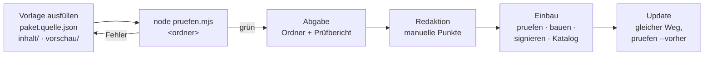

# OFFLINE – Pflichtenheft für Pakete

*Paket-Kit, Version 1 · Stand 29.09.2026, mit Nachtrag (Abnahme, Quellen-`id`, Notrufhinweis) und Prüfprogramm im Repo · gilt für neue Pakete und für jedes Update*

**Maßgeblich ist diese Fassung.** `paket-kit/PFLICHTENHEFT.md` ist die Kopie für Herausgeber, die ohne das Repo arbeiten. Weichen beide ab, gilt dieses Dokument. Die Kopie ist wortgleich und wird bei jeder Änderung mitgezogen; `werkzeug/test.mjs` prüft das.

Dieses Heft sagt, was ein Paket enthalten muss, damit es in OFFLINE eingebaut werden kann. Wer ein Paket liefert (Redaktion, Entwickler, später Herausgeber am Marktplatz), füllt die Vorlage aus und lässt das Prüfprogramm laufen. Erst wenn das Prüfprogramm keinen Fehler meldet, geht das Paket an den Einbau. Der Einbau prüft noch einmal mit demselben Programm, baut das Paket mit `werkzeug/paket.mjs bauen`, signiert es und nimmt es in den Katalog.

Das technische Format des fertigen, signierten Pakets steht in `docs/PAKETFORMAT.md`. Dieses Heft beschreibt die Stufe davor: den **Quellordner**, den man abgibt.



## 1. Was man abgibt

```
<id>/
├── paket.quelle.json        Angaben zum Paket (Pflicht)
├── LIESMICH.md              für die Redaktion: was, warum, wie geprüft (Pflicht)
└── inhalt/                  alles, was in die App kommt (Pflicht)
    ├── vorschau/            die Slideshow für die Paketseite (Pflicht)
    │   ├── folien.json
    │   ├── 1.svg … 5.svg    (oder .webp / .png)
    ├── …                    Inhalte (Texte, Daten, Bilder)
    └── modul/               nur bei art = "modul": die Oberfläche
        └── index.html
```

Alles unter `inhalt/` wird signiert und ausgeliefert. Alles außerhalb bleibt bei der Redaktion.

## 2. `paket.quelle.json`

| Feld | Pflicht | Regel |
|---|---|---|
| `id` | ja | `[a-z0-9-]{2,40}`, bleibt über alle Versionen gleich |
| `titel` | ja | höchstens 60 Zeichen |
| `beschreibung` | ja | ein bis zwei Sätze, höchstens 240 Zeichen |
| `art` | ja | `inhalt`, `zim`, `karte`, `modell`, `kurs`, `software`, `modul` (Paket mit eigener Oberfläche, siehe 5) oder `skin` (Aussehen, siehe 5a) |
| `sprache` | ja | BCP-47, meist `de-AT` |
| `lizenz` | ja | z. B. `CC BY-SA 4.0`, `gemeinfrei`, `eigene Rechte` |
| `herausgeber` | ja | wer verantwortet den Inhalt |
| `quellen` | ja | Liste mit `id`, `name` und `url` (url darf leer sein, wenn es keine gibt). `id` ist kurz, `[a-z0-9-]`, eindeutig im Paket und geht unverändert in `paket.json` über. Schritte und Einträge in den Inhalten verweisen mit `quelle: "<id>"` auf sie, damit die Schlüssel nicht nur im Bauskript stehen |
| `pro` | ja | `true` oder `false` |
| `preis` | ja | `gratis`, `pro` oder `kauf` |
| `pruefstatus` | ja | `redaktion`, `herausgeber` oder `community` |
| `app_min` | ja | kleinste App-Version, z. B. `0.1.0`; Module und Skins mindestens `0.2.0`. Ab App 0.2.0 lädt die App kein Paket, dessen `app_min` über ihrer Version liegt. |
| `aenderungen` | ja | was neu ist, in einem Satz für „Was ist neu?" |
| `alter_ab` | ja | ab welchem Alter das Paket im Kinder-Modus sichtbar ist: `0` für alle, `6`, `10`, `14`, `18` |
| `kategorie` | ja | eine der Gruppen der Paketseite: `ernstfall`, `wissen`, `jeden-tag`, `du-und-die-deinen`, `unterwegs`, `verbindung`, `miteinander`, `aussehen` |
| `braucht_netz` | ja | `false`. Ein Paket, das Netz braucht, ist kein OFFLINE-Paket. Ausnahme nur mit Begründung im LIESMICH |
| `abnahme` | ja | `keine`, oder wer fachlich abgenommen hat bzw. abnehmen muss (`Feuerwehr`, `Rettung`, …) und der Stand (`angefragt`, `erteilt am …`). Dieses Feld führt. Ein Feld `fachlich_abgenommen` in einzelnen Inhalten (etwa im Guide-Format) zeigt höchstens den Stand je Inhalt an und ersetzt `abnahme` nie |
| `ki_generiert` | bei `skin`, sonst nein | `true`, wenn Bilder oder andere Inhalte mit KI erzeugt sind. Die Katalogkarte zeigt dann „Bilder KI-generiert, Herkunft im Paket“; die Herkunft (Modell, Datum, Prompts) liegt im Paket |
| `datenversion` | bei `modul` | ganze Zahl, beginnt bei 1. Erhöhen, wenn sich das Format gespeicherter Nutzerdaten ändert (siehe 7) |
| `bereich` | nein (nur `modul`) | `pause`: die App zeigt die Spiele des Moduls als Formen in Pause; dazu `inhalt/pause-formen.json`. Ab `app_min` 0.6.5 |
| `wasm` | nein (nur `modul`) | `true`, wenn das Modul WebAssembly ausführt. Nur für Module der Redaktion (eigener Herausgeber); ohne Anmeldung sperrt die Sandbox es. Ab `app_min` 0.6.5 |

## 3. Die Slideshow `inhalt/vorschau/`

Jedes Paket hat genau **fünf Folien, immer in derselben Reihenfolge**, damit man Pakete vergleichen kann:

| Nr. | `rolle` | zeigt |
|---|---|---|
| 1 | `wofuer` | die Lage, für die das Paket gemacht ist, mit einem Satz |
| 2 | `aussehen` | einen echten Bildschirm aus dem Paket |
| 3 | `inhalt` | was drin ist, höchstens sechs Punkte |
| 4 | `platz` | Größe, Gerät (Handy / Laptop), ob mit KI |
| 5 | `herkunft` | Herausgeber, Quellen, Prüfstatus, Lizenz |

`folien.json`:

```json
{ "folien": [
  { "nr": 1, "rolle": "wofuer", "bild": "1.svg", "titel": "…", "text": "…", "alt": "…" }
] }
```

Regeln: Titel höchstens 50 Zeichen, Text höchstens 160, `alt` (Bildbeschreibung zum Vorlesen) Pflicht. Alle fünf Bilder zusammen höchstens 200 kB. Keine Schrift als Bild ohne dieselbe Aussage im Text.

## 4. Regeln für alle Inhalte

1. **Kein Netz.** Kein Inhalt lädt etwas nach. Keine Links auf Bilder, Schriften oder Skripte im Internet. Links zum Weiterlesen in Texten sind erlaubt, die App zeigt sie als „braucht Netz".
2. **Erlaubte Dateitypen:** `.json .md .txt .html .css .js .svg .png .webp .jpg .mp3 .ogg .pdf .zim .pmtiles .gguf .woff2 .woff`. Alles andere nur mit Begründung. **Code nur in Modulen:** `.js` und Skripte in `.html`/`.svg` (`<script>`, `on…=`-Attribute, `javascript:`) sind nur bei `art = "modul"` und nur unter `inhalt/modul/` erlaubt (`docs/SICHERHEIT.md`, Grundsatz 2).
3. **Pfade:** nur Kleinbuchstaben, Ziffern, `-`, `_`, `.`, `/`. Keine Leerzeichen, kein `..`, keine versteckten Dateien, keine Verknüpfungen.
4. **Sprache:** kurze Sätze, ein Gedanke pro Satz, österreichische Begriffe (Jänner, Rettung 144). Keine Werbung, keine Floskeln.
5. **Notfallinhalte:** Jede Anleitung für den Ernstfall beginnt mit „Ist jemand in Gefahr?" und der Notrufnummer. Dieser Notrufhinweis ist ein Pflichtfeld jeder Notfallanleitung; fehlt er, ist das ein Fehler, kein Hinweis. Sie ist fester Text, keine KI. Ohne Abnahme bleibt sie im Status `angefragt` und die App zeigt das an.
   - **Feld:** `"notruf": { "frage": "Ist jemand in Gefahr?", "nummer": "144" }` auf oberster Ebene der Anleitung. `frage` wörtlich so, `nummer` drei bis fünf Ziffern.
   - **Als Notfallanleitung gilt** (so erkennt es das Prüfprogramm): jede JSON-Datei mit `"typ": "guide"` oder `"nachschlage-guide"` in einem Paket der Kategorie `ernstfall`, und jede JSON-Datei mit `"notfall": true`, egal in welcher Kategorie. Anleitungen, die das Programm so nicht erkennt, prüft die Redaktion.
6. **Barrierefreiheit:** Jeder Text muss vorlesbar sein (kein Text nur in Bildern). Kontrast bei eigener Gestaltung mindestens 4,5 : 1.
7. **Kinder:** Pakete mit `alter_ab` unter 18 enthalten keine Kontaktmöglichkeit zu Fremden und keine Links nach außen.
8. **Quellen und Lizenz** stehen vollständig in `paket.quelle.json`. Was nicht gemeinfrei, offen lizenziert oder eigenes Werk ist, kommt nicht hinein.

## 5. Zusätzlich für `art = "modul"`

Ein Modul ist ein Paket mit eigener Oberfläche, etwa Wichteln, ein Rätsel oder ein Spiel. Es läuft in der App in einem abgeschlossenen Bereich (Sandbox) ohne Netz.

1. **Einstieg:** `inhalt/modul/index.html`. Alles, was es braucht, liegt in `inhalt/modul/`. Keine Bibliotheken aus dem Internet; wer eine braucht, legt sie als Datei dazu, mit Lizenz.
2. **Verboten** (das Prüfprogramm sucht danach): `fetch`, `XMLHttpRequest`, `WebSocket`, `EventSource`, `sendBeacon`, `eval`, `new Function`, `importScripts`, externe `src=`/`href=`, `<iframe>`, `window.open`, `RTCPeerConnection`/`RTCDataChannel` (WebRTC geht an der Netzsperre vorbei).
3. **Schnittstelle zur App:** Das Modul spricht nur über `window.offline` mit der App.

| Aufruf | Was |
|---|---|
| `offline.speicher.lesen(schluessel)` / `.schreiben(schluessel, wert)` | Daten des Moduls speichern, nur für dieses Modul, am Gerät, im Schließfach mitgesichert |
| `offline.vorlesen(text)` | Text vorlesen lassen |
| `offline.drucken(html)` | Druckansicht öffnen (Karten, Zettel) |
| `offline.wesen.sagen(text)` | das Wesen sagt einen Satz (nur, wenn das Paket „Wir" aktiv ist) |
| `offline.spiel.melden({ id, art, ergebnis, dauer })` | ab App 0.4.0: ein Spielergebnis ins Spiel-Log am Gerät (für Pause). `id` a–z, 0–9, - (höchstens 40), `art` eine bis drei von `tempo`, `kraft`, `ausdauer`, `beweglichkeit`, `koordination`, `gruppe`, `ergebnis` höchstens 12 Felder mit Zahl, ja/nein oder Text bis 80 Zeichen (zusammen höchstens 1 kB), `dauer` in Sekunden. Kein Feld für das Modul: das setzt die App. Höchstens 10 Meldungen je Minute. |
| `offline.spiel.liste()` | ab App 0.4.0: die eigenen Einträge im Spiel-Log (nie die anderer Module oder der Pause), ohne Daten im Aufruf |
| `offline.alter()` | Altersstufe im Kinder-Modus oder `null` |
| `offline.version` | App-Version |

Für die Entwicklung im Browser bringt das Modul einen **Ersatz** mit (`if (!window.offline) window.offline = …` mit `localStorage`), damit man es ohne App testen kann. `localStorage` direkt zu verwenden ist sonst nicht erlaubt.

4. **Größe:** Oberfläche höchstens 2 MB.
5. **Handy zuerst:** muss bei 360 Pixel Breite bedienbar sein, Knöpfe mindestens 44 Pixel hoch.

## 5a. Zusätzlich für `art = "skin"` (Aussehen)

Ein Skin ändert, wie die App aussieht, und sonst nichts. Die App hat ohne Skin ein vollständiges, schlichtes Grundaussehen. Es ist höchstens ein Skin aktiv; Notfallseiten zeigen immer das Grundaussehen.

1. **Einstieg:** `inhalt/skin/skin.css`. Alles liegt unter `inhalt/skin/` (dazu die Slideshow unter `inhalt/vorschau/`). Erlaubt sind nur `.css .woff2 .woff .webp .png .jpg .svg .md .txt .json` – Stil, Schriften, Bilder, Lizenzen, Herkunft. Zusammen höchstens 20 MB.
2. **Kein Code:** keine `.js`, kein HTML, SVG ohne Skript (wie bei allen Paketen außer Modulen).
3. **CSS-Regeln** (gelten für jede `.css` in jedem Paket außer in Modul-Oberflächen; Prüfprogramm und App prüfen sie): kein `@import`; `url()` nur relativ und im Paket (kein Schema, kein `//`, kein `/` am Anfang, kein `..`; erlaubt ist `data:image/…` und `data:font/…`); kein `expression()`, `javascript:`, `behavior:`, `-moz-binding`; keine Backslash-Escapes.
4. **Schnittstelle zur App:** die Klassen mit dem Präfix `of-` im Markup (`of-app` am `<body>`, `of-karte`, `of-btn`, `of-btn--primaer`, `of-plakette`, `of-input`, `of-seitenleiste`, `of-inhalt`, `of-seitenkopf` …) und die Grundwerte der App (`--bg`, `--surface`, `--text`, `--muted`, `--line`, `--accent`, `--ok`, `--warn`, `--radius`, `--font` …), die ein Skin auf `.of-app` neu setzen kann. Bilder kommen als Hintergrund über `url()`, nie als Markup.
5. **Kennzeichnung:** `ki_generiert` ist Pflicht; bei `true` liegt die Herkunft im Paket.
6. **Signatur:** Skins signiert der Paketschlüssel oder der Redaktionsschlüssel.

## 5b. Zusätzlich für `art = "tage"` (Tagesinhalte)

Tagesinhalte füllen die Vorratskammer der Tagesseite: Rätsel, Kapitel, Textkarten, später Lektionen. Die App lädt sie im Voraus und schaltet jeden Tag einen frei.

1. **Bereich:** in `paket.quelle.json` das Feld `tage`, entweder `{ "von": "JJJJ-MM-TT", "bis": "JJJJ-MM-TT" }` oder `{ "von_tag": 1, "bis_tag": n }`. Höchstens ein Jahr.
2. **Inhalt:** `inhalt/tage.json` nach dem Format in `paket-kit/tage-format.mjs` (Tage nach Datum oder Tagnummer, je 1 bis 6 Karten: `raetsel`, `kapitel`, `text`, `lektion`; ein Rätsel mit eindeutiger Kurzantwort bekommt `antworten`, eine nicht leere Liste der gültigen Varianten, Erklärrätsel keine). Dazu nur `.md`/`.txt`. Keine Bilder, kein Code, höchstens 20 MB. `app_min` mindestens `0.3.0`.
3. **Keine Vorschau-Folien nötig:** Die Tagesseite ist die Vorschau.
4. **Fremde Texte:** Romane und andere Werke nur, wenn der Autor vor 1956 gestorben ist und die Ausgabe keine eigenen Rechte hat (keine Übersetzung, keine neue Bearbeitung). Quelle und Vorlage je Werk in `inhalt/herkunft.md`. Historische Schreibweisen bleiben, wie sie in der Vorlage stehen.
5. **Rätsel:** eigene Texte. Bekannte Denkaufgaben neu erzählen, keine fremden Rätseltexte übernehmen. Lösungen nachrechnen.

## 5d. Pause-Inhalte (`inhalt/pause.json`, Paket „pause“)

Daten für die Happen der Pause (App ab 0.4.0, `app_min` mindestens `0.4.0`), Format und Prüfung in `paket-kit/pause-format.mjs`: `{ "format": 1, "formen": [ … ], "fehler": [ … ], "lumisch": { "plan": [ … ], "woerter": [ … ] }, "texte": { … } }`. Jede Form beschreibt sich selbst: `id`, `titel`, `einladung` (ein Satz), `gruppe` (spiel, raetsel, wort, geschichte, ruhe, hand, zu-zweit), `art` (Trainingsarten wie bei `offline.spiel`), `dauer` `{ von, bis }` in Sekunden (ein Happen höchstens 3 Minuten), `alter` (J, M1, M2, A), `tageszeit` (jederzeit, morgen, abend), optional `zone` `{ stufen, start }`, `braucht` (roman, gestern), `auffrischung_monate`, `herkunft`. Eine Form, die die App noch nicht spielen kann, trägt `bedingung: { funktion: "…" }` und wartet, wie bei den Tipps. Die Spiele sind Teil der App, das Paket liefert nur Text.

## 5c. Lumi-Tipps (`inhalt/tipps.json`, Paket „wir“)

`{ "tipps": [ { id, sorte, text, gewicht?, bedingung?, ziel?, buch? } ] }`, Format und Prüfung in `paket-kit/tipps-format.mjs`. Sorten: app, alltag, wissen, weisheit, laune, heute, digital. `ziel` (optional) ist die Stelle der App für den Knopf „Zeig mir“ und muss in der Liste `ZIELE` stehen (Seiten wie `tresor`, `vorsorge`, `bibliothek`, `werkzeuge` und Abschnitte der Übersicht `tagesplan`, `lumi`, `lumi-log`); wo ein Ziel nicht eindeutig ist, keins setzen. `buch` (optional) ist ein Absatz im „Lumi-Buch“ in der Form `b1-03-07` (App ab 0.5.0: Link „Aus dem Lumi-Buch“); liegt das Paket `lumi-buch` daneben, prüft das Kit, dass es den Absatz gibt. Bedingungen sind Daten mit festem Wortschatz (`docs/WESEN.md`).

## 5e. Lumi-Buch (`inhalt/buch.json`, Paket „lumi-buch“)

Ein Band je Paket (App ab 0.5.0, `app_min` mindestens `0.5.0`), Format und Prüfung in `paket-kit/buch-format.mjs`: `{ "format": 1, "band": 1, "titel", "untertitel"?, "hinweis", "kapitel": [ { "nr", "titel", "absaetze": [ { "id": "b1-01-01", "text" } ] } ] }`. Kapitel in Reihenfolge ab 1, Absatznummern lückenlos `b<Band>-<Kapitel>-<Absatz>`. Der `hinweis` steht auf der Titelseite und enthält „Eine erfundene Geschichte“. Liegt das Paket `wir` daneben, prüft das Kit, dass jeder Absatz mindestens einen Tipp hat. Lesbar wird ein Absatz erst in der App, wenn man ihn unter einem Satz der Lumi öffnet; das Paket liefert nur Text.

## 6. `LIESMICH.md`

Für die Redaktion, nicht für Nutzer. Pflichtabschnitte: **Was** (zwei Sätze) · **Für wen** · **Wie geprüft** (was hat man selbst ausprobiert, auf welchen Geräten) · **Offene Punkte** · bei Updates: **Was hat sich geändert**.

## 7. Updates

Ein Update ist derselbe Weg mit einem Zusatz: `node pruefen.mjs <neu> --vorher <alt>`.

1. `id` bleibt gleich.
2. `aenderungen` ist neu geschrieben und sagt, was sich für den Nutzer ändert.
3. Entfernte Dateien werden gelistet. Die Redaktion bestätigt, dass nichts wegfällt, worauf sich Nutzer verlassen.
4. Bei Modulen: Hat sich das Format gespeicherter Daten geändert, wird `datenversion` erhöht **und** `inhalt/modul/migration.js` liegt bei. Das Modul muss Daten der Vorversion lesen können. Nutzerdaten gehen bei einem Update nie verloren.
5. `alter_ab` darf bei einem Update nicht sinken, ohne dass die Redaktion es freigibt.

## 8. Was das Prüfprogramm prüft, und was ein Mensch prüft

| Das Programm (`pruefen.mjs`) | Die Redaktion |
|---|---|
| alle Pflichtfelder, Formate, erlaubte Werte | stimmt der Inhalt, ist die Sprache gut |
| Slideshow: fünf Folien, Rollen, Längen, Größe | sind die Folien ehrlich (echter Bildschirm auf Folie 2) |
| Dateitypen, Pfade, Größen | passen Lizenz und Quellen wirklich |
| verbotene Aufrufe und externe Adressen | fachliche Abnahme bei Notfallinhalten |
| Netz- und Kinderregeln, soweit maschinell erkennbar | Kinderregeln im Sinn, nicht nur im Buchstaben |
| Notrufhinweis in Notfallanleitungen fehlt → Fehler (Regel 4.5) | stimmt die Nummer für die Lage |
| `quellen[].id` vorhanden und eindeutig, jeder Verweis `quelle` in den Inhalten trifft eine `id` | stimmt die Quelle für die Aussage |
| Code nur in Modulen unter `inhalt/modul/`; Module nur mit `pruefstatus: redaktion` | |
| CSS-Regeln (4.2, 5a.3) in jeder `.css`; Skins: Ordner, Dateitypen, 20 MB, `ki_generiert` | Skin hell, dunkel und bei 360 px angesehen |
| Update: id, aenderungen, entfernte Dateien, datenversion + Migration | Update: fällt etwas weg, worauf Nutzer bauen |

Das Programm schreibt einen **Prüfbericht** (`PRUEFBERICHT.md`) in den Ordner. Er hat drei Teile: Fehler (muss behoben werden), Hinweise (sollte man ansehen), Für die Redaktion (Liste der manuellen Punkte zum Abhaken). Der Bericht wird mit abgegeben.

## 9. Abgabe

Ordner (oder ZIP davon) mit grünem Prüfbericht an die Redaktion. Einbau durch Code:

```
node paket-kit/pruefen.mjs <ordner>                    # noch einmal prüfen
cp -r <ordner> pakete/<id>                             # Quelle ablegen
node werkzeug/paket.mjs bauen pakete/<id> <ziel> --pruefen   # prüfen, bauen und signieren
./werkzeug/alles-bauen.sh                              # Katalog neu
```

Bei Modulen prüft `bauen` immer, auch ohne `--pruefen`: Ein Modul mit Fehlern im Prüfbericht wird nicht gebaut (`docs/SICHERHEIT.md`, Module, Bedingung 3). Der Test „Weg aus Abschnitt 9“ in `werkzeug/test.mjs` spielt diesen Ablauf bei jedem Lauf durch.
