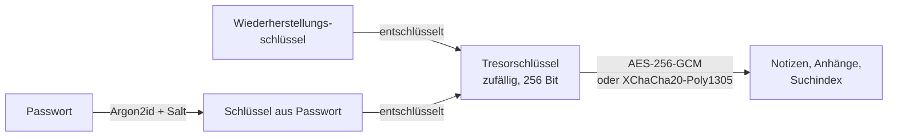

# OFFLINE – Tresor und Notfallmappe (Spezifikation, Entwurf 1)

*Stand 24.09.2026. Entwurf aus einer zweiten Sitzung, am selben Tag ins Repository übernommen. Die Spezifikation beschreibt Verhalten und Verfahren; die Umsetzung im Rust-Kern steht im Abschnitt „Einordnung“ am Ende.*

## Ziel

Die Notizen in OFFLINE bekommen einen gesperrten Bereich, den **Tresor**. Er ist für Dinge gedacht, die man im Ernstfall braucht und die sonst niemand sehen soll: Passwörter, PINs, Versicherungsnummern, Ausweisscans. Die Vorlage **Notfallmappe** gibt die Felder vor, damit man beim Anlegen nichts vergisst.

Grundsatz: **Der Tresor verlässt das Gerät nie unverschlüsselt, und wir haben keinen Schlüssel.**

## Funktionen

**Version 1**

- Ein Tresor pro Installation, mit eigenem Passwort (nicht dasselbe wie für das Gerät)
- Darin Notizen wie im offenen Bereich: Text, Checklisten, Bilder und PDFs als Anhang (Scans)
- Suche nur bei geöffnetem Tresor, der Suchindex ist ebenfalls verschlüsselt
- Sperrt automatisch nach 5 Minuten ohne Eingabe (einstellbar: 1, 5, 15 Minuten), beim Minimieren und beim Ruhezustand des Geräts
- Vorlage „Notfallmappe“ (siehe unten)
- Wiederherstellungsschlüssel zum Ausdrucken, einmalig beim Anlegen
- Export als verschlüsselte Datei, zum Beispiel für einen USB-Stick in der Lade

**Später**

- Mehrere Tresore, etwa einen eigenen und einen für die Familie
- Entsperren mit Touch ID oder Windows Hello, zusätzlich zum Passwort und nie statt des Wiederherstellungsschlüssels
- Abgleich mit dem Handy über das lokale Netz (siehe Handy-Version)
- Druckansicht der Notfallmappe auf Papier, für den Fall, dass kein Gerät mehr läuft

**Bewusst nicht**

- Kein Zurücksetzen des Passworts über uns, keine Kopie in der Cloud, keine Telemetrie über den Inhalt

## Verfahren

- **Zwei Schlüsselebenen.** Beim Anlegen entsteht ein zufälliger Tresorschlüssel. Er wird zweimal verschlüsselt abgelegt: einmal mit dem Schlüssel aus dem Passwort, einmal mit dem Wiederherstellungsschlüssel. Wer das Passwort ändert, muss so nur den Tresorschlüssel neu verpacken, nicht den ganzen Inhalt.
- **Passwort zu Schlüssel:** Argon2id mit Parametern, die auf einem schwachen Laptop etwa eine halbe Sekunde brauchen. Die Parameter werden in der Datei mitgespeichert, damit man sie später erhöhen kann.
- **Inhalt:** Authentifizierte Verschlüsselung, jede Notiz und jeder Anhang einzeln, jeweils mit eigener Nonce. Eine manipulierte Datei fällt beim Öffnen auf.
- **Bibliotheken:** Nur geprüfte Standards wie libsodium oder die Kryptografie der Plattform. Nichts selbst bauen.
- **Im Arbeitsspeicher:** Den Schlüssel beim Sperren überschreiben und nichts Entschlüsseltes auf die Festplatte schreiben, auch nicht in Vorschaubilder, den Papierkorb oder Absturzprotokolle.
- **Zwischenablage:** Kopierte Passwörter nach 30 Sekunden löschen.

## Wogegen der Tresor schützt

| Szenario | geschützt? |
|---|---|
| Laptop oder Handy gestohlen, Tresor gesperrt | ja |
| Jemand in der Familie öffnet die App | ja |
| Sicherung oder USB-Stick gerät in fremde Hände | ja |
| Schadsoftware auf dem Gerät, während der Tresor offen ist | nein |
| Jemand schaut beim Entsperren über die Schulter | nein |
| Passwort und Wiederherstellungsschlüssel verloren | **Inhalt ist weg** |

## Hinweistexte (Entwurf)

**Beim Anlegen:**
> Nur du kennst dieses Passwort. Wir können es nicht zurücksetzen, weil wir keinen Zugang zu deinem Tresor haben. Wenn du Passwort und Wiederherstellungsschlüssel verlierst, kann niemand den Inhalt wiederherstellen, auch wir nicht.

**Wiederherstellungsschlüssel:**
> Druck diesen Schlüssel aus oder schreib ihn ab und leg ihn an einen sicheren Ort, getrennt vom Gerät. Er wird nur jetzt angezeigt.

**Bestätigung:** Vor dem Weitermachen den Schlüssel teilweise neu eintippen lassen (vier zufällige Gruppen).

## Vorlage Notfallmappe

Jedes Feld ist optional. Leere Felder werden beim Drucken ausgeblendet.

1. **Personen im Haushalt:** Name, Geburtsdatum, Blutgruppe, Allergien, Medikamente mit Dosierung, Hausarzt
2. **Wichtige Nummern:** Notrufe (112, 144, 122, 133, 140 Bergrettung, 141 Ärztenotdienst, 1450), Vergiftungsinformationszentrale, Nachbarn, Familie außerhalb, Arbeitgeber, Schule oder Kindergarten
3. **Treffpunkte:** Wo sich die Familie trifft, wenn niemand erreichbar ist, mit Ersatztreffpunkt
4. **Dokumente (Scans):** Reisepass, Personalausweis, Führerschein, E-Card, Meldezettel, Geburtsurkunden, Heiratsurkunde, Impfpass
5. **Versicherungen:** Haushalt, Eigenheim, Kfz, Unfall, Leben, jeweils mit Polizzennummer und Schadenhotline
6. **Geld:** Bank und Kundennummer, Sperrnotruf für Karten, Bargeldvorrat und wo er liegt. Keine vollständigen Kartennummern
7. **Zugänge:** Wichtige Passwörter und PINs (ID Austria, Mail, Bank), Router, WLAN
8. **Haus:** Hauptwasserhahn, Sicherungskasten, Gashaupthahn, Schlüssel bei wem, Rauchfangkehrer, Installateur, Elektriker
9. **Tiere:** Tierarzt, Futter, Chipnummer
10. **Radio:** ORF-Frequenzen der eigenen Region

## Offene Fragen

- Unterbau der App: Tauri oder Electron? Davon hängt ab, welche Kryptobibliothek am einfachsten ist.
- Soll der Tresor in der Gratisversion enthalten sein? Empfehlung: ja, weil er das stärkste Argument für die App ist.
- Datenschutz: Gesundheitsdaten in der Notfallmappe sind besondere Kategorien nach DSGVO. Weil nichts unser Gerät erreicht, sollten wir nicht Verantwortliche sein. Das als Zusatzfrage an den Anwalt geben.

---

## Einordnung in OFFLINE (24.09.2026, nach Übernahme ins Repository)

Antworten auf die offenen Fragen und der Platz im Unterbau:

- **Unterbau ist Tauri 2**, nicht Electron. Die Kryptografie gehört in den Rust-Kern (`kern/`), nicht in die Oberfläche. Die Oberfläche (`web/`) sieht nie einen Schlüssel: Sie schickt Passwort und Notiztext über einen Tauri-Befehl an den Kern und bekommt Klartext nur für die Anzeige zurück. Im Web-Prototyp gibt es den Tresor nicht (dort wäre der Schlüssel in JavaScript, und das ist genau das, was die Spezifikation verbietet).
- **Bibliotheken (Rust, geprüft, ohne C-Compiler baubar):** `argon2` (Argon2id), `chacha20poly1305` (XChaCha20-Poly1305, 24-Byte-Nonce, damit Zufallsnonces ohne Zähler sicher sind), `zeroize` (Schlüssel im Arbeitsspeicher überschreiben), `rand` (Tresorschlüssel, Salt, Nonces). Das sind die RustCrypto-Kisten, die auch ed25519-dalek im Kern schon nutzt. Kein libsodium nötig.
- **Ablage:** ein Ordner `tresor/` neben `pakete/` im Datenordner der App (siehe DESKTOP.md). Darin `tresor.json` (Kopf: Version, Argon2-Parameter, Salt, der zweimal verpackte Tresorschlüssel) und je Notiz und Anhang eine eigene verschlüsselte Datei. Der Export für den USB-Stick ist derselbe Ordner als eine Datei, ohne Umschlüsselung.
- **Wiederherstellungsschlüssel:** 128 Bit Zufall, dargestellt als sechs Gruppen zu fünf Zeichen (Base32 ohne verwechselbare Zeichen), auf Papier schreibbar. Er verschlüsselt den Tresorschlüssel direkt (Argon2 ist hier nicht nötig, der Schlüssel ist bereits zufällig).
- **Sperren:** Der Kern hält den entschlüsselten Tresorschlüssel nur im Arbeitsspeicher und wirft ihn nach Ablauf, beim Minimieren (Tauri-Fensterereignis) und beim Beenden weg. Anhänge werden zur Anzeige dem Fenster als Datenadresse übergeben, nie in einen temporären Ordner geschrieben; damit bleibt der lokale Dateiserver (`lokalserver.rs`) außen vor, weil er nur unter dem Paketordner liest.
- **Gratis oder Pro:** Gratis. Der Tresor ist das stärkste Argument für die App und braucht keinen Speicherplatz auf dem Update-Server. Die spätere Druckansicht und der Abgleich mit dem Handy können Pro sein.
- **Datenschutz:** Die Gesundheitsdaten der Notfallmappe verlassen das Gerät nie und erreichen keinen Server von uns. Als Zusatzfrage an den Anwalt vorgemerkt (siehe KONZEPT.md, offene Punkte).
- **Phase:** 4b, nach dem Gigabyte-Test der Bibliothek und vor der KI. Erst der Kern mit Tests (Anlegen, Öffnen, falsches Passwort, Wiederherstellung, Passwortwechsel, manipulierte Datei), dann die Oberfläche.
