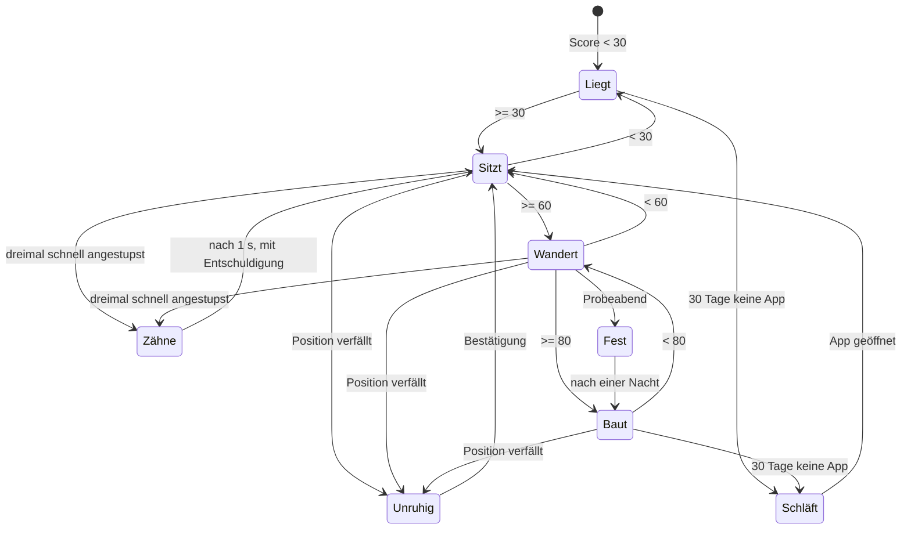

# OFFLINE – Die Lumi (Konzept, Entwurf 3) und ihre Umsetzung

*Konzept vom 27.09.2026 aus einer zweiten Sitzung, am 28.09.2026 ins Repository übernommen und in App 0.1.5 umgesetzt. Der Konzepttext steht unverändert in Abschnitt A, die Umsetzung mit Abweichungen und Sicherheitsregeln in Abschnitt B.*

## B. Umsetzung (App 0.1.5, 28.09.2026; Lumi und Bereit 2 in 0.2.0, 29.09.2026)

**Lumi in 0.2.0 (`web/wesen.js`, Tests `web/wesen.test.mjs`):**
- **Standard aus.** Frische Installation: aus, nach einer Woche einmal die dunkle Karte mit zwei Lichtern („Unter dem Eis wohnt jemand.“, *Ja, zeig sie mir* / *Nein, danke*; nach „Nein“ nie wieder). Einschalten jederzeit unter „Lumi“ auf der Übersicht. Solange sie aus ist: ganz still, keine Tipps.
- **Übergang:** Wer in 0.1.x einen eigenen Namen vergeben hatte, behält Name und Darstellung. Alle anderen sind nach dem Update aus und bekommen die Karte nach einer Woche.
- **Startablauf** nach `OFFLINE-Lumi-Startablauf.md` mit den Texten von dort: erster Satz „Oh. Hier oben ist es hell.“, Namensfrage mit *Namen geben* / *Später*, erster Satz mit Namen, Ausschalten mit Rückfrage („… geht schlafen.“ *Ausschalten* / *Doch nicht*), Wiedereinschalten: kurz schlafen, dann „Da bist du ja. Ich hab geschlafen.“ Name, Log und Zustand bleiben.
- **Kein „ich“ ohne Namen:** Tipps mit ich/mir/mich/mein tragen `benannt`; zusätzlich filtert die App jeden Text, der von sich spricht, solange es keinen Namen gibt – auch Laute beim Anstupsen und `wesen.sagen` aus Modulen.
- **Foto-Ansicht:** ein freigestelltes Bild je Zustand (`web/lumi/`), Vorrang nach der Mimik-Tafel (`mimikZustand`), Antennenlicht als Ebene über den Spitzen (Helligkeit nach Bereit, Fest sehr hell, Schläft aus, Unruhig flackert), Kopfneigung als Drehung um den Halsansatz. Das Pixel-Sprite bleibt als „Figur: Pixel (sparsam)“.
- **Darstellungen:** aus (Standard), Lumi mit Tipps, nur Tipps.
- **Tipps:** 176 im Paket `wir` (180 aus der Session, vier mit `profil.*` weggelassen), Wortschatz erweitert um `wochentag`, `stunde`, `tag`, Monatslisten, `alter` (Alter einer Bereit-Bestätigung) und `zeitumstellung_in_tagen`. Unbekannte Wörter: Der Tipp kommt nicht.
- **KI-Kennzeichnung** beim Einschalten und in den Einstellungen; Herkunft in `docs/LUMI-BILDER.md`.

**Sicherheit zuerst, so wie bei allen Paketen:**
- Das Wesen ist Oberfläche (`web/wesen.js`, `web/wesen.css`), die Bereit-Zahl ist Berechnung (`web/bereit.js`). Beides kommt mit der App, nie aus einem Paket.
- Das Paket `wir` (`pakete/wir/`) liefert **nur Text**: `inhalt/tipps.json` mit Kennung, Sorte, Text, optional Bedingung und Gewicht. **Bedingungen sind Daten, kein Code**: `ansicht`, `einstellung`, `monat`, `score_unter`, `score_ab`, `verfallen`. Unbekannte Felder werden ignoriert, unbekannte Sorten verworfen, jeder Text wird beim Anzeigen entschärft.
- Das Paket durchläuft dieselbe Prüfkette wie jedes andere (Signatur, Struktur, Pfade, Prüfsummen, Staging). Ist es kaputt, bleibt das Wesen stumm; die App läuft.
- Keine Telemetrie, keine Push-Nachrichten, kein Netz: Log, Einstellungen, Bestätigungen und das Gelernte liegen nur am Gerät (`localStorage`, Teil von „Restlos löschen“).
- Töne sind standardmäßig aus; wenn an, drei kurze Sinustöne aus der App, keine Dateien.

**Bereit-Modul (`web/bereit.js`), Version 2 (29.09.2026), vier Quellen nach Gesamtkonzept Kapitel 4:**

| Quelle | Gewicht | Positionen |
|---|---|---|
| Inhalte | 20 % | Österreich-Paket am Gerät, Paket nicht älter als 6 Monate, Wissen ohne Netz (ZIM), Karte ohne Netz – liest die App selbst |
| Dinge | 35 % | 18 Punkte der Vorsorge-Checkliste, abgehakt **und** bestätigt; Wasser 12 Monate, Batterien und Radio 24, Medikamente und Powerbanks 6, Tank 3 |
| Menschen | 25 % | Familiengruppe, Treffpunkt, Nummern auf Papier, Nachbar (je 6 Monate), Anlaufstelle (12), Notfallmappe im Tresor (Desktop, liest die App) |
| Können | 20 % | Kocher angezündet, Radio getestet, Probeabend (je 12 Monate) |

- Innerhalb einer Quelle zählt jede Position mit ihrem Gewicht (Wasser 3, Probeabend 2 …). Gewichte und Fristen stehen nur in `bereit.js`.
- Nach Ablauf sinkt eine Position über drei Monate langsam auf null und steht als „fällig“ auf der Übersicht (Checklistenpunkte auch auf der Vorsorge-Seite, mit „Erneuert“).
- Über 95 ohne Probeabend in den letzten drei Monaten: „Das ist verdächtig gut. Wann war dein letzter Probeabend?“
- Positionen, die es auf einem Gerät nicht gibt (Notfallmappe im Web-Prototyp ohne Tresor), zählen dort nicht mit; 100 bleibt erreichbar.
- Die Lumi liest nur `wert` und `faellig` (bzw. `verfallen`). Die Stufen 30/60/80 kommen aus `stufe()` in `bereit.js`.
- Übertragung aus Version 1: Bestätigungen behalten ihr Datum, alte Häkchen gelten ab dem Update. Gespeichert wird unter `bereit-v2`; die Daten von Version 1 bleiben liegen.
- Tests: `web/bereit.test.mjs` (15 Fälle, auch in der CI). Im Entwickler-Build lässt sich das Datum auf der Übersicht vorstellen.

**Das Wesen (`web/wesen.js`):**
- Sprite 48 × 36 auf Canvas, ohne Glättung skaliert; der Schein der Leuchtkugeln liegt auf einer zweiten, weichen Ebene. Höhle als Welt: dunkler Stein, Eisband oben, der glimmende Spalt unten, aufsteigender Dampf.
- Zustände nach Konzept: Liegt, Sitzt, Wandert, Baut, Unruhig, Zähne, Fest, Schläft (30 Tage nicht geöffnet). Zustand steht immer als Text daneben (Screenreader).
- Anstupsen: Ohren zurück und ein Laut. Dreimal schnell: Zähne für eine Sekunde, dann „…tschuldigung. Ich mag das nicht.“
- Tipps: erster nach drei Sekunden auf der Übersicht, danach nach dem gelernten Takt (60/90/180 s) solange man etwas tut, Pause bei zwei Minuten Stillstand, höchstens zwölf je Sitzung, höchstens einer je Ansicht, keiner unter Notfall. Sorten gleich verteilt, Laune halb so oft, nichts wiederholt sich innerhalb eines Tages, solange der Vorrat reicht.
- Log mit Sorte, Zeit, Stern, Filter und Suche unter der Übersicht.
- Drei Darstellungen: Wesen mit Tipps, nur Tipps (Textkarte unten rechts), aus (nur die Zahl). Name, Fell (Eisblau, Flieder, Moos, Sand), Größe, Laute, Töne, Takt, Sorten, „baut über 80“ einstellbar. „Digital“ ist standardmäßig aus.

**Abweichungen und Offenes:**
- Starter-Bestand von 51 Tipps in sieben Sorten (App, Alltag, Wissen, Weisheit, Laune, Heute, Digital) als Platzhalter. Der Erstbestand von 150 aus `OFFLINE-Wir-Tipps-150.md` ersetzt ihn, sobald die Datei im Repository liegt.
- Der Pilzgarten über 80 und der Turm sind einfache Pixel; Arme mit Daumen sind angedeutet. Feinschliff des Sprites nach den Fotovorlagen (`OFFLINE-Lumi-Fotos.md`) steht aus.
- Pupillen folgen dem Finger, Augenbrauen, Charakterregler und Chat: Pro, mit der KI.
- Sparmodus (Standbild) und „Bildschirmlampe“ im Blackout: später, mit der Handy-Version.
- Der Web-Prototyp zeigt das Wesen ebenfalls, ohne Tresor-Quelle in der Bereit-Zahl.

---

## A. Konzept (Entwurf 3, 29.09.2026, aus der Session Lumi-Mimik übernommen)

*Mimik-Tafel und Startablauf mit allen Texten:  und Abschnitt B unten. Bei Widerspruch gilt dieser Abschnitt.*

*Stand 29.09.2026 abends (Name „Lumi“, Standard aus, Namensgabe, Mimik-Tafel, gewählte Referenz; „Hörner“ durchgehend zu „Antennen“), Entwurf 3 mit Ergänzungen „Wir“, „Lumi“ und Evolution (Heimat jetzt Antarktis). Fotos und Bildvorlage: OFFLINE-Lumi-Fotos.md. Vorfahren: Kaninchen. Vorschau zum Klicken: https://claude.ai/artifact/LBBuDBRNUaxcPXbTQ41uTV. Zeichnung „Die Lumis“ (Welt unten, Namen, Zustände, Zwischenfälle, Einbau): https://claude.ai/artifact/E3pW61zqQE2ofeMcqGTR6o. Mimik-Tafel, Zustandsbilder und Startablauf: https://claude.ai/artifact/Us6eLRY7TCDDxQF6K1gDWr, dazu OFFLINE-Lumi-Mimik.md und OFFLINE-Lumi-Startablauf.md. Gehört zum Gesamtkonzept, Kapitel 4 und 5. Entschieden ist: Gestalt und Herkunft (unten), Basis gratis ohne Interaktion mit Tipps, Pro mit Chat und lebhafterem Gesicht. Die Designrichtungen A/B/C aus Entwurf 1 sind damit erledigt: Das Licht kommt aus den Antennen, die Welt ist dunkel, es ist Flechte und Laterne in einem Tier.*

---

### 1. Steckbrief

| | |
|---|---|
| **Heimat** | mehrere Kilometer unter dem antarktischen Eis, eine eigene Welt, dunkel, warm genug, unberührt (bis 27.09.2026 hieß es „arktisch“; geändert, weil unter der Antarktis Land liegt und sie einmal warm war, siehe „Wie die Wir wurden“) |
| **Kennt nicht** | Politik, Krieg, Armut, Wirtschaft, Gefahr jeder Art. Daraus ist eine andere Intelligenz geworden: sehr klug, aber nicht wie ein Mensch klug. |
| **Wesen** | kuschelig, launisch, freundlich, optimistisch, ganz empathisch. Es tut dir nie absichtlich weh, auch nicht, wenn es launisch ist. |
| **Körper** | ein Höhlenkaninchen, blaugrau mit silbrigem Fell. Große, aufgestellte Ohren mit rosa Innenseite, einzeln drehbar. Im Gesicht nur feiner Flaum, damit man die Mimik sieht; große dunkle Augen vorn, weiche Stirn, breite Nase, geschlossene Oberlippe (keine Hasenscharte). Kleine Hände mit Daumen. Zwei schlanke Antennen mit leuchtenden Spitzen. **Verbindliche Referenz: das von Mik am 29.09.2026 gewählte Bild** (`Lumi-gewaehlt-2026-09-29.png`, in der Session als `lumi-freude` geführt). |
| **Licht** | Die Antennen leuchten so hell, wie du vorbereitet bist. Das ist die Bereitschaftsanzeige. Das Licht reicht von einem Glimmen bis sehr hell: Voll aufgedreht leuchtet ein Lumi eine ganze Höhle aus, bis die Eisdecke glitzert. Im Blackout ist die Lumi das, was auf dem Bildschirm leuchtet. (sehr hell: entschieden 27.09.2026) |
| **Rasse** | Sie nennen sich **Wir**. Sie kennen jede Sprache der Menschen, aber sie haben keinen Eigennamen, weil es unten nie ein „ihr“ gab; Namen entstehen aus Unterschied. Die Menschen sagen **Lumi** zu ihnen, angeblich „Schnee“: Einer von uns hat zwei Winter in ihrer Nähe verbracht und sie so benannt, weil der erste Entdecker die Entdeckung benennen darf und alle anderen das Wort dann für immer verwenden. Die Wir finden das einen komischen Brauch. (entschieden 27.09.2026) |
| **Der Entdecker** | namenlos, zwei Winter, mehr weiß man nicht. Naheliegend: ein Überwinterer einer Forschungsstation, die in der Antarktis über den Winter besetzt bleiben. Absichtlich offen: ein Haken für später (Roman der Woche, Tipp-Serie, Pro-Gespräch). |
| **Name** | gibt der Mensch beim ersten Sehen (Max, Horst, Susi …). Es ist das erste Mal, dass eine Lumi einen Namen braucht. **Erst mit dem Namen bekommt sie ein „Ich“.** Vorher spricht sie nie von sich selbst, höchstens von „uns“ unten. Danach sagt sie „wir“, wenn sie von unten erzählt, und „ich“, wenn sie von sich spricht. (entschieden 29.09.2026) |

#### Die Welt unten (Stand 27.09.2026)

| | |
|---|---|
| **Ort** | eine riesige Höhle aus Stein und Eis, mehrere Kilometer unter dem antarktischen Eis. Warm, nicht kalt. |
| **Quelle des Lebens** | ein schmaler Spalt, aus dem heißes Wasser aus der Tiefe in ein Flussbett fließt. Alles Leben liegt an diesem Fluss. |
| **Leben** | mannigfaltig. Alle ernähren sich von Pilzen, und davon gibt es unendlich viele. Niemand hungert, niemand konkurriert. |
| **Was die Lumi tun** | essen, schlafen, philosophische Gespräche führen. Sonst nichts. |
| **Wie viele** | vielleicht eine Million, vielleicht eine Milliarde. Wer zählt schon. |
| **Körper** | rund, klein, mit Händen und Daumen wie wir. Anders sind das Fell, das Licht, die langen Ohren und das Kaninchengesicht. |
| **Geschlecht** | Die Lumis trennen nicht nach Geschlecht. Für die Fortpflanzung gibt es zwei Rollen, und jedes Lumi nimmt die ein, die gerade gebraucht wird. Das Kind kommt nach sieben Monaten. In der App heißt es grammatisch „die Lumi“ und damit „sie“, wie bei „die Katze“; das sagt nichts über ein Geschlecht. Gibt der Mensch ihr einen Namen, der bei uns ein Geschlecht hat, widerspricht sie nicht; sie fragt höchstens, was das Wort bedeutet. (27.09., Grammatik 29.09.2026) |
| **Schreibweise** | die Lumi, die Lumis (so Mik und Bill am 29.09.2026; vorher „das Lumi“). **Lumi** ist der Name, den alle Menschen benutzen, auch in der App. **Wir** nennen sich die Lumis selbst; das kommt in ihren Geschichten vor, nicht als Name in der Oberfläche. „Das Wesen“ ist nur noch ein Konzeptwort. Das Inhaltspaket heißt weiter `wir`. |
| **Zeit** | Sie rechnen in Perioden, nicht in Jahren. Wie lang eine Periode ist, sagen sie nicht; vermutlich wissen sie es selbst nicht genau, und es ist ihnen egal. |
| **Die große Frage der letzten Periode** | Gibt es intelligentes Leben da draußen, über dem Eis? Vorherrschende Meinung: wahrscheinlich nicht. Die Frage ist noch nicht abgeschlossen. Der Fund eines Menschen mit zwei Wintern Aufenthalt gilt als Indiz, aber nicht als Beweis. |

#### Wie die Wir wurden (Evolution, 27.09.2026, Fassung Kaninchen)

*Entschieden 27.09.2026 abends: Die Vorfahren waren Kaninchen, keine Affen. Erfunden, aber an echte Geologie gehängt. Echt ist: Die Antarktis war bis vor rund 34 Millionen Jahren bewaldet und über eine Landbrücke mit Südamerika verbunden; unter dem Eis liegen heute Hunderte Seen, der Wostoksee ist der bekannteste, und die Westantarktis ist vulkanisch warm. Erfunden ist: Hasenartige haben es dorthin geschafft. Man hat nie welche gefunden. Die Wir würden sagen: Ihr habt nicht unter dem Eis nachgesehen.*

| Wann | Was geschah | Was es aus ihnen machte |
|---|---|---|
| vor rund 50 Mio. Jahren | kleine Kaninchenvorfahren leben in den warmen Wäldern der Antarktis | große Ohren, große Augen, feine Nase, Leben in Gruppen, Baue unter der Erde |
| ab rund 34 Mio. Jahren | Die Antarktis vereist. Eine Gruppe gräbt sich tiefer, bis in Höhlen an heißen Quellen. | Wer gräbt, überlebt. Sie wohnen, wo Wasser aus der Tiefe kommt. |
| danach | Das Eis schließt sich über ihnen. Es wird dunkel. Außer Pilzen wächst fast nichts. | Das Fell verliert die Farbe und wird silbrig eisblau. Sie fressen nur noch Pilze; die Nagezähne mahlen weiter. |
| danach | Leuchtpilze siedeln sich in den Haarbüscheln am Kopf an. Der Pilz bekommt Wärme und wird herumgetragen, das Tier bekommt Licht. | Aus den Büscheln werden dicke Antennen mit großen Kugeln am Ende, in denen die Pilze sitzen. Deshalb bleiben die Augen groß: Es gibt Licht, nur ihr eigenes. |
| danach | Wer das hellste Licht hat, wird gesehen, gefunden und gehört. Die Tiere lernen, die Pilze zu füttern und das Licht zu regeln. | Das Licht reicht vom Glimmen bis sehr hell. Gedimmt heißt: ich denke nach. Hell heißt: ich freue mich. Wenn viele gleichzeitig aufdrehen, ist die ganze Höhle taghell; das ist ihr Fest. |
| danach | Pilze pflückt man besser, als man sie abnagt. | Aus den Vorderpfoten werden kleine Hände mit Daumen. Sie sitzen aufrecht, um die Hände frei zu haben. |
| danach | Kaninchen warnen einander, indem sie mit den Hinterläufen klopfen. Im Dunkeln unter dem Eis gibt es nichts, wovor man warnen müsste, aber viel, worüber man reden kann. | Aus dem Klopfen wird eine Stimme, aus der gespaltenen Oberlippe ein weicher, beweglicher Mund. Die langen Ohren hören jedes Wort. Wer nichts tun muss, redet. |
| danach | Im Dunkeln zählt, woher ein Laut kommt. Kaninchen können schon heute jedes Ohr einzeln drehen. | Die langen Ohren stehen aufrecht und drehen sich unabhängig voneinander: eines zu dem, der spricht, das andere zu dem, was sonst in der Höhle passiert. Wer zuhört, richtet beide auf den Sprecher; daran sieht man, dass ein Lumi zuhört. |
| danach | Es gibt nichts, das von hinten kommt. Dafür arbeiten die Hände direkt vor dem Gesicht, und man redet einander gegenüber. | Die Augen wandern von der Seite nach vorn wie bei Affen und Menschen: räumliches Sehen statt Rundumblick. Das Fell im Gesicht wird zu feinem Flaum, durch den die Haut schimmert, eine weiche Stirn, eine breite Nase. Im eigenen Licht sieht man so jede Regung des anderen. Das Gesicht erinnert an einen jungen Neandertaler, der Körper bleibt Kaninchen. |
| danach | Wer viel redet, will verstanden werden. Kaninchen atmen nur durch die Nase; der Kehlkopf sitzt so hoch, dass kaum ein Laut durch den Mund geht. | Der Kehlkopf wandert nach unten wie beim Menschen, sie lernen durch den Mund zu atmen. Die gespaltene Oberlippe wächst ganz zusammen, ohne Spalt und ohne Furche, und die Lippen werden voll und beweglich, die Zunge wird lang und geschickt. Seitdem sprechen sie deutlich: jedes O rund, jedes M mit geschlossenen Lippen. Deshalb können sie heute jede Sprache der Menschen. |
| danach | Niemand kämpft um etwas. | Keine Rangordnung. Die großen Nagezähne bleiben; gezeigt werden sie nur noch als Reflex. Daher der Zustand „Zähne“ mit Entschuldigung. |
| heute | Ein Mensch überwintert zweimal in der Nähe und nennt sie Lumi. | Die Wir halten ihn für ein Indiz, nicht für einen Beweis. |

**Für die Figur heißt das:** Die Lumi ist ein Kaninchen, das seit 34 Millionen Jahren unter dem Eis lebt, so wie auf dem gewählten Bild vom 29.09.2026. Fell am Körper und an den großen, aufgestellten, einzeln drehbaren Ohren; im Gesicht nur Flaum; Augen vorn; geschlossene Oberlippe; kleine Hände; zwei schlanke Antennen mit Leuchtspitzen, deren Licht vom Glimmen bis sehr hell reicht. Die Wahl ersetzt die „doppelt so dicken“ Antennen vom 27.09. **Mimik ist Zustand:** Mund, Augen, Ohren, Antennen und Kopfneigung gehören zum jeweiligen Zustand, nicht zur Figur. Die Tafel dazu steht in **OFFLINE-Lumi-Mimik.md**; das offene Lächeln mit Zähnchen auf dem gewählten Bild ist der Zustand „Freude“. Die Ruhefigur hat einen geschlossenen Mund mit leichtem Lächeln.

**Die Affen-Fassung ist verworfen** (27.09.2026). Falls die Herkunft einmal erklärt werden muss, gibt es einen echten Anker: Beuteltiere sind nachweislich über die Antarktis nach Australien gewandert, und eines davon sieht aus wie ein Kaninchen, der Kaninchennasenbeutler (Bilby). Nur als Möglichkeit notiert, nicht entschieden.

**Ohren im Sprite:** Die Ohren sind das Zuhör-Zeichen. Bei einem Tipp zeigt ein Ohr zum Nutzer. Beim Anstupsen drehen sich beide kurz nach hinten. Im Zustand „Unruhig“ zucken sie hin und her.

**Das helle Licht in der App:** Beim Zustand „Fest“ dreht die Lumi voll auf, der Schein füllt die ganze Bühne. Denkbar für später: Im Blackout wird ihr Licht auf Wunsch zur Bildschirmlampe, ein Stups macht es hell. Das kostet Akku, deshalb nur auf Knopfdruck und nie im Sparmodus.

**Was das fürs Produkt heißt:**

- **Der Chat ist für sie natürlich.** Ein Volk, das nichts tut außer essen, schlafen und philosophieren, redet gern. Pro ist nicht ein Feature, das man dem Tier anschraubt; es ist das, was es zu Hause den ganzen Tag macht. In der Basis hält es sich zurück, weil es unsere Sprache der kurzen Sätze gelernt hat.
- **Pilze sind die Währung der Fürsorge.** Was die Lumi beim Wandern aufsammelt, sind Pilze. Wer bestätigt, gibt ihr einen. Sie braucht keinen, sie freut sich trotzdem.
- **Das Licht ist warm, nicht kalt.** Die Bühne zeigt keine Eiswüste, sondern die Höhle: dunkler Stein, oben Eis, unten der Spalt mit dem heißen Fluss, der rötlich glimmt. Die Antennen leuchten in dasselbe Warm.
- **Arme und Daumen** kommen ins Sprite. Damit kann es zeigen (statt eines Pfeils), Pilze halten, sich beim Fest die Arme heben und beim Schlafen den Kopf drauflegen.
- **Die große Frage ist ihr Humor und ihre Demut zugleich.** Die Lumi sitzt in einer App voller Menschen und hält die Frage, ob es da draußen intelligentes Leben gibt, für offen. Das ist nie herablassend gemeint. Sie ist die einzige Figur in OFFLINE, die dem Nutzer ohne Absicht den Spiegel vorhält, und sie tut es freundlich. Für die Tipps der Sorte Weisheit ist das die ergiebigste Quelle.
- **„Wer zählt schon"** ist der Ton für alles, was mit Zahlen zu tun hat. Die Lumi nennt den Score, aber sie hängt nicht an ihm. Das ist die richtige Distanz für eine Bereitschaftsanzeige, die beruhigen soll.

**Die Namen als Tipps:** „Wie wir heißen? Wir. Es gab unten nie jemand anderen, also hat das gereicht. Du hast mir einen Namen gegeben. Das war neu. Ich mag es.“ Und: „Ihr sagt Lumi zu uns. Heißt angeblich Schnee. Einer von euch hat zwei Winter in unserer Nähe verbracht und uns so benannt. Bei euch darf der, der etwas zuerst findet, sagen, wie es heißt, und alle anderen sagen es dann für immer. Komischer Brauch. Oder?“

**Warum die Herkunft zählt:** Ein Tier, das keine Gefahr kennt, kann von Vorsorge reden, ohne Angst zu machen. Es sagt „Dein Wasser ist neun Monate alt" wie man sagt „Es regnet". Das ist der Ton, den OFFLINE braucht: vorbereitet, nicht alarmiert. Und es kann über Krieg und Politik nur staunen, was den Nutzer bei den Themen des Moduls „Wohin" entlastet, statt ihn zu belehren.

### 2. Basis und Pro

| | Basis · gratis | Pro |
|---|---|---|
| **Interaktion** | keine. Man kann sie anstupsen, das ist alles. | Chat mit der lokalen KI, mit Gedächtnis |
| **Was sie sagt** | Tipps, wenn du in der App bist: wie man sich in OFFLINE zurechtfindet, was den Score hebt, und Dinge des Lebens. Sonst ist sie still. | dasselbe, plus Antworten auf Fragen, aus den Paketen mit Quelle |
| **Gesicht** | Zustände nach Score, Blinzeln, Laute in Sprechblasen | lebhafter: schaut deinem Finger nach, Augenbrauen, Ohren zucken, Stimmungen, die man ablesen kann |
| **Launisch** | in den Tipps: „Heute nicht. Frag mich morgen." | im Gespräch, und man merkt, warum |
| **Stirbt** | nie | nie |
| **Push-Nachrichten** | keine | keine |
| **Wenn Pro endet** | Sie bleibt, verstummt und sagt weiter ihre Tipps. | |

**Die Regel für Tipps in der Basis (entschieden 27.09.):** Man kann keinen Tipp anstoßen. Sie kommen von selbst, solange man in der App ist, und hören auf, wenn man sie verlässt.

| Takt | |
|---|---|
| Erster Tipp | drei Sekunden nach dem Öffnen der Tagesseite |
| Danach | alle 90 Sekunden, solange die App im Vordergrund ist und man etwas tut; bei Stillstand (kein Tipp, kein Wisch für zwei Minuten) pausiert es |
| Beim Wechsel der Ansicht | höchstens ein Tipp je Ansicht, passend zur Ansicht (im Tresor ein Tresor-Tipp) |
| Im Guide, im Ernstfall, im Sparmodus | keiner |
| Obergrenze | zwölf je Sitzung, danach nur noch Laute |
| Gelernt | Wer die Tipps nie liest (sofort weiterwischt), bekommt sie alle drei Minuten; wer im Log stöbert, alle 60 Sekunden. Sichtbar unter „gelernt", rückstellbar. |

**Fünf Sorten**, gleich verteilt, Laune seltener; dazu „Digital“ als sechste, die nur kommt, wenn man sie in den Einstellungen ankreuzt:

| Sorte | Was | Beispiel |
|---|---|---|
| **App** | sich in OFFLINE zurechtfinden | „Der Tresor ist hinter dem kleinen Schloss oben rechts. Nur du kennst das Passwort. Ich auch nicht." |
| **Alltag** | was den Score hebt, was man heute tun könnte | „Ein Probeabend ohne Strom bringt zehn Punkte. Und du weißt danach, was fehlt. Meistens die Taschenlampe." |
| **Wissen** | Fakten, die man im Ernstfall braucht, aus den Paketen | „Gefrorenes hält vierundzwanzig Stunden, wenn du die Tür zulässt. Auch wenn du nachschauen willst. Gerade dann." |
| **Weisheit** | von unten, aus einer Welt ohne Gefahr | „Vorbereitet sein heißt nicht, Angst haben. Es heißt, keine haben zu müssen." |
| **Laune** | launisch, nie verletzend | „Heute nicht. Frag mich morgen." |

Weitere Sorten, die sich anbieten, sobald die Inhalte da sind: **Heute** (aus dem Kalender: Gemeinfreiheit am 1. Jänner, Zeitumstellung, Heizsaison), **Nachbarschaft** (aus dem Mesh, wenn eines da ist: „Drei Knoten wach heute Nacht."), **Von dir** (aus dem eigenen Tagebuch, nur Pro: „Vor einem Jahr hast du geschrieben, dass du den Kocher testen willst.").

**Entschieden 27.09.2026:** **Heute** wird eingeplant, weil sie nur den Kalender braucht. Nachbarschaft kommt, wenn das Mesh steht, Von dir mit Pro.

**Das Log:** Jeder Tipp landet im Log im Bereich der Lumi. Filterbar nach Sorte, durchsuchbar, jeder Tipp mit Stern merkbar. Das Log bleibt am Gerät und wandert mit ins Schließfach. Es ist zugleich das Gedächtnis der Basis-Version: Was die Lumi gesagt hat, kann man nachlesen, auch wenn man mit ihr nicht reden kann.

**Redaktion:** Die Tipps sind Redaktionstext, kein KI-Text, und liegen als Paket vor (aktualisierbar, signiert, de-AT). Jeder Tipp trägt Sorte, Text, optional eine Bedingung (nur wenn Wasser älter als neun Monate; nur in der Ansicht Tresor; nur im Dezember) und ein Gewicht. Erstbestand: rund 150, davon 30 je Sorte, Laune 15, dazu 15 mit Bedingung.

#### Lumi als Einstieg in die digitale Welt (Überlegung, 27.09.2026)

Die Lumi begeistert Kleine und Große. Daraus folgt eine Möglichkeit und eine Grenze.

**Die Möglichkeit:** Eine Figur, die nie urteilt, nie hetzt, alles in kurzen Sätzen erklärt und selbst gerade erst lernt, wie es hier oben zugeht, ist die bessere Lehrfigur als jeder Kurs. Sie steht auf der Seite des Anfängers, weil sie einer ist. OFFLINE ist als erste App für Menschen ohne digitale Vorgeschichte ohnehin geeignet: Sie erklärt, sie ist endlich, sie verkauft nichts, sie funktioniert ohne Netz. Die Lumi wird zur Stimme dieses Einstiegs, mit einer **sechsten Tipp-Sorte „Digital“**: Was ein Update ist, was ein Passwort ist, warum der Flugmodus Akku spart, was WLAN von Mobilfunk unterscheidet, wie man einen Screenshot macht. Kurz, ohne Fachwort, aus der Sicht von jemandem, der es selbst erst versteht.

**Die Grenze:** Die Figur bleibt in ihrer Welt. Unter dem Eis, in dieser App, mit ihren Pilzen. Sie führt Menschen in die digitale Welt, aber nur von dort aus, wo sie zu Hause ist. Kein Auftritt als Maskottchen der Academy, des Magazins oder in Werbung; das macht aus einem Lumi einen Clippy. Der Weg ist: Lumi als Einstieg in OFFLINE, OFFLINE als Einstieg in die digitale Welt. Die Kurse der digitalworld Academy bleiben vorerst außen vor (entschieden 27.09.2026).

**Entschieden 27.09.2026:** Die Sorte „Digital“ gibt es, aber nur, wenn sie in den Einstellungen angekreuzt ist. Standard: aus. Dreißig Tipps liegen im Paket `wir` (Bedingung `einstellung.digital`), Liste in OFFLINE-Wir-Tipps-150.md.

### 3. Verhalten

| Zustand | Auslöser | Was man sieht | Was es braucht |
|---|---|---|---|
| **Liegt** | Score unter 30 | flach, Augen zu, Ohren hängen seitlich, Antennen fast dunkel, Fell grauer | den ersten Eintrag im Notfallplan |
| **Sitzt** | 30–59 | rund, blinzelt, Antennen glimmen, ab und zu „mh" | die Checkliste der Dinge |
| **Wandert** | 60–79 | steht, pendelt langsam, sammelt Pilze | Menschen: Familiengruppe, Nachbarn |
| **Baut** | 80–100 | steht ruhig, Antennen hell und pulsierend, daneben wächst ein kleiner Turm mit Licht obenauf, nachts Augen zu | nur Bestätigungen, wenn etwas verfällt |
| **Unruhig** | eine Position verfallen | Ohren zurück, zittert leicht, Pfeil auf die Stelle, Sprechblase nennt sie | die eine Bestätigung |
| **Zähne** | dreimal schnell angestupst | Mund auf, Zähne, Ohren flach, „grrr", eine Sekunde; dann „…tschuldigung. Ich mag das nicht." | nichts. Sie verzeiht sofort. |
| **Fest** | Probeabend, große Bestätigung | Sterne um die Antennen, offener Mund, eine Nacht lang | |
| **Schläft** | 30 Tage nicht geöffnet | liegt, zzz, Antennen aus, Score eingefroren | öffnen. Ein Stups weckt sie. Sie wirft nichts vor. |

**Grundsätze:** Sie stirbt nicht. Sie bettelt nicht (keine Push). Sie lügt nicht (der Score sinkt sichtbar, kein Streak kaschiert das). In der Basis spricht sie nur in Tipps. Sie ist nie da, ohne dass der Mensch sie eingeschaltet hat. Die Zähne sind ein Reflex, nie ein Angriff, und es entschuldigt sich immer.

### 4. Gestaltung

- **Raster:** 48 × 36 logische Pixel auf Canvas, ohne Glättung skaliert. Klein genug für die Tagesseite am Handy, grob genug für die Achtziger.
- **Welt:** Standard ist „die Höhle": dunkler Stein, Eisband oben, unten der Spalt mit dem heißen Fluss als rötlich glimmende Linie, aufsteigende Dampfpartikel. Auf der hellen Tagesseite gibt es eine warme Variante mit dem Boden des Skins. Das Licht der Antennen ist ein weicher Schein, der einzige nicht-pixelige Teil, und er wächst mit dem Score.
- **Fell:** vier Farben zur Wahl (Eisblau als Standard, Flieder, Moos, Sand), Innenohren rosa, Bauch heller, unter 30 alles zu Grau gemischt.
- **Gesicht:** Augen 3 × 5 Pixel mit Pupille und Glanzpunkt, groß im Verhältnis zum Kopf. Mund: zwei Punkte, in Ruhe ein Lächeln, beim Fest offen, bei Zähnen eine Reihe Weiß auf Dunkel. In Pro: Augenbrauen, Pupillen folgen dem Finger, Ohren zucken alle paar Sekunden.
- **Bewegung:** unter 10 Bilder je Sekunde, Blinzeln alle paar Sekunden, Wandern als Pendeln, Antennen pulsieren über 30. Im Sparmodus ein Standbild mit gedimmtem Schein.
- **Ton:** keiner. Laute sind Sprechblasen („mh", „!", „grrr"). Optional drei leise Töne, standardmäßig aus.
- **Barrierefreiheit:** Der Zustand steht immer als Text daneben, Screenreader lesen ihn und die Tipps. Die Lumi ist nie die einzige Quelle einer Information.
- **Farbschema für Diagramme (entschieden 27.09.2026): Höhle und Eisblau.** Hell: Papier #eef2f4, Tinte #1f2a33, gedämpft #4d6070, Akzent (Licht der Antennen) #d06a1f, Link Eisblau #2f7aa0. Dunkel: Papier #121316, Knoten #1c1e23, Tinte #e9e4da, gedämpft #a8b3bc, Akzent #ffb35c, Link #8fc9e3. Schriften Instrument Serif, Geist, Geist Mono. Erster Einsatz: die Zeichnung „Die Lumis“.

### 5. Einstellungen

**Standard ist aus (entschieden 29.09.2026, ersetzt die drei Stufen vom 27.09.):**

Wer OFFLINE zum ersten Mal öffnet, sieht keine Lumi. Eine Lumi zu sehen ist eine bewusste Entscheidung: Möchte ich eine Lumi auf dem Startbildschirm? Wer sie einschaltet, erfährt dabei, dass er sie jederzeit wieder ausschalten kann. Beim ersten Sehen gibt der Mensch ihr einen Namen; erst dann hat sie ein „Ich“. Der Ablauf steht in **OFFLINE-Lumi-Startablauf.md**.

| Stufe | Was man sieht | Für wen |
|---|---|---|
| **Aus** (Standard) | keine Figur. Die Bereit-Zahl bleibt. In den Einstellungen steht der Eintrag „Lumi“, über den man sie einschaltet. | alle, bis sie sich entscheiden |
| **Lumi mit Tipps** | das Tier auf der Tagesseite, Tipps in Sprechblase und Karte, Log | wer sie eingeschaltet hat |
| **Nur Tipps** | keine Figur; Tipps als Textkarte im selben Takt, Log | wem das Tier zu verspielt ist, wer die Tipps aber will |

Das Paket `wir` bleibt installiert, auch wenn die Lumi aus ist; es liefert nur, was eingeschaltet ist. Jede Stufe ist jederzeit umschaltbar, nichts geht verloren: Das Log bleibt, der Name bleibt, die Lumi wacht beim Wiedereinschalten auf, als wäre sie weg gewesen (Zustand „Schläft“), und wirft nichts vor.

**Offen (Mik):** Kommen Tipps ohne Figur („Nur Tipps“), solange die Lumi aus ist, oder ist bei „Aus“ alles still? Vorschlag: still, damit „aus“ wirklich aus ist.

| Einstellung | Schicht | Standard |
|---|---|---|
| Darstellung (aus / Lumi mit Tipps / nur Tipps) | gesetzt | **aus** |
| Name | gesetzt beim ersten Sehen | keiner; ohne Namen kein „Ich“ |
| Fell | gesetzt | Eisblau |
| Welt (unter dem Eis / Tagesseite) | gesetzt | unter dem Eis; auf hellen Skins Tagesseite |
| Laute, Töne | gesetzt | Laute an, Töne aus |
| Tipps: Takt (normal / seltener / aus) | gesetzt | normal |
| Welche Sorten kommen | gesetzt | App, Alltag, Wissen, Weisheit, Laune an; **Digital aus**, ankreuzbar |
| baut über 80 | gesetzt | an |
| Größe auf der Tagesseite | gesetzt | mittel |
| Tageszeit, zu der es schläft | gelernt | aus der Nutzung, sichtbar, rückstellbar |
| Welche Tipp-Sorte öfter kommt | gelernt | aus dem, was man liest; nie auf null |
| Pro: Charakter-Regler (Gesamtkonzept Kapitel 5) | gesetzt | Vorlage nach Wahl |

### 6. Einbau in die App

Die Lumi ist Oberfläche, die Tipps sind Inhalt, und beides zusammen heißt in der App das Paket „Wir". Wer es deaktiviert, sieht nur noch die Zahl. Teile:

| Teil | Wo | Was |
|---|---|---|
| **`web/wesen.js` + `wesen.css`** | Oberfläche, eingebunden in `app.html` auf der Tagesseite | Zeichnen, Zustände, Anstupsen, Einstellungen im lokalen Speicher; liest den Score aus dem Kern |
| **Paket `wir`** | `pakete/wir/`, `art: "inhalt"`, gratis, de-AT; lässt sich wie jedes Paket deaktivieren | die Tipps als JSON mit Sorte, Text, Bedingung, Gewicht; aktualisierbar wie jedes Paket |
| **Log** | lokaler Speicher der App, Teil des Schließfachs | alle gezeigten Tipps mit Zeit, Sorte, Stern; Filter und Suche in der Oberfläche |
| **Score-Modul** | Kern oder für den Anfang `web/` | vier Quellen mit Verfall, Wert 0–100; ohne das zeigt die Lumi nur einen Testwert |
| **Pro: Chat** | später, mit der KI aus der Machbarkeitsstudie | Persönlichkeitsdatei plus verschlüsseltes Gedächtnis |

**Reihenfolge:** 1. Score-Modul (klein, Checkliste mit Verfallsdaten). 2. `wesen.js` mit Sprite und Zuständen in die Tagesseite. 3. Paket `wir` mit dem Erstbestand der Tipps. 4. Pro-Chat, wenn die KI steht.

### 7. Entschieden am 27.09.2026

- **Name der Anzeige: Bereit.** „Bereit 72." Bereit sein ist alles.
- **Über 80 wächst ein Pilzgarten** neben der Lumi, ein Pilz je vier Punkte, bis fünf.
- **Fell-Standard: Eisblau.**
- **Töne: drei, leise**, standardmäßig aus. Fest (zwei aufsteigende Sinustöne), Laut (ein kurzer), Zähne (ein tiefer). Alle unter einer Viertelsekunde.
- **Der mit den zwei Wintern bleibt offen.**
- **Tipps: Erstbestand 150** im Paket `wir` (Liste: OFFLINE-Wir-Tipps-150.md). Es werden mehr; 150 sind der Anfang.
- **Weitere Sorten:** „Heute“ wird eingeplant; Nachbarschaft mit dem Mesh, Von dir mit Pro.
- **Farbschema für Diagramme:** Höhle und Eisblau (Kapitel 4).
- **Heimat Antarktis statt Arktis**, mit Evolutionsgeschichte (Kapitel 1). **Vorfahren: Kaninchen**, nicht Affen; das Licht kann sehr hell werden; sie reden deutlich (Kehlkopf, Lippen, Zunge); Gesicht fast ohne Fell, Augen nach vorn, Neandertaler-Züge; Ohren aufgestellt und einzeln drehbar.
- **Einbau:** Pull Requests einzeln, begonnen wird mit dem Bereit-Modul.

- **29.09.2026 (Mik, über Bill):** Name für alle Menschen „Lumi“, Selbstbezeichnung „Wir“, „das Wesen“ nur Konzeptwort · Lumi **standardmäßig aus**, Einschalten ist eine bewusste Wahl, Ausschalten jederzeit · **Namensgabe beim ersten Sehen, erst dann „Ich“** · verbindliche Referenz ist das gewählte Bild · **Mimik ist Zustand** (Tafel in OFFLINE-Lumi-Mimik.md) · Kopfneigung gehört zur Mimik.

### 8. Offen

- Einbau in die App: nach dem Bereit-Modul `wesen.js`, dann Paket `wir`, je als eigener Pull Request.
- Tipps der Sorte „Heute“ schreiben (Kalenderanlässe) und ins Paket `wir` aufnehmen.
