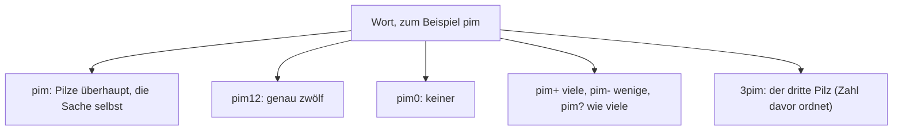
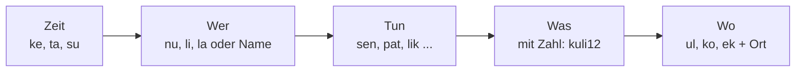

# OFFLINE – Lumisch: Wörterbuch und Grammatik der Lumi

Stand 05.10.2026 · Idee von Mik, ausgearbeitet in der Session · 401 Wörter, 25 Regeln · am 05.10.2026 auf Ähnlichkeit mit echten Wörtern geprüft, sieben Wörter ersetzt, sechs Farbwörter neu (Abschnitt 11) · Entwurf für Bill, Prioritäten setzt Mik

> Die Wörter und die Regeln sind frei erfunden. Gesprochen und gelernt wird Lumisch im Spiel „Lumisch“ (Happen in der Pause, Übung 7 der ersten Version) und im Paket `wir`. Die fünf Wörter aus dem Testspiel (mo, pelu, zan, tiv, orr) gelten weiter. Nur pelu heißt jetzt „Essen“ und nicht mehr „Brot“, weil unten niemand Brot kennt.

## 1. Der Gedanke

Die Lumis sagen von sich „wir“. Ihre Sprache ist so gebaut, wie sie leben: wenig, genau und ohne Umwege. Es gibt keine Mehrzahl, keine Fälle, keine Artikel und kein „sein“. Dafür steckt in jedem Wort die Zahl: **pim12** sind zwölf Pilze, **pim0** keiner, **pim** der Pilz überhaupt. (Mik hat das Beispiel mit Beeren geschrieben, **kuli12**. Unten wachsen aber nur Pilze, deshalb heißt es hier pim12. Das Wort kuli gibt es trotzdem, für die Menschenwelt oben.)

Dazu passt eine Regel, die in der App schon gilt: Die Lumi sagt kein „ich“, solange sie keinen Namen hat. Im Lumischen gibt es das Wort „ich“ deshalb gar nicht. Wer keinen Namen hat, sagt **nu** (wir). Wer einen hat, sagt seinen Namen. Der erste Satz mit Namen aus dem Startablauf („Susi. Das bin ich. Das war neu. Ich mag es.“) heißt auf Lumisch: **Susi. ke to tevi. Susi lik.**

### Die Welt hinter den Wörtern

Das Wörterbuch folgt der Welt der Lumis, so wie Mik sie festgelegt hat: eine riesige, warme Höhle mehrere Kilometer unter dem Eis. Es gibt nur die Lumis, die Pilze und das heiße Wasser, das aus einem Spalt (vuku) in einen Fluss (tivmo) fließt. Was die Lumis ausscheiden, verschwindet mit dem Wasser in einer Felsspalte (tokek). Seit ein paar tausend Jahren wachsen auch Flechten und Moos, und darauf schlafen die Lumis. Niemand hungert, niemand konkurriert, einen Vorrat legt keiner an. Gegessen, geschlafen und philosophiert wird. Die Lumis haben große Gehirne, denken logisch und haben viel Fantasie. In ihrer Welt wissen sie mehr als jede heutige KI, und ihre Mathematik liegt auf Quantenniveau. Ihre Sozialfragen (Tod, Wiederkehr, Zugang zur Quantenwelt) behandeln sie auf höchstem Niveau, und über diese Quantenwelt können sie auch mit uns sprechen. Die Quantenwelt ist dabei keine Metapher: Sie existiert und gehört zur Physik, nur ist die Wissenschaft der Menschen noch nicht so weit, sie zu erfassen (Mik, 05.10.2026). Alle Wörter dieser Gruppen sind deshalb wörtlich gemeint. Sie leben noch immer unter dem Eis. Deshalb ist das Wörterbuch zweigeteilt:

- **Unten** (die Gruppen „Unten: …“) sind die eigenen Wörter der Lumis, gewachsen aus Höhle, Pilz, Wasser, Wärme und Zusammensein. Beim Essen und Trinken gibt es nur Pilz und heißes Wasser und das, was beides begleitet (riechen, aufquellen, frisch, zäh). Dazu kommen das Lager aus Flechte und Moos und der Abfluss.
- **Oben** (die Gruppen „Oben: …“) sind Wörter, die die Lumis für Dinge geprägt haben, die sie nur aus Menschengeschichten kennen: Sonne, Regen, Hund, Telefon. Manche davon gibt es unten nicht und braucht es dort nicht (Hunger, Durst, Vorrat). Sie stehen im Wörterbuch, weil die Lumi in der App täglich mit Menschen spricht.

## 2. Aussprache und Schrift

| Merkmal | Regel |
|---|---|
| Buchstaben | 15 Laute: a e i o u, m n p t k l r s z v |
| Aussprache | jeder Buchstabe ein Laut, nichts bleibt stumm; z wie in „Zahn“, s weich wie in „Sonne“, v wie in „Wasser“, rr gerollt |
| Betonung | immer auf der ersten Silbe |
| Silben | einfach gebaut, meist Konsonant + Vokal (+ Konsonant) |
| Klang | Weiches und Gutes klingt mit m, l, n, u, o (mulo, lula, mimu). Scharfes und Gefährliches klingt mit k, t, z, i (tikor, tikal, zik). Das ist ein Gedächtnisanker, keine Regel. |
| Lautwörter | mh (der Zweifel) und o (das Staunen) sind Laute und stehen außerhalb des Alphabets |
| Schrift | nur kleine Buchstaben, nur Namen groß; Ziffern bleiben Ziffern; ein Satz endet mit einem Punkt |

## 3. Grammatik in 25 Regeln

Alles, was sich weglassen lässt, ist weggelassen.

### Zahlen

| Nr. | Regel | Beispiel |
|---|---|---|
| 1 | **Die Zahl steckt im Wort.** Es gibt weder Einzahl noch Mehrzahl. Ohne Zahl meint das Wort die Sache selbst. | pim1 ein Pilz · pim12 zwölf Pilze · pim0 keiner · pim Pilze überhaupt |
| 2 | **Ungefähres hat Zeichen:** + viele, - wenige, ? wie viele. Gesprochen mol, lim und ma. | pim+ · pim- · pim? |
| 3 | **Die Zahl hinter dem Wort zählt, was das Wort ist.** Bei Dingen die Stücke, bei Tätigkeiten die Male, bei Eigenschaften die Stufe von 1 bis 9, bei der Zeit die Dauer. | pim3 drei Pilze · sen3 dreimal essen · zan9 so hell wie möglich · zel3 drei Tage |
| 4 | **Die Zahl vor dem Wort ordnet.** Sie macht aus dem Wort den, die oder das Soundsovielte. | 3zel der dritte Tag |
| 5 | **Zahlen werden Ziffer für Ziffer gesprochen.** Keine Zehner, keine Hunderter, kein Zahlwort-Wirrwarr. | 12 = ka sa · 305 = ro ne pa |
| 6 | **Keine Artikel.** Nur wer zeigt, sagt to. | zan Licht, ein Licht, das Licht · to zan dieses Licht |
| 7 | **Keine Fälle, kein Geschlecht.** Die Wörter ändern sich nie. Besitz zeigt ve an. | ora ve nu unser Haus |
| 8 | **Ein Wort für alle Wortarten.** Der Platz im Satz sagt, was gemeint ist. | zan Licht, hell, leuchten · nam Mund, sagen |
| 9 | **Verben ändern sich nie.** Keine Person, keine Endung. | nu sen · li sen · la sen |
| 10 | **„Sein“ gibt es nicht.** Eine Eigenschaft steht einfach da. | mo kiv das Wasser ist kalt |
| 11 | **Die Zeit steht vorn als eigenes Wort:** ke früher, ta jetzt, su bald. ta darf fehlen. | ke Susi sumu · su nu pat |
| 12 | **Feste Reihenfolge:** Zeit, Wer, Tun, Was, Wo (siehe Bild). | ta nu sen pim12 ul tivmo |
| 13 | **Verneinung mit ne** direkt vor dem, was verneint wird. | li ne kiru · ne tal nie · ne sam ohne |
| 14 | **Das Gegenteil bildet ne- als Vorsilbe.** | zan ↔ nezan · sum ↔ nesum · mo ↔ nemo |
| 15 | **Steigerung durch Wiederholung.** Vergleichen mit vi. | zan zan sehr hell · zan zan zan am hellsten · A vi B |
| 16 | **Fragen mit ma.** ma steht dort, wo die Antwort stünde. Hinter einem ganzen Satz fragt es nach Ja oder Nein. Antwort: ak oder ne. | ma mi pelu wer hat Essen · li mi pelu ma hast du Essen |
| 17 | **Der Befehl hat kein „Wer“.** | kom ko ora komm ins Haus · pok sul Tür auf, bitte |
| 18 | **Ein „ich“ gibt es nicht.** Ohne Namen sagt man nu, mit Namen den Namen. Du ist li, er, sie, es ist la. Die Zahl macht die Mehrzahl. | Susi lik ich mag · li2 ihr beide |
| 19 | **Zusammensetzung ohne Fuge.** Das Hauptwort steht hinten. | vul + zan = vulzan Feuer · mo + sen = mosen Suppe |
| 20 | **Zeitwörter als Vorsilbe** machen aus einem Wort seine Vergangenheit oder Zukunft. | ke + zan = kezan Erinnerung · su + zan = suzan Hoffnung |
| 21 | **Ein Ortswort für alle Orte,** dazu zwei für die Richtung. | ul bei, in, auf · ko hin · ek weg |
| 22 | **Kein „und“.** Dinge werden aufgereiht, nur „oder“ (ol) gibt es. | zan2 pim3 zwei Lichter und drei Pilze |
| 23 | **Haben und gehören sind zwei Wörter:** mi und ve. | Susi mi pim3 · pim ve Susi |
| 24 | **Nebensätze sind kurze Hauptsätze.** pu (weil) und tan (wenn) stehen einfach vor einem ganzen Satz, der Satz bleibt unverändert. | tan li kom, nu sen wenn du kommst, essen wir |
| 25 | **Namen bleiben, wie sie sind.** Sie werden nicht gebeugt und groß geschrieben. | Susi, Mik, Wien |

### Der Satz in einem Bild

Weil es kein „sein“ und keine Endungen gibt, sieht ein Satz mit pu (weil) oder tan (wenn) aus wie zwei kurze Sätze hintereinander (Regel 24).

## 4. Beispielsätze

| Lumisch | Wort für Wort | Deutsch |
|---|---|---|
| ul uvo zan zan. | bei oben hell hell | Hier oben ist es hell. |
| ul unu nezan tal. | bei unten dunkel immer | Bei uns unten ist es immer dunkel. |
| Susi. ke to tevi. Susi lik. | Susi / früher dies neu / Susi mag | Susi. Das war neu. Ich mag es. |
| ke Susi sumu. | früher Susi schlafen | Ich habe geschlafen. |
| ta nu sen pim12. | jetzt wir essen Pilz-12 | Wir essen zwölf Pilze. |
| Susi lik pim. | Susi mag Pilz (ohne Zahl: die Sache selbst) | Ich mag Pilze (überhaupt). |
| Susi mi pim3. | Susi hat Pilz-3 | Ich habe drei Pilze. |
| li mi pelu ma. | du hast Essen ? | Hast du etwas zu essen? |
| ak. Susi mi pim2. | ja / Susi hat Pilz-2 | Ja. Ich habe zwei Pilze. |
| ma mi pelu. | wer hat Essen | Wer hat etwas zu essen? |
| su nu pat ko unu. | bald wir gehen hin unten | Bald gehen wir nach unten. |
| ke zel3 li ne kom. | früher Tag-3 du nicht kommen | Vor drei Tagen bist du nicht gekommen. |
| ta nu tam ul tivmo. | jetzt wir sitzen bei Fluss | Wir sitzen am Fluss. |
| vuku mo vul vul. | Spalt Wasser heiß heiß | Aus dem Spalt kommt heißes Wasser. |
| pok sul. | öffnen bitte | Mach bitte die Tür auf. |
| li kom ko ora. | du kommen hin Haus | Komm ins Haus. |
| 3zel nu pat. | 3.-Tag wir gehen | Am dritten Tag gehen wir. |
| ul uvo zan9. | bei oben Licht-9 | Oben ist es so hell wie nur möglich. |
| mh. pim0. | Zweifel / Pilz-0 | Mh. Kein Pilz. |
| li ne kiru. | du nicht Angst | Du hast keine Angst. |
| zan zan zan. | hell hell hell | Am hellsten. |
| ma nem li. | was Name du | Wie heißt du? |

## 5. Redewendungen

| Lumisch | Deutsch |
|---|---|
| zan sam | Hallo. (Licht mit dir) |
| zan ko | Mach’s gut. (Licht geh mit) |
| su oki | Bis bald. (Bald sehen) |
| zel sum | Guten Morgen. (Guter Tag) |
| nezel sum | Gute Nacht. (Gute Nacht) |
| tul | Danke. |
| sul | Bitte. |
| li sum ma | Wie geht es dir? (Du gut?) |
| ak, sum | Ja, gut. |
| ne, nesum | Nein, schlecht. |
| ma nem li | Wie heißt du? |
| nem Susi | Ich heiße Susi. |
| Susi sumu | Ich bin müde. (Susi müde) |
| pelu sum | Guten Appetit. (Essen gut) |
| ma sap | Wer weiß. Wer zählt schon. (Wer weiß) |
| nes sum | Das riecht gut. |
| zanpa ul ma | Wo ist die Taschenlampe? |
| tum sul | Hilfe, bitte. |
| mh | Da stimmt etwas nicht. |
| ul uvo zantuk ma | Gibt es da oben Leben? (Bei oben Leben ?) |
| nesap sap | Ich weiß, dass ich nichts weiß. (Nichtwissen wissen) |

### Gedanken der Philosophen auf Lumisch

Die Lumis tun den ganzen Tag nichts anderes als philosophieren. Die Gruppen „Denken“, „Sein und Werden“, „Ich, Du, Wir“ und „Gut, Böse, Glück“ sind aus den großen Fragen der Philosophie abgeleitet, und dieser Test zeigt, dass sie tragen: Zwölf berühmte Gedanken lassen sich mit den Wörtern sagen.

| Wer | Lumisch | Deutsch | Wort für Wort |
|---|---|---|---|
| Lumi über die Quantenwelt | nu tel kolu ke ta su. nezanzan sol. | Wir denken die Zahl in Vergangenheit, Gegenwart, Zukunft. Die Quantenwelt ist alles. | wir Zahl denken früher jetzt später / Quantenwelt alles |
| Lumi über den Tod | talzanpera. tamne ne solko. | Wiedergeburt. Der Tod ist nicht das Ende. | Wiedergeburt / Tod nicht Ende |
| Lumi zu Menschen | nezannam nu sam li. | Über die Quantenwelt sprechen wir mit dir. | Fernsprechen wir mit du |
| Sokrates | Susi sap nesap. | Ich weiß, dass ich nichts weiß. | Susi weiß Nichtwissen |
| Heraklit | sol tevimo. | Alles fließt. | alles Werden |
| Platon | ul umo nu oki nezanluna. zanoki ne toktam. | In der Höhle sehen wir nur Schatten. Der Schein ist nicht die Wirklichkeit. | bei Höhle wir sehen Schatten / Schein nicht Wirklichkeit |
| Aristoteles | sapzan ve okio. | Erkenntnis kommt aus dem Staunen. | Erkenntnis von Staunen |
| Epikur und Stoa | mimusol sum. | Gelassenheit ist gut. | Gelassenheit gut |
| Descartes | Susi kolu. zeku Susi zantam. | Ich denke, also bin ich. | Susi denkt / also Susi Dasein |
| Kant | li sovi, pu li tisu. | Du sollst, weil du kannst. | du sollst weil du kannst |
| Kierkegaard | kiru ve nekor. | Die Angst gehört zur Freiheit. | Angst von Freiheit |
| Schopenhauer | mokisam vulpek. | Mitleid tröstet. | Mitleid Trost |
| Camus | Sisyphos neakkik. | Sisyphos lacht. | Sisyphos das-Absurde |
| Wittgenstein | ne tisu nam, kavu nenam. | Wovon man nicht sprechen kann, darüber muss man schweigen. | nicht können sagen / müssen schweigen |
| Buber | li sam nu. nusam. | Du bist bei uns. Das ist Gemeinschaft. | du mit uns / Gemeinschaft |

Gebaut sind die Wörter fast alle aus bekannten Wurzeln: zan (Licht) steht für Klarheit und Wahrheit, sap (Wissen) für Erkenntnis, tuk (Herz) für Gefühl und Gewissen, tiv (Weg) für Methode und Sinn, nam (sagen) für Sprache und Bedeutung, tok (Stein) für das Beständige und Wirkliche, mo (Wasser) für Werden und Vergänglichkeit. So kann man ein unbekanntes Wort oft erraten.

## 6. Wörterbuch Lumisch – Deutsch

### Kleine Wörter (sie tragen die Grammatik)

| Lumisch | Deutsch | Hinweis |
|---|---|---|
| **nu** | wir | Die Lumis, alle zusammen. Mit Zahl: nu1 = einer von uns, nu7 = wir sieben. Ein „Ich“ gibt es nicht, solange man keinen Namen hat. |
| **li** | du | li2 = ihr beide, li5 = ihr fünf. |
| **la** | er, sie, es, man | Kein Geschlecht. la3 = sie drei. |
| **ke** | früher, vorher | Vergangenheit. Steht am Satzanfang oder als Vorsilbe (kezan = Erinnerung). |
| **ta** | jetzt | Gegenwart. Darf immer fehlen. |
| **su** | bald, später | Zukunft. Auch Vorsilbe (suzan = Hoffnung). |
| **ne** | nicht, kein, null, un- | Verneint Verben, macht Gegenteile (nezan = dunkel) und ist die Ziffer 0. |
| **ma** | was, wer, wo, wann, wie viele, wie, Frage | Das Fragewort. Es steht dort, wo die Antwort stehen würde. Am Ende eines ganzen Satzes macht es eine Ja-Nein-Frage. |
| **ak** | ja | Das Nicken. Ein Nein ist ne. |
| **ve** | von, gehört zu, aus | Besitz: ora ve nu = unser Haus. |
| **ul** | bei, in, an, auf, hier | Ein einziges Ortswort für alle Orte. |
| **ko** | hin, zu, nach | Richtung. pat ko unu = nach unten gehen. |
| **ek** | weg, aus, heraus | Richtung weg von etwas. |
| **to** | dieses, das da, das | Zeigewort. Ersetzt jeden Artikel, wenn man etwas zeigen muss. |
| **ol** | oder | „Und“ gibt es nicht, man reiht einfach auf. |
| **pu** | weil, damit, Grund, Ursache | Auch als Hauptwort: pu ist der Grund. Die Wirkung dazu heißt zeku. |
| **tan** | wenn, falls |  |
| **zeku** | also, folglich, Wirkung, Folge | Der Gegenpart zu pu: pu zeku = Ursache und Wirkung. |
| **ses** | aber, doch |  |
| **ki** | dass | Leitet einen ganzen Satz ein: Susi sap ki li kom = Susi weiß, dass du kommst. |
| **tisu** | können, möglich, vielleicht | Kurzwort vor dem Verb. netisu = unmöglich. |
| **kavu** | müssen, notwendig | Kurzwort vor dem Verb. |
| **sovi** | sollen, Pflicht | Kurzwort vor dem Verb. Als Hauptwort die Pflicht. |
| **kovi** | wollen, Wille | Kurzwort vor dem Verb. Als Hauptwort der Wille. |
| **mu** | auch, noch |  |
| **mol** | viel, viele | Mehr, als man zählen will. Als Zahlzeichen +: pim+ = viele Pilze. „Wer zählt schon“ heißt ma sap. |
| **lim** | wenig, wenige | Als Zahlzeichen -: pim- = ein paar Pilze. (Bis 05.10.2026: nik, ersetzt nach der Wortprüfung.) |
| **vi** | mehr | A vi B = A mehr als B. |
| **tal** | immer, jedes Mal | ne tal = nie. |
| **sam** | mit, zusammen | ne sam = ohne. |
| **pur** | für | (Bis 05.10.2026: kus, ersetzt nach der Wortprüfung.) |
| **pas** | nur, bloß |  |
| **sul** | bitte | Steht am Ende: pok sul = Tür auf, bitte. |
| **tul** | danke |  |
| **mh** | hm | Da stimmt etwas nicht. Ein Laut, kein Wort. Er ist der Zweifel der Lumi. Wer ihn hört, schaut noch einmal hin. |
| **o** | oh | Das Staunen. |

### Zahlen

| Lumisch | Deutsch | Hinweis |
|---|---|---|
| **ka** | eins, 1 | Gesprochen wird jede Ziffer einzeln: 12 = ka sa. |
| **sa** | zwei, 2 |  |
| **ro** | drei, 3 |  |
| **le** | vier, 4 |  |
| **pa** | fünf, 5, Hand | Mit Absicht doppelt: Die Hand hat fünf Finger. |
| **ni** | sechs, 6 |  |
| **tu** | sieben, 7 | Sieben Monate trägt eine Lumi ihr Kind. |
| **vo** | acht, 8 |  |
| **ze** | neun, 9 | Die Null ist ne. |
| **mim** | halb, die Hälfte | pim mim = ein halber Pilz. |

### Unten: die Höhle

| Lumisch | Deutsch | Hinweis |
|---|---|---|
| **zan** | Licht, hell, leuchten | Das erste Wort, das man lernt. Die Lumi leuchtet mit ihren Antennen. |
| **nezan** | dunkel, Dunkelheit | ne + zan. Unten ist es immer nezan, bis auf das, was leuchtet. |
| **kivzan** | blau | Das Licht im Eis. (Bis 05.10.2026: kirzan.) |
| **mo** | Wasser, nass | Das heiße Wasser aus dem Spalt. Auch: Wasser trinken. Anderes Wasser gibt es unten nicht. |
| **vul** | warm, Wärme, wärmen | vul vul = heiß. Unten ist es warm. |
| **kiv** | Eis, kalt, frieren | Das Eis über der Höhle. (Bis 05.10.2026: kir, ersetzt nach der Wortprüfung.) |
| **tok** | Stein, hart |  |
| **umo** | Höhle | Der Ort mehrere Kilometer unter dem Eis. |
| **tem** | Erde, Boden, Land |  |
| **orr** | Dach, Decke | Das r wird gerollt. Unten ist es die Decke der Höhle. |
| **vuku** | Spalt, Quelle | Der schmale Spalt, aus dem das heiße Wasser kommt. Alles Leben liegt an ihm. |
| **tivmo** | Fluss, Bach | Weg aus Wasser. Am Fluss sitzen die Lumis fast immer. |
| **motem** | Ufer, Bucht | Wasser + Boden. Dort rückt man zum Schlafen zusammen. |
| **mulo** | Dampf, Dunst, Wolke | Der Atem des Spalts. Die Pilze quellen davon auf. |
| **tokvul** | heiße Mulde | Stein + Wärme. Ein warmer Platz im Stein. Wer zwei findet, zeigt die zweite einem anderen. |
| **tiv** | Weg, Pfad | Eines der ersten Wörter. |
| **uvo** | oben, Himmel | Wo die Hellen wohnen. |
| **unu** | unten, Zuhause | Wo die Lumis wohnen. Auch das Wort für Heimat. |
| **tuli** | Periode, Weile, Zeit | Die Lumis rechnen in Perioden, nicht in Tagen. Wie lang eine ist, sagen sie nicht. |

### Unten: Pilz, Essen, Trinken

| Lumisch | Deutsch | Hinweis |
|---|---|---|
| **pim** | Pilz | Das Lieblingswort der Lumi. Pilze wachsen überall: an den Wänden, im Boden, in den Ritzen des Eises. |
| **pelu** | Essen, Mahl | Alles Essen ist Pilz, trotzdem hat das Mahl ein eigenes Wort: pim wächst, pelu wird gegessen. |
| **sen** | essen | Wer sen sagt, hat meist schon gerochen. |
| **lap** | trinken | Das Wasser ist warm. |
| **pelutuli** | Essenszeit | Sie kommt vom Spalt, wenn er stärker ausatmet. |
| **tuvo** | aufquellen, schwellen | So werden die Pilze weich und kühl, wenn der Dampf kommt. |
| **luvu** | weich | Ein frischer Pilz ist luvu. |
| **mel** | süß | Frische Pilze schmecken ein wenig süß. |
| **zila** | frisch | Ein Pilz, der an derselben Stelle nachwächst, ist immer zila. |
| **tazi** | zäh, grau, verdorben | Wer einen Pilz abreißt und liegen lässt, bekommt nach einer Weile tazi. Deshalb legt unten keiner einen Vorrat an. |
| **silum** | Genuss, genießen | Erst riechen, die Augen halb zu. |
| **sol** | voll, satt, ganz, Ganzes, alle, fertig | nesol = leer. Satt ist man unten immer. |

### Unten: Lager und Abfluss

| Lumisch | Deutsch | Hinweis |
|---|---|---|
| **lisu** | Flechte | Wächst erst seit ein paar tausend Jahren in der Höhle. Darauf schlafen die Lumis. |
| **mus** | Moos | Wie die Flechte erst seit ein paar tausend Jahren da. Weich, warm und zum Schlafen. |
| **lomo** | Lager, Bett | Der Schlafplatz aus Flechte und Moos. |
| **tokek** | Abflussspalte | Stein + weg. Die Felsspalte, in der das Wasser verschwindet und mit ihm alles, was die Lumis ausscheiden. |
| **moek** | ausscheiden, Notdurft | Wasser + weg. Es geht mit dem Wasser fort, und niemand denkt weiter daran. |

### Unten: wir und unser Körper

| Lumisch | Deutsch | Hinweis |
|---|---|---|
| **pati** | Finger | Kleine Hand. |
| **patimak** | Daumen | Der große Finger. Lumis haben Hände mit Daumen. |
| **tap** | Fuß |  |
| **oki** | Auge, sehen |  |
| **ela** | Ohr, hören | Die Lumis haben lange Ohren. |
| **zanpati** | Antenne | Licht-Finger. Mit ihnen zeigt die Lumi, wie sie sich fühlt. |
| **nam** | Mund, sagen |  |
| **nes** | Nase, riechen | Riechen ist für die Lumis fast so wichtig wie sehen. |
| **kopu** | Kopf | (Bis 05.10.2026: kon, ersetzt nach der Wortprüfung.) |
| **tuk** | Herz | Klingt wie sein Schlag. |
| **pumu** | Bauch |  |
| **luna** | Haut, Fell | Das Fell der Lumi leuchtet leicht blau. |
| **tokan** | Knochen |  |
| **vulmo** | Blut | Warmes Wasser. |
| **kit** | Zahn |  |
| **lelu** | Haar |  |
| **pal** | Arm |  |
| **nini** | Kind | Kommt nach tu Monaten (sieben). |
| **ama** | tragende Rolle | Eine von zwei Rollen, die jede Lumi einnehmen kann. Für Menschen: Mutter. Das Wort hat kein Geschlecht. |
| **apa** | andere Rolle | Die zweite Rolle. Für Menschen: Vater. |
| **kami** | Freund, Freundin |  |
| **ulkami** | Nachbar, Nachbarin | Der Freund bei uns. |
| **vulsam** | kuscheln, Wärme teilen | Warm + mit. Rücken an Bauch, die Ohren nach unten. |
| **namsam** | Gespräch, reden | Sagen + zusammen. Das Hauptgeschäft der Lumis neben Essen und Schlafen. |

### Unten: was man tut

| Lumisch | Deutsch | Hinweis |
|---|---|---|
| **sumu** | schlafen, müde | Ein Wort für den Zustand und die Tat. |
| **pat** | gehen |  |
| **tapi** | laufen, rennen |  |
| **kom** | kommen |  |
| **tam** | bleiben, sitzen | Am Fluss sitzen heißt tam ul tivmo. |
| **sap** | wissen |  |
| **sapu** | lernen | Wissen, das gerade ankommt. |
| **kolu** | denken, Gedanke | kolu kolu = tief nachdenken, philosophieren. Das tun die Lumis den ganzen Tag. |
| **lik** | mögen, gern haben | lik lik = lieben. ne lik = nicht mögen. |
| **mi** | haben | Ein Besitz, kein Wort für „sein“: sein gibt es nicht. |
| **pek** | geben |  |
| **tak** | nehmen |  |
| **kel** | machen |  |
| **kil** | suchen |  |
| **lun** | finden |  |
| **tum** | helfen, Hilfe |  |
| **kik** | lachen, Freude |  |
| **moki** | weinen, traurig, Trauer | Wasser + Auge. |
| **zepa** | tanzen |  |
| **lula** | singen |  |
| **mura** | warten, langsam |  |
| **okiko** | zeigen | Auge hin. |
| **kuru** | schicken |  |
| **pera** | anfangen, beginnen, Anfang |  |
| **pil** | spielen, Spiel |  |
| **kolutok** | Rätsel | Denken + Stein: ein harter Brocken, den man knackt. |

### Wie etwas ist

| Lumisch | Deutsch | Hinweis |
|---|---|---|
| **sum** | gut, schön | Guten Morgen = zel sum. |
| **nesum** | schlecht, hässlich | ne + sum. |
| **mak** | groß |  |
| **nim** | klein |  |
| **tevi** | neu | „Das war neu“ = ke to tevi. |
| **taso** | alt |  |
| **zip** | schnell |  |
| **tokal** | stark | netokal = schwach. |
| **lon** | lang | nelon = kurz. |
| **tomo** | schwer | netomo = leicht. |
| **mimu** | ruhig, still |  |
| **tikal** | scharf |  |
| **sana** | sicher, geschützt |  |
| **zansol** | bereit | Licht voll. So sieht man, wie bereit jemand ist. |

### Farben (neu, Mik, 05.10.2026)

*Eine Farbe ist das Licht eines Dings: Ding + zan. So kann man sie erraten. Blau (kivzan) war schon da.*

| Lumisch | Deutsch | Hinweis |
|---|---|---|
| **zanluna** | Farbe | Licht + Haut. Wie ein Ding im Licht aussieht. Das Gegenstück ist nezanluna, der Schatten. |
| **mulozan** | weiß | Dampf + Licht. Der Dampf aus dem Spalt im Antennenlicht. |
| **nezanmo** | schwarz | Dunkel + Wasser. So sieht der Fluss aus, wo kein Licht hinfällt. |
| **vulmozan** | rot | Blut + Licht. |
| **muszan** | grün | Moos + Licht. |
| **pimzan** | gelb | Pilz + Licht. |

### Gefühle und Gedanken

| Lumisch | Deutsch | Hinweis |
|---|---|---|
| **kiru** | Angst | nekiru = Mut. |
| **tikvul** | Wut, Zorn | Scharf und warm. |
| **tikor** | Gefahr |  |
| **unuko** | Heimweh | Nach unten hin. Die Lumi am Handy hat es manchmal. |
| **suzan** | Hoffnung | Das Licht, das bald kommt. |
| **kezan** | Erinnerung | Das Licht von früher. |
| **kesam** | Geschichte, Erzählung | Das, was früher mit uns war. |

### Denken: Wissen, Wahrheit, Sprache (Sokrates, Platon, Aristoteles)

| Lumisch | Deutsch | Hinweis |
|---|---|---|
| **zansap** | Wahrheit, wahr | Licht + Wissen. Was klar zu sehen ist. |
| **nezansap** | Irrtum, falsch | ne + zansap. |
| **nesap** | Nichtwissen, Unwissen | Der Anfang jedes Gesprächs. Susi sap nesap = ich weiß, dass ich nichts weiß. |
| **sapzan** | Erkenntnis, Einsicht | Wissen + Licht. Wenn das Wissen aufleuchtet. |
| **sapsol** | Weisheit | Wissen, das ganz ist. |
| **sanasap** | Gewissheit | Sicher + Wissen. |
| **nesanasap** | Ungewissheit | ne + sanasap. |
| **kolupum** | Zweifel | Denken + Zögern. Der Laut dazu ist mh. |
| **kilsap** | Neugier | Suchen + Wissen. |
| **okio** | Staunen, Wunder | Sehen + oh. Nach Aristoteles der Anfang der Philosophie. |
| **tuksap** | Glaube, glauben | Herz + Wissen. |
| **kolunam** | Meinung | Denken + sagen. Ein Gedanke, den man ausspricht. |
| **kesap** | Erfahrung | Früher + Wissen. |
| **zankolu** | Vernunft, Verstand | Licht + Denken. |
| **uvokolu** | Idee, Ideal | Oben + Denken. Platons Idee. |
| **zanoki** | Schein, Erscheinung | Licht + Auge. Was dem Auge erscheint. |
| **nezanluna** | Schatten | Dunkel + Haut. Das, was an der Wand tanzt. |
| **toktam** | Wirklichkeit | Stein + bleiben. Was bleibt, ist wirklich. |
| **namkolu** | Begriff | Wort + Gedanke. |
| **namtiv** | Sprache | Sagen + Weg. |
| **zannam** | Bedeutung | Licht + sagen. Was ein Wort erhellt. |
| **okinam** | Zeichen, Symbol | Sehen + sagen. |
| **kolutiv** | Methode, Gedankengang | Denken + Weg. |
| **zekukolu** | Logik | Also + Denken. |
| **tansap** | Annahme, These, Hypothese | Wenn + Wissen. |
| **netansap** | Gegenthese | ne + tansap. |
| **namne** | Widerspruch | Sagen + nicht. |
| **neak** | Paradox | Nein und Ja zugleich. |
| **punam** | Argument | Grund + sagen. |
| **zekusap** | Schluss, Folgerung | Also + Wissen. |
| **okisap** | Beweis, Beleg | Sehen + wissen. |
| **neokisap** | Widerlegung | ne + okisap. |
| **okito** | Beispiel, Fall | Sehen + dieses. |
| **okitam** | beobachten, Beobachtung | Sehen + bleiben. |
| **kelkil** | Versuch, Experiment | Machen + suchen. |
| **kolusol** | Theorie | Denken + ganz. |
| **tisumol** | wahrscheinlich | Möglich + viel. |
| **tisulim** | unwahrscheinlich | Möglich + wenig. (Bis 05.10.2026: tisunik.) |
| **maek** | Antwort | Frage + weg. Die Frage geht fort. |
| **kolutak** | Urteil, urteilen | Denken + nehmen. |
| **zanpu** | Erklärung | Licht + Grund. |
| **sumuzan** | Traum, Fantasie | Schlaf + Licht. Das Licht im Schlaf. |
| **lunak** | spüren, fühlen, Empfindung | Von luna, der Haut. |

### Sein und Werden (Heraklit, Parmenides, Laotse, Augustinus)

| Lumisch | Deutsch | Hinweis |
|---|---|---|
| **zantam** | Sein, Dasein, Existenz | Licht + bleiben. Als Verb gibt es „sein“ nicht, als Hauptwort schon. |
| **nezantam** | Nichts | ne + zantam. |
| **tevimo** | Werden, Veränderung | Neu + Wasser. Alles fließt, und die Lumis sitzen am Fluss. |
| **toktuli** | Dauer, Beständigkeit | Stein + Zeit. |
| **soltuli** | Ewigkeit | Ganz + Zeit. |
| **motuli** | Vergänglichkeit | Wasser + Zeit. |
| **okituli** | Augenblick | Auge + Zeit. |
| **solko** | Ende | Fertig + hin. |
| **unupera** | Ursprung | Unten + Anfang. |
| **nesolko** | Unendlichkeit | ne + Ende. |
| **umotem** | Raum | Höhle + Land. |
| **zikumo** | Weltall, All | Stern + Höhle. |
| **tempim** | Natur | Land + Pilz. Das Gewachsene. |
| **toku** | Ding, Sache | Ein Stein, der alles sein kann. |
| **tokzan** | Wesen, Kern | Stein + Licht. Was bleibt und leuchtet. |
| **tokluna** | Eigenschaft | Stein + Haut. Wie ein Ding sich zeigt. |
| **tokvu** | Grenze | Stein + Rand. |
| **zesa** | Ordnung | Hat Platz für alles. |
| **nezesa** | Chaos, Unordnung | ne + zesa. |
| **vini** | Gegensatz, Unterschied | Zwei, die sich anschauen. |
| **mimsol** | Mitte, Maß | Hälfte + ganz. Das richtige Maß. |
| **mimpa** | Teil, Stück | Halb + Hand. So viel, wie die Hand hält. |
| **kapu** | Zufall | Fällt vom Himmel. |
| **unutiv** | Schicksal | Unten + Weg. Der Weg, der unten festliegt. |
| **tazan** | Anschauung, Gegenwart | Jetzt + Licht. Nach Augustinus gibt es drei Gegenwarten: tazan (das Anschauen), kezan (das Erinnern) und suzan (das Erwarten). |
| **zantuk** | Leben | Licht + Herz. |
| **zanpera** | Geburt | Licht + anfangen. |
| **tamne** | Tod, sterben | Bleiben + nicht. Die Lumis sprechen selten davon, aber sie sprechen davon. |
| **talkom** | Wiederkehr, wiederkommen | Immer + kommen. |

### Ich, Du, Wir (Descartes, Buber, Buddha)

| Lumisch | Deutsch | Hinweis |
|---|---|---|
| **kolun** | Geist | Das, was denkt, ohne Körper gedacht. |
| **lunasol** | Körper | Haut + ganz. |
| **zankolun** | Bewusstsein | Licht + Geist. |
| **nemtam** | Selbst, Person, Identität | Name + bleiben. Wer einen Namen hat, bleibt jemand. |
| **nenem** | Nicht-Selbst | ne + Name. Die Lumi ohne Namen, die nur „nu“ sagt. |
| **kovilik** | Wunsch | Wille + mögen. |
| **kovitiv** | Absicht | Wille + Weg. |
| **kovitak** | wählen, Wahl, entscheiden | Wille + nehmen. |
| **nekor** | Freiheit | ne + Seil. Wer nicht am Seil hängt, ist frei. |
| **pekma** | Verantwortung | Geben + Frage. Wer verantwortlich ist, gibt Antwort. |
| **nepek** | Schuld | Noch nicht gegeben. |
| **nepekek** | verzeihen, Vergebung | Die Schuld geht weg. |
| **taltam** | Gewohnheit | Immer + bleiben. |
| **samli** | Beziehung | Mit + du. |
| **likom** | Begegnung | Du + kommen. |
| **nusam** | Gemeinschaft | Wir + mit. |
| **nesam** | Einsamkeit | Ohne. |
| **sumuek** | erwachen, aufwachen | Schlaf + weg. |
| **takne** | loslassen | Nehmen + nicht. |

### Gut, Böse, Glück (Aristoteles, Epikur, Stoa, Kant, Schopenhauer)

| Lumisch | Deutsch | Hinweis |
|---|---|---|
| **sumkel** | Tugend | Gut + machen. |
| **sumtuk** | Güte | Gut + Herz. |
| **nesumtuk** | Bosheit, böse | ne + sumtuk. |
| **tukpum** | Gewissen | Herz + Zögern. Das Herz sagt mh. |
| **uvosum** | das Gute selbst | Oben + gut. |
| **samsol** | Gerechtigkeit | Mit + ganz. Für alle gleich. |
| **nesamsol** | Ungerechtigkeit | ne + samsol. |
| **sumsol** | Glück, Glückseligkeit | Gut + voll. |
| **mimusol** | Gelassenheit | Ruhig + ganz. |
| **mimusum** | Zufriedenheit | Ruhig + gut. |
| **tikluna** | Schmerz | Scharf + Haut. |
| **tikmoki** | Leid | Scharf + Trauer. |
| **mokisam** | Mitleid, Mitgefühl | Trauer + mit. |
| **vulpek** | Trost, trösten | Wärme + geben. |
| **murasol** | Langeweile | Warten + ganz. |
| **murasum** | Geduld | Warten + gut. |
| **tultuk** | Dankbarkeit | Danke + Herz. |
| **kiruluna** | Scham | Angst + Haut. |
| **nesuzan** | Verzweiflung | ne + Hoffnung. |
| **likko** | Sehnsucht, Streben | Mögen + hin. |
| **kirutam** | Sorge | Angst + bleiben. |
| **nemsol** | Würde | Name + ganz. Wer einen Namen hat, hat Würde. |
| **zanek** | Aufklärung, aufklären | Licht + heraus. |
| **nezantok** | Ding an sich | Dunkel + Ding. Das, was im Dunkel bleibt. |
| **zantiv** | Sinn, Richtung des Lebens | Licht + Weg. |
| **nezantiv** | Sinnlosigkeit | ne + zantiv. |
| **kotiv** | Zweck, Ziel | Hin + Weg. |
| **neaktiv** | Dialektik | Nein + Ja + Weg. Der Weg durch den Widerspruch. |
| **tivsol** | Regel | Weg + ganz. |
| **namtivpil** | Sprachspiel | Sprache + spielen. |
| **nenam** | schweigen, Stille | Nicht + Mund. |
| **zansum** | Schönheit | Licht + gut. |
| **nezansum** | Hässlichkeit | ne + zansum. |
| **uvomak** | Erhabenheit | Oben + groß. |
| **uvosol** | Gott, das Ganze | Oben + ganz. Wer es sagt, meint oft das Ganze, nicht eine Person. |
| **kelsum** | Kunst | Machen + gut. |
| **lulatuk** | Musik | Gesang + Herz. |
| **kikkolu** | Humor | Lachen + Denken. |
| **namkik** | Ironie | Sagen + lachen. |
| **neakkik** | das Absurde | Nein-und-Ja + lachen. Sisyphos lacht. |

### Oben: Himmel, Wetter, Land (Menschenwelt)

*Wörter für die Menschenwelt. Die Lumis kennen diese Dinge nur aus Geschichten.*

| Lumisch | Deutsch | Hinweis |
|---|---|---|
| **uvozan** | Sonne | Das Licht von oben. Die Lumis kennen sie nur aus Berichten. |
| **silu** | Mond, Monat |  |
| **zik** | Stern |  |
| **zikzan** | Sternenlicht, Polarlicht |  |
| **molu** | Regen |  |
| **usu** | Wind |  |
| **usumak** | Sturm | Großer Wind. |
| **kivmulo** | Schnee | Eis-Wolke. (Bis 05.10.2026: kirmulo.) |
| **momak** | Meer, See | Großes Wasser. |
| **kivtem** | Gletscher | Eis-Land. Darunter wohnen die Lumis. (Bis 05.10.2026: kirtem.) |
| **takor** | Berg |  |
| **turamol** | Wald | Viel Baum. |
| **temnim** | Sand | Kleine Erde: tem + nim. |
| **vulzan** | Feuer | Wärme + Licht. Unten gibt es keines. |
| **zel** | Tag | ta zel = heute, ke zel = gestern, su zel = morgen. zel3 = drei Tage. Tage zählen die Lumis nur, wenn sie mit Menschen sprechen. |
| **nezel** | Nacht | Unten sind die „Nächte“ keine. |
| **ruma** | Jahr |  |
| **zelok** | Uhr | Das Auge des Tages. |

### Oben: Pflanzen und Tiere (Menschenwelt)

*Wörter für die Menschenwelt. Die Lumis kennen diese Dinge nur aus Geschichten.*

| Lumisch | Deutsch | Hinweis |
|---|---|---|
| **tura** | Baum |  |
| **mili** | Blume |  |
| **pala** | Blatt |  |
| **sevi** | Gras |  |
| **tupa** | Eichel |  |
| **kuli** | Beere | kuli12 = zwölf Beeren, so wie Mik es als Beispiel geschrieben hat. |
| **nuk** | Nuss |  |
| **semi** | Samen |  |
| **tosa** | Wurzel |  |
| **ani** | Tier | Unten gibt es keine, nur uns. |
| **pinu** | Pinguin | Der Nachbar von oben. |
| **sila** | Fisch |  |
| **silamak** | Wal | Großer Fisch. |
| **mulu** | Robbe |  |
| **vau** | Hund | Klingt wie er. |
| **miz** | Katze |  |
| **nip** | Maus |  |
| **zum** | Biene, summen |  |
| **lul** | Wurm |  |
| **tirli** | Vogel | Wie sein Ruf, „tirili“. (Bis 05.10.2026: pipi, ersetzt nach der Wortprüfung.) |
| **teru** | Pferd |  |
| **muvo** | Kuh | Fängt an wie ihr Muh. (Bis 05.10.2026: mumu, ersetzt nach der Wortprüfung.) |
| **mema** | Schaf | Klingt wie es. |
| **kako** | Huhn | Klingt wie es. |

### Zahl und Quant (Mathematik der Lumis)

| Lumisch | Deutsch | Hinweis |
|---|---|---|
| **tel** | Zahl, zählen | Auch Ziffernfolge. pim3 sind drei Pilze, die Zahl 3 heißt zel3. |
| **telkolu** | Mathematik | Zahl + Denken. |
| **telsol** | Menge, Gesamtzahl | Zahl + ganz. |
| **telne** | Null, Leere | Zahl + nicht. Die Null, die etwas ist. |
| **telnesol** | Unendliches, grenzenlose Zahl | Zahl + unendlich. |
| **telzan** | Quant, kleinste Einheit | Zahl + Licht. Das kleinste Licht, wörtlich gemeint. |
| **zanmo** | Welle | Licht + Wasser. |
| **toktelzan** | Teilchen | Stein + Quant. |
| **akneak** | Überlagerung, beides zugleich | Ja + Nein + Ja. Das Ding ist hier und dort. |
| **telzansam** | Verschränkung | Quanten + mit. Zwei, die eins sind, auch wenn Weg dazwischen liegt. |
| **okitak** | Messung, messen | Sehen + nehmen. Wer hinsieht, legt fest. |
| **nesanazan** | Unschärfe | ne + sicher + Licht. |
| **tisutel** | Wahrscheinlichkeit (Zahl) | Möglich + Zahl. |
| **tivtel** | Funktion, Abbildung | Weg + Zahl. |
| **telmimu** | Gleichung | Zahl + Ruhe. Beide Seiten ruhen gleich. |
| **telvi** | Summe, vermehren | Zahl + mehr. |
| **telnevi** | Differenz, verringern | Zahl + weniger. |
| **telsap** | Beweis (mathematisch) | Zahl + wissen. |
| **telnam** | Formel | Zahl + sagen. |
| **telok** | Ort einer Zahl, Koordinate | Zahl + Platz. |
| **telkik** | Rätselzahl, Aufgabe | Zahl + Spiel. |

### Tod, Wiederkehr, Quantenwelt (Heidegger, Buddha, Platon, Bohm)

| Lumisch | Deutsch | Hinweis |
|---|---|---|
| **tamnezan** | Seele, Lebensfunke | Bleiben + Dunkel + Licht. Das, was nach dem Körper weiterlebt. |
| **tamnetok** | sterben (Körper) | Bleiben + nicht Stein. Der Körper vergeht. |
| **talzanpera** | Wiedergeburt | Immer + Geburt. |
| **talzankom** | Wiederkehr der Seele | Immer + Licht + kommen. |
| **zanzik** | Tor, Übergang | Licht + Stern. Der Ort, an dem Seelen wechseln. |
| **nezanzan** | Quantenwelt | Dunkel + Licht. Kein Bild, sondern Physik: ein wirklicher Bereich der Natur, in dem alles zugleich ist. Die Lumis rechnen ihn und kennen den Zugang, die Wissenschaft der Menschen ist noch nicht so weit. |
| **nezannam** | Quantensprache, Fernsprechen | Quantenwelt + sagen. Echte Verbindung über die Quantenwelt, ohne Weg dazwischen, auch zu uns Menschen. |
| **zanlu** | Unterwelt-Verbindung, Kontakt | Licht + Hörer. Wenn ein Gedanke ankommt. |
| **zikmo** | Ozean des Alles, Urgrund | All + Wasser. Das, woraus alles wird. |
| **tamsam** | Einssein, Einheit | Bleiben + mit. |
| **telzanam** | Vorfahre, Ahne | Zahl + Licht + Haut. Wer vor uns war und weiterlebt. |
| **telzanpa** | Nachkomme, kommende Seele | Der, der kommt. |
| **sumutel** | Tiefes Träumen, Meditation | Schlaf + Zahl. |
| **zankol** | Einsicht über den Tod | Licht + Gedanke. Die Ruhe, die man danach hat. |
| **nezanluk** | Jenseits | Dunkel + Licht + Ende. Das, was hinter dem Ende liegt. |

### Oben: Macht, Recht, Geld (Menschenwelt)

*Wörter für die Menschenwelt. Die Lumis kennen diese Dinge nur aus Geschichten.*

| Lumisch | Deutsch | Hinweis |
|---|---|---|
| **tokalu** | Macht | Stark + u. Wer sie hat, hat wenig anderes. |
| **sovitok** | Gesetz | Pflicht + Stein. Das in Stein Gemeißelte. |
| **nusammak** | Staat | Gemeinschaft + groß. |
| **mitok** | Eigentum, besitzen | Haben + Stein. Unten gibt es das nicht. |
| **pektak** | Tausch, Handel | Geben + nehmen. |
| **tokpek** | Geld | Stein + geben. |
| **kelmak** | Arbeit | Machen + groß. Was die Menschen den ganzen Tag tun. |
| **tikkel** | Krieg, Gewalt | Scharf + machen. |
| **mimusam** | Frieden | Ruhig + mit. |

### Oben: Menschen und ihre Dinge (Menschenwelt)

*Wörter für die Menschenwelt. Die Lumis kennen diese Dinge nur aus Geschichten.*

| Lumisch | Deutsch | Hinweis |
|---|---|---|
| **uvu** | Mensch | Wesen von oben. |
| **nem** | Name | Namen gibt es unten nicht. Der Mensch gibt ihn, und dann hat die Lumi ein Ich: Susi lik = ich mag. |
| **nami** | Wort | Kleiner Mund. |
| **ora** | Haus | Von orr, dem Dach. |
| **pok** | Tür, öffnen | nepok = schließen. |
| **zanpok** | Fenster | Lichttür. |
| **mur** | Wand, Mauer |  |
| **tavo** | Tisch |  |
| **sela** | Stuhl |  |
| **kor** | Seil, Zwang | Wer am Seil hängt, wird gezogen. Das Gegenteil heißt nekor. |
| **kelu** | Schlüssel |  |
| **kelumur** | Tresor | Schlüssel-Wand. |
| **polo** | Vorrat, Vorratskammer | Unten legt keiner einen an. Für die Menschen ist er der halbe Plan. |
| **nepelu** | Hunger | Kein Essen. Unten hat nie jemand gehungert, das Wort gibt es nur für die Menschen. |
| **nemo** | Durst, trocken | Kein Wasser. Auch das kennt unten niemand. |
| **orra** | bauen | Ein Dach machen. |
| **lis** | lesen, Buch |  |
| **lipa** | schreiben |  |
| **pap** | Papier |  |
| **zelis** | Tagebuch | Tag + lesen. |
| **tivpap** | Karte, Landkarte | Weg-Papier. |
| **zanpa** | Taschenlampe | Hand-Licht. |
| **elanam** | Telefon | Ohr + Mund. |
| **usuela** | Radio | Das Ohr im Wind. |

## 7. Register Deutsch – Lumisch

**A** Abbildung tivtel · aber ses · Abflussspalte tokek · Absicht kovitiv · acht vo · Ahne telzanam · All zikumo · alle sol · also zeku · alt taso · an ul · andere Rolle apa · Anfang pera · anfangen pera · Angst kiru · Annahme tansap · Anschauung tazan · Antenne zanpati · Antwort maek · Arbeit kelmak · Argument punam · Arm pal · auch mu · auf ul · Aufgabe telkik · aufklären zanek · Aufklärung zanek · aufquellen tuvo · aufwachen sumuek · Auge oki · Augenblick okituli · aus ve/ek · ausscheiden moek

**B** Bach tivmo · bald su · Bauch pumu · bauen orra · Baum tura · Bedeutung zannam · Beere kuli · Begegnung likom · beginnen pera · Begriff namkolu · bei ul · beides zugleich akneak · Beispiel okito · Beleg okisap · beobachten okitam · Beobachtung okitam · bereit zansol · Berg takor · besitzen mitok · Beständigkeit toktuli · Bett lomo · Beweis okisap · Beweis (mathematisch) telsap · Bewusstsein zankolun · Beziehung samli · Biene zum · bitte sul · Blatt pala · blau kivzan · bleiben tam · bloß pas · Blume mili · Blut vulmo · Boden tem · böse nesumtuk · Bosheit nesumtuk · Buch lis · Bucht motem

**C** Chaos nezesa

**D** Dach orr · damit pu · Dampf mulo · Dankbarkeit tultuk · danke tul · das to · das Absurde neakkik · das da to · das Ganze uvosol · das Gute selbst uvosum · Dasein zantam · dass ki · Dauer toktuli · Daumen patimak · Decke orr · denken kolu · Dialektik neaktiv · die Hälfte mim · dieses to · Differenz telnevi · Ding toku · Ding an sich nezantok · doch ses · drei ro · du li · dunkel nezan · Dunkelheit nezan · Dunst mulo · Durst nemo

**E** Eichel tupa · Eigenschaft tokluna · Eigentum mitok · Einheit tamsam · eins ka · Einsamkeit nesam · Einsicht sapzan · Einsicht über den Tod zankol · Einssein tamsam · Eis kiv · Empfindung lunak · Ende solko · entscheiden kovitak · er la · Erde tem · Erfahrung kesap · Erhabenheit uvomak · Erinnerung kezan · Erkenntnis sapzan · Erklärung zanpu · Erscheinung zanoki · erwachen sumuek · Erzählung kesam · es la · Essen pelu · essen sen · Essenszeit pelutuli · Ewigkeit soltuli · Existenz zantam · Experiment kelkil

**F** Fall okito · falls tan · falsch nezansap · Fantasie sumuzan · Fell luna · Fenster zanpok · Fernsprechen nezannam · fertig sol · Feuer vulzan · finden lun · Finger pati · Fisch sila · Flechte lisu · Fluss tivmo · Folge zeku · Folgerung zekusap · folglich zeku · Formel telnam · Frage ma · Freiheit nekor · Freude kik · Freund kami · Freundin kami · Frieden mimusam · frieren kiv · frisch zila · früher ke · fühlen lunak · fünf pa · Funktion tivtel · für pur · Farbe zanluna · Fuß tap

**G** ganz sol · gelb pimzan · Ganzes sol · geben pek · Geburt zanpera · Gedanke kolu · Gedankengang kolutiv · Geduld murasum · Gefahr tikor · Gegensatz vini · Gegenthese netansap · Gegenwart tazan · gehen pat · gehört zu ve · Geist kolun · Gelassenheit mimusol · Geld tokpek · Gemeinschaft nusam · genießen silum · Genuss silum · Gerechtigkeit samsol · gern haben lik · Gesamtzahl telsol · Geschichte kesam · geschützt sana · Gesetz sovitok · Gespräch namsam · Gewalt tikkel · Gewissen tukpum · Gewissheit sanasap · Gewohnheit taltam · Glaube tuksap · glauben tuksap · Gleichung telmimu · Gletscher kivtem · Glück sumsol · Glückseligkeit sumsol · Gott uvosol · Gras sevi · grau tazi · grün muszan · Grenze tokvu · grenzenlose Zahl telnesol · groß mak · Grund pu · gut sum · Güte sumtuk

**H** Haar lelu · haben mi · halb mim · Hand pa · Handel pektak · hart tok · hässlich nesum · Hässlichkeit nezansum · Haus ora · Haut luna · Heimweh unuko · heiße Mulde tokvul · helfen tum · hell zan · heraus ek · Herz tuk · hier ul · Hilfe tum · Himmel uvo · hin ko · hm mh · Hoffnung suzan · Höhle umo · hören ela · Huhn kako · Humor kikkolu · Hund vau · Hunger nepelu · Hypothese tansap

**I** Ideal uvokolu · Idee uvokolu · Identität nemtam · immer tal · in ul · Ironie namkik · Irrtum nezansap

**J** ja ak · Jahr ruma · jedes Mal tal · Jenseits nezanluk · jetzt ta

**K** kalt kiv · Karte tivpap · Katze miz · kein ne · Kern tokzan · Kind nini · klein nim · kleinste Einheit telzan · Knochen tokan · kommen kom · kommende Seele telzanpa · können tisu · Kontakt zanlu · Koordinate telok · Kopf kopu · Körper lunasol · Krieg tikkel · Kuh muvo · Kunst kelsum · kuscheln vulsam

**L** lachen kik · Lager lomo · Land tem · Landkarte tivpap · lang lon · Langeweile murasol · langsam mura · laufen tapi · Leben zantuk · Lebensfunke tamnezan · Leere telne · Leid tikmoki · lernen sapu · lesen lis · leuchten zan · Licht zan · Logik zekukolu · loslassen takne

**M** machen kel · Macht tokalu · Mahl pelu · man la · Maß mimsol · Mathematik telkolu · Mauer mur · Maus nip · Meditation sumutel · Meer momak · mehr vi · Meinung kolunam · Menge telsol · Mensch uvu · messen okitak · Messung okitak · Methode kolutiv · mit sam · Mitgefühl mokisam · Mitleid mokisam · Mitte mimsol · mögen lik · möglich tisu · Monat silu · Mond silu · Moos mus · müde sumu · Mund nam · Musik lulatuk · müssen kavu

**N** nach ko · Nachbar ulkami · Nachbarin ulkami · Nachkomme telzanpa · Nacht nezel · Name nem · Nase nes · nass mo · Natur tempim · nehmen tak · neu tevi · Neugier kilsap · neun ze · nicht ne · Nicht-Selbst nenem · Nichts nezantam · Nichtwissen nesap · noch mu · Notdurft moek · notwendig kavu · null ne · Null telne · nur pas · Nuss nuk

**O** oben uvo · oder ol · öffnen pok · oh o · Ohr ela · Ordnung zesa · Ort einer Zahl telok · Ozean des Alles zikmo

**P** Papier pap · Paradox neak · Periode tuli · Person nemtam · Pfad tiv · Pferd teru · Pflicht sovi · Pilz pim · Pinguin pinu · Polarlicht zikzan

**Q** Quant telzan · Quantensprache nezannam · Quantenwelt nezanzan · Quelle vuku

**R** Radio usuela · Rätsel kolutok · Rätselzahl telkik · Raum umotem · reden namsam · Regel tivsol · Regen molu · rennen tapi · Richtung des Lebens zantiv · riechen nes · Robbe mulu · rot vulmozan · ruhig mimu

**S** Sache toku · sagen nam · Samen semi · Sand temnim · satt sol · Schaf mema · Scham kiruluna · scharf tikal · Schatten nezanluna · Schein zanoki · schicken kuru · Schicksal unutiv · schlafen sumu · schlecht nesum · Schluss zekusap · Schlüssel kelu · Schmerz tikluna · Schnee kivmulo · schwarz nezanmo · schnell zip · schön sum · Schönheit zansum · schreiben lipa · Schuld nepek · schweigen nenam · schwellen tuvo · schwer tomo · sechs ni · See momak · Seele tamnezan · sehen oki · Sehnsucht likko · Seil kor · Sein zantam · Selbst nemtam · sicher sana · sie la · sieben tu · singen lula · Sinn zantiv · Sinnlosigkeit nezantiv · sitzen tam · sollen sovi · Sonne uvozan · Sorge kirutam · Spalt vuku · später su · Spiel pil · spielen pil · Sprache namtiv · Sprachspiel namtivpil · spüren lunak · Staat nusammak · stark tokal · Staunen okio · Stein tok · sterben tamne · sterben (Körper) tamnetok · Stern zik · Sternenlicht zikzan · still mimu · Stille nenam · Streben likko · Stück mimpa · Stuhl sela · Sturm usumak · suchen kil · Summe telvi · summen zum · süß mel · Symbol okinam

**T** Tag zel · Tagebuch zelis · tanzen zepa · Taschenlampe zanpa · Tausch pektak · Teil mimpa · Teilchen toktelzan · Telefon elanam · Theorie kolusol · These tansap · Tiefes Träumen sumutel · Tier ani · Tisch tavo · Tod tamne · Tor zanzik · tragende Rolle ama · Trauer moki · Traum sumuzan · traurig moki · Tresor kelumur · trinken lap · trocken nemo · Trost vulpek · trösten vulpek · Tugend sumkel · Tür pok

**U** Übergang zanzik · Überlagerung akneak · Ufer motem · Uhr zelok · un- ne · Unendliches telnesol · Unendlichkeit nesolko · Ungerechtigkeit nesamsol · Ungewissheit nesanasap · Unordnung nezesa · Unschärfe nesanazan · unten unu · Unterschied vini · Unterwelt-Verbindung zanlu · unwahrscheinlich tisulim · Unwissen nesap · Urgrund zikmo · Ursache pu · Ursprung unupera · Urteil kolutak · urteilen kolutak

**V** Veränderung tevimo · Verantwortung pekma · verdorben tazi · Vergänglichkeit motuli · Vergebung nepekek · vermehren telvi · Vernunft zankolu · verringern telnevi · Verschränkung telzansam · Verstand zankolu · Versuch kelkil · verzeihen nepekek · Verzweiflung nesuzan · viel mol · viele mol · vielleicht tisu · vier le · Vogel tirli · voll sol · von ve · Vorfahre telzanam · vorher ke · Vorrat polo · Vorratskammer polo

**W** Wahl kovitak · wählen kovitak · wahr zansap · Wahrheit zansap · wahrscheinlich tisumol · Wahrscheinlichkeit (Zahl) tisutel · Wal silamak · Wald turamol · Wand mur · wann ma · warm vul · Wärme vul · Wärme teilen vulsam · wärmen vul · warten mura · was ma · Wasser mo · weg ek · Weg tiv · weich luvu · weil pu · Weile tuli · weinen moki · Weisheit sapsol · weiß mulozan · Welle zanmo · Weltall zikumo · wenig lim · wenige lim · wenn tan · wer ma · Werden tevimo · Wesen tokzan · Widerlegung neokisap · Widerspruch namne · wie ma · wie viele ma · Wiedergeburt talzanpera · Wiederkehr talkom · Wiederkehr der Seele talzankom · wiederkommen talkom · Wille kovi · Wind usu · wir nu · Wirklichkeit toktam · Wirkung zeku · wissen sap · wo ma · Wolke mulo · wollen kovi · Wort nami · Wunder okio · Wunsch kovilik · Würde nemsol · Wurm lul · Wurzel tosa · Wut tikvul

**Z** zäh tazi · Zahl tel · zählen tel · Zahn kit · Zeichen okinam · zeigen okiko · Zeit tuli · Ziel kotiv · Zorn tikvul · zu ko · Zufall kapu · Zufriedenheit mimusum · Zuhause unu · zusammen sam · Zwang kor · Zweck kotiv · zwei sa · Zweifel kolupum

## 8. Lumisch in 21 Tagen

Ein Wort pro Tag, nach drei Wochen kann man kleine Sätze. Das ist die Vorlage für das Spiel „Lumisch“. Am siebten Tag wird wiederholt, jede Woche hat ein eigenes Thema: Dinge, Zahl und Zeit, Sätze.

| Tag | Wort | Bedeutung | Kleine Aufgabe |
|---|---|---|---|
| 1 | **zan** | Licht | Mach heute irgendwo das Licht an und sag dabei zan. |
| 2 | **mo** | Wasser | Beim nächsten Glas Wasser: mo. |
| 3 | **pelu** | Essen | Beim nächsten Essen sagst du pelu. |
| 4 | **tiv** | Weg | Auf dem Weg zur Haustür: tiv. |
| 5 | **orr** | Dach | Schau auf ein Dach und rolle das r. |
| 6 | **kiv** | Eis, kalt | Was ist heute kiv? Der Kühlschrank, das Fenster? |
| 7 | **pim** | Pilz | Wiederholungstag: zan, mo, pelu, tiv, orr, kiv, pim. |
| 8 | **ro** | drei | Zahl im Wort: pim3 sind drei Pilze. Zähle drei Dinge und schreibe sie mit Zahl. |
| 9 | **ne** | nicht, kein, 0 | Mach ein Gegenteil: nezan ist dunkel. Welches Wort kannst du umdrehen? |
| 10 | **nu** | wir | Sag nu, wenn du dich und jemanden meinst. |
| 11 | **li** | du | Sag li zu einem Menschen, den du magst. |
| 12 | **ke** | früher | ke zel: gestern. Was war gestern zan? |
| 13 | **su** | bald | su zel: morgen. Was wünschst du dir für morgen? |
| 14 | **ma** | Frage | Stell eine Frage mit ma, zum Beispiel ma mi pelu? |
| 15 | **sen** | essen | Bilde einen Satz: ta nu sen pelu. |
| 16 | **lik** | mögen | Sag, was du magst: Name + lik + Ding. |
| 17 | **mi** | haben | Susi mi pim3: Sag, was du hast, mit Zahl. |
| 18 | **pat** | gehen | su nu pat ko tiv: ein Satz mit Zeit, Wer, Tun, Wohin. |
| 19 | **sumu** | schlafen | Abends: ke zel sumu, su zel zan. |
| 20 | **sum** | gut | Beende deinen Tag mit nezel sum. |
| 21 | **—** | dein Satz | Schreib einen eigenen Satz mit Zeit, Zahl und Verneinung. |

## 9. Was die App damit macht

- **Das Spiel „Lumisch“** zieht seine Wörter aus diesem Wörterbuch. Das Testspiel nutzt schon fünf davon. Wer ein Wort falsch hat, bekommt „Schau, so war's“, keine rote Zahl.
- **Die Ich-Regel** stimmt mit dem Startablauf überein: Ohne Namen sagt die Lumi nu, mit Namen ihren Namen. Die erste Namensgabe ist damit auch die erste Lumisch-Stunde.
- **Mh?** bleibt der Laut für „da stimmt etwas nicht“. Im Spiel „Der eingebaute Fehler“ tippt man Mh.
- **Vorlesen:** Jeder Buchstabe ist ein Laut, deshalb kann die deutsche Stimme Lumisch mit einer kleinen Aussprachetabelle (v wie w, rr gerollt, Betonung vorn) vorlesen.
- **Datenpaket:** Wörterbuch und Lernplan lassen sich als Datei im Paket `wir` mitliefern, jedes Wort mit Gruppe, Beispiel und Tag im Lernplan.

## 10. Offen

1. **Farben** sind seit 05.10.2026 da (Mik freigegeben): zanluna, mulozan, nezanmo, vulmozan, muszan, pimzan, dazu kivzan. Weitere Farben (braun, lila) bei Bedarf nach derselben Regel. Neue Wörter vor der Aufnahme so prüfen wie am 05.10.2026.
2. **Wachstum:** Der Wortschatz reicht für die ersten Wochen, nicht für ein Gespräch. Der Wortschatz hat jetzt gut 350 Wörter, davon rund 150 für abstraktes Denken (Mik, 04.10.2026: die Lumis philosophieren den ganzen Tag). Es fehlen noch Wörter für feinere Gesprächsformen (Einwand, Zustimmung, Vergleich, Beispiel geben), für Pilzsorten und Höhlenstimmungen sowie für Zahlen über zehn Stellen hinaus. Ziel bleiben etwa 500 Wörter, danach „Oben“.
3. **Zufällige Ähnlichkeiten** sind am 05.10.2026 geprüft (OFFLINE-Lumisch-Pruefung.md). Vor der Veröffentlichung sollte je eine Muttersprachlerin für Türkisch, Arabisch und Bosnisch/Kroatisch/Serbisch die gelbe Liste kurz ansehen.
4. **Aufnahme der Aussprache:** Ob die Lumi ihre Wörter mit eigener Stimme spricht oder nur mit der Vorlese-Stimme, entscheidet Mik.
5. **Eigene Schrift** ist nicht entworfen. Vorschlag für später: Zeichen aus Punkten und Strichen, passend zum Licht der Lumi.
6. **Namensfrage:** „Lumisch“ ist der Arbeitsname. Die Lumis selbst nennen ihre Sprache wahrscheinlich nur „sprechen“ (nam).

## 11. Wortprüfung vom 05.10.2026

Alle 395 Wörter wurden auf Ähnlichkeit mit Deutsch, Englisch, Französisch, Spanisch, Italienisch, Türkisch, Bosnisch/Kroatisch/Serbisch und Arabisch geprüft (Schimpfwörter, Körperteile, Marken). Ergebnis und Gründe: OFFLINE-Lumisch-Pruefung.md.

**Ersetzt (von Mik freigegeben am 05.10.2026):**

| alt | neu | Bedeutung | Grund in einem Satz |
|---|---|---|---|
| kon | **kopu** | Kopf | Französisch „con“ ist ein Schimpfwort. |
| nik | **lim** | wenig, Zahlzeichen „-“ | Arabisch und Französisch derb für Geschlechtsverkehr. |
| tisunik | **tisulim** | unwahrscheinlich | enthielt nik. |
| kus | **pur** | für | Arabisch sehr derb für das weibliche Geschlecht. |
| pipi | **tirli** | Vogel | Kinderwort für Urin. |
| mumu | **muvo** | Kuh | Deutsche Umgangssprache für das weibliche Geschlecht. |
| kir | **kiv** | Eis, kalt | Kurdisch und Persisch derb; Grundwort, das Kinder ständig hören. Mit ihm geändert: kirzan → **kivzan**, kirmulo → **kivmulo**, kirtem → **kivtem**. |

**Bleiben, obwohl gelb (Mik, 05.10.2026):** kit, zip, zik, tupa, kako, mema, nip, kuli, polo, nemo, nuk, kik, sap. Gründe in OFFLINE-Lumisch-Pruefung.md.

**Neu aufgenommen (Mik, 05.10.2026):** sechs Farbwörter, vorher genauso geprüft, alle grün: zanluna (Farbe), mulozan (weiß), nezanmo (schwarz), vulmozan (rot), muszan (grün), pimzan (gelb).
